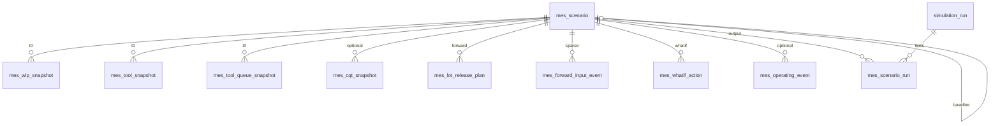

# MES FORWARD / WHAT-IF Schema (V2)

> **V1 REPLAY deprecated.** See `sql/flyway/V002__mes_forward_whatif.sql`.  
> Old doc: `MES_REPLAY_SCHEMA.md` (archive reference only).

## Goals

| Mode | Question | DB input | Engine |
|------|----------|----------|--------|
| **FORWARD** | T0 그대로 x분 후 fab는? | T0 snapshots + `mes_lot_release_plan` [t0,t0+x] | Rule dispatch + proc dist + PM/BD |
| **WHAT-IF** | 대응안 적용 시? | FORWARD + `mes_whatif_action` | Same + overrides |

**Non-goal:** Full x-minute `TRACK_IN`/`TRACK_OUT` grid (use statistics, not simulation).

## Apply migrations

```bash
psql "$DATABASE_URL" -f simulation/sql/flyway/V001__mes_replay_schema.sql   # if fresh
psql "$DATABASE_URL" -f simulation/sql/flyway/V002__mes_forward_whatif.sql
```

## ER diagram



## Tables

### `mes_scenario`

| Column | FORWARD | WHAT-IF |
|--------|---------|---------|
| `scenario_id` PK | required | required |
| `t0_sim_minute`, `horizon_minutes` | required | required |
| `mode` | `FORWARD` | `WHATIF` |
| `baseline_scenario_id` | null | FK → FORWARD scenario |
| `trigger_meta` JSONB | optional | optional |
| `use_master_lot_release` | if true, use `lot_release` filter | same |

### T0 snapshots (common)

- `mes_wip_snapshot` — WIP at T0 (+ `product`, `is_super_hot` since V002)
- `mes_tool_snapshot` — tool state
- `mes_tool_queue_snapshot` — queue order (recommended)
- `mes_cqt_snapshot` — optional

### `mes_lot_release_plan` (FORWARD)

Releases with `release_time ∈ [t0, t0 + horizon]`.  
ETL from master `lot_release` or MES export.

### `mes_forward_input_event` (optional sparse)

| `event_kind` | Use |
|--------------|-----|
| `FAB_ARRIVAL` | fab entry (if not using release plan row) |
| `HOLD` / `RELEASE` | MES-confirmed operating |

### `mes_whatif_action` (WHAT-IF only)

| `action_kind` | Example payload |
|---------------|-----------------|
| `LOT_PRIORITY` | `{"priority": 5}` |
| `LOT_HOLD` / `LOT_RELEASE` | `{}` |
| `DISPATCH_RULE_OVERRIDE` | `{"tool_group":"Litho_FE","dispatch_rule":"FIFO"}` |
| `FORCE_TOOL` | `{"tool_id":"Litho_FE#2","once":true}` |
| `SKIP_RELEASE` | `{"mes_lot_release_plan_id": 12}` |
| `ADD_RELEASE` | release fields |

### `mes_operating_event` (optional P2)

`HOLD`, `RELEASE`, `SCRAP`, `REWORK` — future MES calendar.

### Output (unchanged)

`simulation_run`, `simulation_log`, `lot_event_log`, `tool_state_log`, `kpi_snapshot`, `mes_scenario_run`.

## CSV templates

`simulation/sample_csv/`:

- `mes_scenario.csv`
- `mes_wip_snapshot.csv`
- `mes_tool_snapshot.csv`
- `mes_tool_queue_snapshot.csv`
- `mes_lot_release_plan.csv`
- `mes_whatif_action.csv`
- `mes_forward_input_event.csv`

## ETL

```bash
cd simulation
.venv/bin/python load_mes_scenario.py --scenario-id FWD_001 --mode FORWARD \
  --t0 10800 --horizon 180 \
  --wip sample_csv/mes_wip_snapshot.csv \
  --tools sample_csv/mes_tool_snapshot.csv \
  --releases sample_csv/mes_lot_release_plan.csv \
  --validate-only
```

## Validation SQL

`simulation/sql/validation/mes_forward_whatif_validation.sql`

## FabEnv (planned)

```python
env.reset(options={"scenario_id": "FWD_001"})
# inject snapshots, t0, releases, what-if actions
# DISPATCH_MODE=rule (NOT mes_replay)
```

## Removed in V2

| Item | Reason |
|------|--------|
| `mes_schedule_event` + TRACK_IN grid | Full REPLAY |
| `v_schedule_adherence` | REPLAY compare |
| `mode REPLAY / REPLAY_WHATIF` | Replaced |
| `DISPATCH_MODE=mes_replay` | Not implemented / dropped |

## Open questions (MES team)

1. T0 이후 **release 목록만** export 가능한가?
2. Release `release_time`: 절대 sim 분 vs calendar string?
3. T0 WIP에 **queue order**, **processing_remaining_min** 포함?
4. Hold/Release/Scrap 예정 목록 export 형식?
5. WHAT-IF Agent **whitelist** (priority, hold, dispatch rule, …)?
6. `use_master_lot_release=true` vs `mes_lot_release_plan` 중 MES 표준?
7. `FAB_ARRIVAL` vs `mes_lot_release_plan` 중복 시 우선순위?
8. SCRAP/REWORK를 `mes_operating_event`로 받을지, 엔진 stochastic 유지할지?
9. WHAT-IF `FORCE_TOOL`: 1회만 vs step 전체?
10. Trigger `trigger_meta` 필수 필드 합의 (tg, snapshot_time, model_version)?
