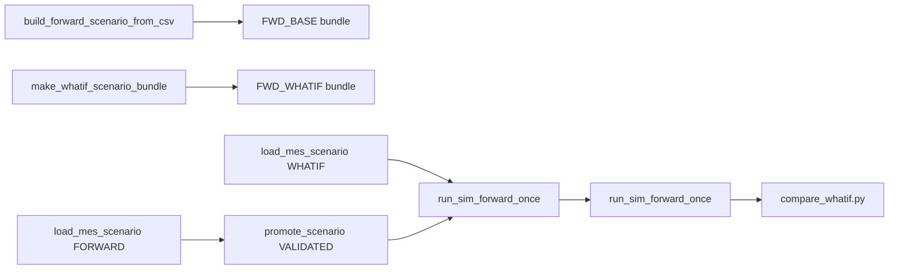

# MES WHAT-IF actions (`mes_whatif_action`)

Policy FORWARD simulation compares a **baseline** scenario (`FWD_BASE_*`) with a **what-if** scenario (`FWD_WHATIF_*`) at the same T0 snapshot. Differences come from:

1. **`mes_lot_release_plan.csv`** (production plan diff)
2. Optional **`mes_wip_snapshot.csv`** diff (T0 priority / super-hot / due)
3. **`mes_whatif_action.csv`** — timed overrides applied during the horizon

Schedule replay (`DISPATCH_MODE=schedule_replay`) is **not** used for this PoC.

---

## Scenario workflow

| Step | Command |
|------|---------|
| Baseline CSVs | `tools/build_forward_scenario_from_csv.py --scenario-id FWD_BASE_<tag> ...` |
| What-if bundle | `tools/make_whatif_scenario_bundle.py --base-dir scenario_out/FWD_BASE_<tag> ...` |
| Load baseline | `load_mes_scenario.py --mode FORWARD --wip --tools --queues --releases` |
| Load what-if | `load_mes_scenario.py --mode WHATIF --baseline FWD_BASE_<tag> --whatif mes_whatif_action.csv` |
| Promote | `tools/promote_scenario.py --scenario-id <id> --status VALIDATED` |
| Run | `run_sim_forward_once.py --scenario-id <id> --csv-dir sim_csv_out/<tag>` |
| Compare KPI | `tools/compare_whatif.py --t0 <T0> --horizon 120 ...` |

`effective_time` on every action is **absolute fab sim minutes** (same clock as `t0_sim_minute`), not minutes since run start.

---

## `action_kind` reference

| `action_kind` | `lot_id` | `tool_group` / `tool_id` | `payload_json` | Phase |
|---------------|----------|--------------------------|------------------|-------|
| `LOT_HOLD` | required | — | `{"reason":"..."}` optional | P0 |
| `LOT_RELEASE` | required | — | `{}` | P0 |
| `LOT_PRIORITY` | required | — | `{"priority": <int>}` | P0 |
| `SET_SUPER_HOT` | required | — | `{"super_hot": true\|false}` | P1 |
| `DISPATCH_RULE_OVERRIDE` | — | TG in payload or column | `{"tool_group":"<TG>","dispatch_rule":"<rule string>"}` | P0 |
| `FORCE_TOOL` | required | optional | `{"tool_id":"<TG>#k","tool_group":"<TG>","once":true}` | P0 |
| `REQUEUE_TOOL` | required | optional | see below | P1 |
| `SKIP_RELEASE` | — | — | `{"mes_lot_release_plan_id": <DB id>}` | P0 |
| `ADD_RELEASE` | — | — | product/route/times like plan row | P0 |

### `SET_SUPER_HOT` (P1)

Sets `super_hot` on `active_lots_data` and every queue `payload` for the lot. Dispatch ranks super-hot lots before normal lots (see `fab_env._select_dispatch_candidate`).

### `REQUEUE_TOOL` (P1)

Moves a **queued** lot to another tool in the same tool group. Does **not** preempt a lot that is `PROCESSING` or holding the tool resource.

| Field | Required | Description |
|-------|----------|-------------|
| `tool_group` | yes | Tool group name |
| `to_tool_id` | yes | Destination `#Tool` |
| `from_tool_id` | no | Source tool; if omitted, search all tools in the group |
| `step_seq` | no | If set and mismatched vs queue payload, logs `action_warnings` |

On success: event removed from source queue, `enqueue_time = sim_env.now`, `payload.tool_id` updated, `_check_trigger(to_tool_id)` called. Missing `req_setup` is filled from the route step when possible.

### `FORCE_TOOL` vs `REQUEUE_TOOL`

| Situation | Use |
|-----------|-----|
| Lot already waiting on the **wrong** tool queue at the current step | **`REQUEUE_TOOL`** |
| Pin the **next** visit to a tool, or jump queue on the **same** tool without a cross-tool move | **`FORCE_TOOL`** (`once: true` recommended) |

---

## P0 example rows (template)

See `simulation/scenario_out/_templates/mes_whatif_action_p0.csv` (6 actions: hold, priority, dispatch override, skip release, force tool, release).

`SKIP_RELEASE` needs `mes_lot_release_plan.id` from Postgres after baseline load (or export ids into the CSV).

## P1 example rows

See `simulation/scenario_out/_templates/mes_whatif_action_p1.csv` (`SET_SUPER_HOT`, `REQUEUE_TOOL`).

---

## Agent mapping (T0 CR → actions)

| Agent intent | Mechanism |
|--------------|-----------|
| Delay / cancel a planned release | Plan CSV diff or `SKIP_RELEASE` |
| Rush WIP / release priority | `LOT_PRIORITY` or `SET_SUPER_HOT` |
| Relieve bottleneck TG | `DISPATCH_RULE_OVERRIDE` on that TG |
| Move lot off overloaded unit | `REQUEUE_TOOL` |
| Pin next processing on a unit | `FORCE_TOOL` |

---

## KPI compare

`tools/compare_whatif.py` joins `kpi_fab.csv` / `kpi_toolgroup.csv` (and tool/process files if present) at `snapshot_time ≈ t0 + horizon`, writes `whatif_compare_summary.csv`, and optionally inserts `kpi_whatif_diff` with `--insert-db`.

Typical KPIs: `wip`, `q_time_min`, `utilization`, `utilization_avg`, `wait_ratio`, `q_len`.
