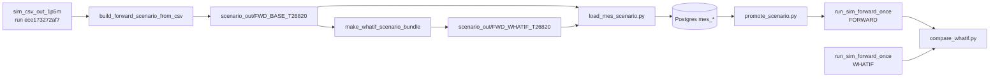

# Task: FORWARD + WHAT-IF 전체 E2E 검증 (T0=26820, ref `sim_csv_out_1p5m`)

## 목적

cold-start ref run CSV(`sim_csv_out_1p5m`)에서 **T0 스냅샷을 역추정**하고, Postgres `mes_*` 시나리오를 적재한 뒤:

1. **FORWARD (baseline)** — `run_sim_forward_once.py` → H분 전개 → KPI/ledger CSV
2. **WHAT-IF** — 동일 T0 + `mes_whatif_action` (+ 선택 plan diff) → H분 → baseline 대비 KPI diff
3. **compare** — `tools/compare_whatif.py`로 `@ T0+H` delta 산출

**검증 대상:** `build_forward_scenario_from_csv`, `load_mes_scenario`, `promote_scenario`, `make_whatif_scenario_bundle`, `run_sim_forward_once`, `fab_env` what-if 액션, `compare_whatif`.

**비목표:** ref run(`ece173272af7`)과 bit-identical 재현, schedule replay, Spring/Agent API.

---

## Locked test parameters (본 E2E SSOT)

| 항목 | 값 | 비고 |
|------|-----|------|
| Ref CSV dir | `FAB_BEAR/simulation/sim_csv_out_1p5m` | cold-start 산출물 |
| Ref `run_id` | `ece173272af7` | ledger/kpi/lot_events 공통 |
| **T0** | **26820.0** | KPI 60분 격자 정렬 (447×60) |
| **Horizon H** | **120** | PoC 2h; 통과 후 180/1440 확장 가능 |
| Baseline scenario_id | `FWD_BASE_T26820` | `mode=FORWARD` |
| What-if scenario_id | `FWD_WHATIF_T26820` | `mode=WHATIF`, baseline=`FWD_BASE_T26820` |
| Baseline run CSV out | `sim_csv_out/fwd_base_t26820` | ref와 분리 |
| What-if run CSV out | `sim_csv_out/fwd_whatif_t26820` | ref와 분리 |
| Compare output | `sim_csv_out/whatif_compare_t26820.csv` | |
| `use_master_lot_release` | **false** | |
| `DISPATCH_MODE` | **rule** | |
| Runner `--max-steps` | **≥ 50000** | horizon 120 + congestion 여유 |

**T0=26820 사전 검증 (ref CSV):**

- sim 범위: 0 ~ ~313,568 분 → T0 유효
- `kpi_fab.csv`에 `snapshot_time=26820` 행 존재
- `lot_release_ledger` T0 이전 release ~1,067건

---

## 아키텍처 (데이터 흐름)



**중요:** `run_sim_forward_once.py`는 **ref CSV를 읽지 않음**. 반드시 `build_*` → `load_*` → `VALIDATED` 선행.

---

## 사전 조건 (Phase 0 전)

```bash
cd FAB_BEAR
docker compose up -d db
cd simulation
.venv/bin/python init_db.py    # drop_all + 엑셀 마스터 (전용 DB 권장)
```

- `FAB_BEAR/.env`: `POSTGRES_HOST`, `POSTGRES_PORT` 등 docker와 일치
- `simulation/data/SMT_3_*.xlsx` 존재
- ref dir 8종 CSV 존재 (`lot_release_ledger.csv` 포함)

---

## Phase 1 — Baseline 스냅샷 번들 (CSV only)

```bash
cd FAB_BEAR/simulation

.venv/bin/python tools/build_forward_scenario_from_csv.py \
  --run-id ece173272af7 \
  --t0 26820 \
  --horizon 120 \
  --scenario-id FWD_BASE_T26820 \
  --sim-csv-dir sim_csv_out_1p5m
```

**산출:** `scenario_out/FWD_BASE_T26820/`

- `mes_tool_snapshot.csv`
- `mes_tool_queue_snapshot.csv`
- `mes_wip_snapshot.csv`
- `mes_lot_release_plan.csv`
- `build_confidence.json`
- `mes_scenario.meta.json`

**Acceptance (Phase 1):**

- [ ] exit 0
- [ ] `build_confidence.json`: 치명적 note 없음 (missing route/tool 대량 없음)
- [ ] `tool_count` > 0, `wip_count` > 0
- [ ] queue lot ⊆ wip (수동 또는 스크립트 spot-check)
- [ ] plan `release_time` ∈ `[26820, 26940]` (T0 ~ T0+H)

---

## Phase 2 — Baseline DB load + validate + promote

```bash
cd FAB_BEAR/simulation

.venv/bin/python load_mes_scenario.py --create-tables \
  --scenario-id FWD_BASE_T26820 \
  --mode FORWARD \
  --t0 26820 \
  --horizon 120 \
  --description "E2E baseline T0=26820 from sim_csv_out_1p5m" \
  --tools scenario_out/FWD_BASE_T26820/mes_tool_snapshot.csv \
  --queues scenario_out/FWD_BASE_T26820/mes_tool_queue_snapshot.csv \
  --wip scenario_out/FWD_BASE_T26820/mes_wip_snapshot.csv \
  --releases scenario_out/FWD_BASE_T26820/mes_lot_release_plan.csv

.venv/bin/python load_mes_scenario.py --validate-only --scenario-id FWD_BASE_T26820

.venv/bin/python tools/promote_scenario.py --scenario-id FWD_BASE_T26820 --status VALIDATED
```

**Acceptance (Phase 2):**

- [ ] load exit 0, validate **errors=[]**
- [ ] `mes_scenario.status = VALIDATED`
- [ ] `use_master_lot_release = false`

---

## Phase 3 — FORWARD run

```bash
cd FAB_BEAR/simulation
mkdir -p sim_csv_out/fwd_base_t26820

.venv/bin/python run_sim_forward_once.py \
  --scenario-id FWD_BASE_T26820 \
  --csv-dir ./sim_csv_out/fwd_base_t26820 \
  --max-steps 50000
```

**Acceptance (Phase 3):**

- [ ] exit 0
- [ ] 출력: `Status transition: VALIDATED -> RUNNING -> DONE`
- [ ] `sim_now_abs ≈ 26940` (T0+H, ± tolerance)
- [ ] `mes_scenario.status = DONE`
- [ ] `sim_csv_out/fwd_base_t26820/`에 최소 존재:
  - `kpi_fab.csv`, `kpi_toolgroup.csv`
  - `lot_release_ledger.csv`
  - `lot_events.csv`
- [ ] `lot_release_ledger` 행 수 > 0 (horizon 내 release)
- [ ] `Finished lots` + `Active lots remaining` — 빈 fab 아님

**기록:** stdout의 `Run id (simulation_run)` → baseline forward `run_id` (compare용)

---

## Phase 4 — WHAT-IF 번들 + load + promote

### 4.1 번들 생성

```bash
cd FAB_BEAR/simulation

.venv/bin/python tools/make_whatif_scenario_bundle.py \
  --base-dir scenario_out/FWD_BASE_T26820 \
  --whatif-scenario-id FWD_WHATIF_T26820 \
  --baseline-scenario-id FWD_BASE_T26820 \
  --t0 26820 \
  --horizon 120 \
  --whatif-actions scenario_out/_templates/mes_whatif_action_p0.csv \
  --description "E2E what-if T0=26820"
```

### 4.2 `mes_whatif_action.csv` 패치 (필수 검토)

템플릿 `mes_whatif_action_p0.csv`의 **`SKIP_RELEASE`** 행:

- `payload_json.mes_lot_release_plan_id`는 baseline load **후** DB `mes_lot_release_plan.id`와 일치해야 함.
- E2E 단순화: **SKIP_RELEASE 행 삭제** + 나머지 ≥4행 유지해도 WHAT-IF validate 통과.

**`effective_time`:** 모든 action = **26820** (T0 절대 fab 분). `LOT_RELEASE`(optional) = **26850**.

**실lot ID 패치:** 템플릿 placeholder lot_id를 baseline `mes_wip_snapshot` / queue에 **실제 존재하는 lot_id**로 교체 (없으면 action no-op).

### 4.3 load + validate + promote

```bash
.venv/bin/python load_mes_scenario.py --create-tables \
  --scenario-id FWD_WHATIF_T26820 \
  --mode WHATIF \
  --baseline FWD_BASE_T26820 \
  --t0 26820 \
  --horizon 120 \
  --tools scenario_out/FWD_WHATIF_T26820/mes_tool_snapshot.csv \
  --queues scenario_out/FWD_WHATIF_T26820/mes_tool_queue_snapshot.csv \
  --wip scenario_out/FWD_WHATIF_T26820/mes_wip_snapshot.csv \
  --releases scenario_out/FWD_WHATIF_T26820/mes_lot_release_plan.csv \
  --whatif scenario_out/FWD_WHATIF_T26820/mes_whatif_action.csv

.venv/bin/python load_mes_scenario.py --validate-only --scenario-id FWD_WHATIF_T26820

.venv/bin/python tools/promote_scenario.py --scenario-id FWD_WHATIF_T26820 --status VALIDATED
```

**Acceptance (Phase 4):**

- [ ] validate errors=[]
- [ ] `mes_whatif_action` ≥ 4행
- [ ] `baseline_scenario_id = FWD_BASE_T26820`

---

## Phase 5 — WHAT-IF run

```bash
cd FAB_BEAR/simulation
mkdir -p sim_csv_out/fwd_whatif_t26820

.venv/bin/python run_sim_forward_once.py \
  --scenario-id FWD_WHATIF_T26820 \
  --csv-dir ./sim_csv_out/fwd_whatif_t26820 \
  --max-steps 50000
```

**Acceptance (Phase 5):** Phase 3과 동일 +

- [ ] `DONE`, KPI/ledger 생성
- [ ] (권장) baseline과 **동일 horizon**에서 KPI 일부 **delta ≠ 0** (what-if 반영 증거)

**기록:** what-if forward `run_id`

---

## Phase 6 — KPI compare

```bash
cd FAB_BEAR/simulation

.venv/bin/python tools/compare_whatif.py \
  --baseline-csv-dir ./sim_csv_out/fwd_base_t26820 \
  --whatif-csv-dir ./sim_csv_out/fwd_whatif_t26820 \
  --t0 26820 \
  --horizon 120 \
  --tolerance 1.0 \
  --baseline-scenario-id FWD_BASE_T26820 \
  --whatif-scenario-id FWD_WHATIF_T26820 \
  --baseline-run-id <baseline_run_id_from_phase3> \
  --whatif-run-id <whatif_run_id_from_phase5> \
  --out ./sim_csv_out/whatif_compare_t26820.csv
```

**Acceptance (Phase 6):**

- [ ] exit 0
- [ ] `whatif_compare_t26820.csv` 존재
- [ ] `snapshot_time ≈ 26940` 행 존재
- [ ] FAB `wip` 또는 TG `utilization_avg` / `wip` 중 **≥1건 delta ≠ null**
- [ ] (선택) `--insert-db` → `kpi_whatif_diff` 적재

---

## Phase 7 — 회귀 테스트 (병행)

```bash
cd FAB_BEAR/simulation
.venv/bin/python -m pytest \
  tests/test_scenario_forward_smoke.py \
  tests/test_whatif_set_super_hot.py \
  tests/test_whatif_requeue_tool.py \
  tests/test_compare_whatif.py \
  tests/test_lot_release_ledger.py \
  -q

.venv/bin/python tools/debug_whatif_healthcheck.py
```

**Acceptance:** all pytest pass, healthcheck `ALL_OK`.

---

## Phase 8 — E2E 리포트 (실행자 작성)

`FAB_BEAR/simulation/e2e_reports/E2E_T26820_<YYYYMMDD>.md` (신규)에 기록:

| 섹션 | 내용 |
|------|------|
| Environment | docker PG port, init_db 일시, git commit |
| build_confidence | tool/wip/queue/release counts, notes 요약 |
| validate | baseline/what-if error 목록 |
| Forward run | gym_steps, sim_now_abs, finish/active lots, run_id |
| What-if run | 동일 + action_errors/warnings (fab validation report) |
| Compare | delta 상위 5 TG (wip, utilization_avg) |
| Verdict | PASS / FAIL + blocker |

---

## 실패 시 트러블슈팅

| 증상 | 원인 | 조치 |
|------|------|------|
| `scenario not found` | load 안 함 | Phase 2/4 load |
| `status=DRAFT` 거부 | promote 안 함 | `promote_scenario.py` |
| validate wip step unknown | init_db/route 불일치 | `init_db.py` 재실행 |
| `sim_now_abs` ≪ T0+H | `--max-steps` 부족 | 50000+ |
| what-if KPI = baseline | action lot_id/TG 불일치 | wip/queue 기준 lot_id 패치 |
| SKIP_RELEASE invalid id | plan id 불일치 | 행 삭제 또는 DB id 반영 |
| compare delta 전부 null | run_id/경로 오류 | Phase 3/5 run_id·csv-dir 재확인 |

---

## Acceptance checklist (전체 E2E PASS)

- [ ] Phase 1: `scenario_out/FWD_BASE_T26820` + confidence OK
- [ ] Phase 2: baseline load validate OK, VALIDATED
- [ ] Phase 3: FORWARD DONE, CSV 산출, sim_now_abs ≈ 26940
- [ ] Phase 4: what-if bundle + load validate OK, ≥4 actions
- [ ] Phase 5: WHAT-IF DONE, CSV 산출
- [ ] Phase 6: compare CSV, ≥1 meaningful delta
- [ ] Phase 7: pytest + healthcheck OK
- [ ] Phase 8: E2E 리포트 작성

---

## Agent / Cursor 실행 지침

1. **한 Phase씩** 실행하고 Acceptance 체크 후 다음 Phase 진행.
2. 실패 시 **해당 Phase만** 수정·재실행; init_db는 시나리오 데이터도 지우므로 Phase 2부터 재load.
3. ref CSV(`sim_csv_out_1p5m`)는 **읽기 전용**; forward/what-if 출력은 **별도 디렉터리**.
4. bit-identical ref 재현 실패는 **FAIL 아님**; runner crash, validate error, empty KPI는 **FAIL**.
5. `load_mes_scenario.py` CLI는 **`--scenario-dir` 없음** — `--wip --tools --queues --releases [--whatif]` flags 사용.

---

## 관련 문서

- [PROMPT_FORWARD_T0_FROM_SIM_CSV.md](./PROMPT_FORWARD_T0_FROM_SIM_CSV.md) — T0 역추정 SSOT
- [PROMPT_IMPLEMENT_WHATIF_P0_P1.md](./PROMPT_IMPLEMENT_WHATIF_P0_P1.md) — what-if action kinds
- [MES_WHATIF_ACTION.md](./MES_WHATIF_ACTION.md) — payload 표
- [REPORT_SIMULATION_KPI.md](./REPORT_SIMULATION_KPI.md) — CSV 8종 스키마
