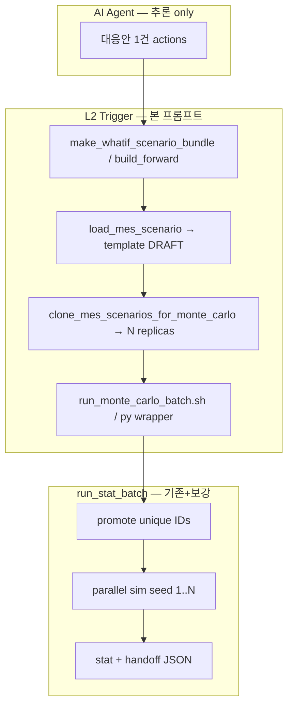

# 구현 프롬프트: Monte Carlo 시나리오 Replica (Template → N× DB clone) + Trigger 오케스트레이션

아래 블록 전체를 **시스템/역할 프롬프트**로 복사해 구현 에이전트에 붙여 넣으세요.

**목표:** AI Agent가 **대응안/시나리오 1건**만 제출하면, 플랫폼(Trigger)이 **동일 내용·서로 다른 `scenario_id` N개**를 Postgres에 복제하고, `run_stat_batch.py`가 **병렬 Monte Carlo sim N=30** + stat/handoff까지 수행할 수 있게 한다.

**배경:** `mes_scenario.status`는 행당 `VALIDATED → RUNNING → DONE` 1회 전환. **동일 `scenario_id`로 sim N회 병렬 불가.** PoC what-if E2E는 `_R01..R30` suffix + `--whatif-suffix-pattern`으로 우회했으나 **DB clone 도구·Trigger API가 repo에 없음**.

**대상 코드:** `FAB_BEAR/simulation/tools/` (+ `run_stat_batch.py` 보강, tests, docs)  
**건드리지 않음:** `fab_env.py` 핵심, Track A/B stat 수식(`stats/*`), Agent 추론 로직, `data_labeling.ipynb`

**선행 완료:** `PROMPT_PATCH_RUN_STAT_BATCH_PROMOTE.md` (promote before batch, fail-fast)

---

## 역할

당신은 `FAB_BEAR/simulation` Python 구현자입니다. **L2 Trigger/오케스트레이터** 레이어를 추가합니다. AI Agent는 template 1건만 등록하고, **N개 replica 생성·sim·handoff는 플랫폼**이 담당합니다.

---

## Locked decisions (반드시 준수)

| # | 결정 | 값 |
|---|------|-----|
| L1 | Template vs Replica | **Template 1건** (Agent/ETL) → **Replica N건** (플랫폼 clone, 내용 동일) |
| L2 | Replica naming | `{template_id}_R{run:02d}` (run=1..N). pattern은 CLI/API에서 override 가능 |
| L3 | Default N | `n_runs=30` (PoC SSOT) |
| L4 | Replica status after clone | **`DRAFT`** (promote는 `run_stat_batch` / `promote_scenario_validated`) |
| L5 | Clone scope | `mes_scenario` + snapshot/plan/action child rows (scenario_id FK 전부) |
| L6 | Idempotent clone | 동일 replica_id 존재 시 `--on-conflict skip|replace` (default **replace** child rows) |
| L7 | Agent boundary | Agent **replica N개 생성·30 CSV 폴더 복사 금지** — Trigger만 |
| L8 | Baseline FORWARD 병렬 | `FWD_BASE_T{t0}_R{run:02d}` + `--scenario-suffix-pattern` (what-if와 동일 패턴) |
| L9 | What-if 병렬 | baseline manifest **재사용** (baseline sim 재실행 없음) + whatif replica N sim |
| L10 | Single-ID parallel guard | `len(unique_scenario_ids)==1` 이고 `parallel>1` → **경고 + parallel=1 강제** 또는 exit 1 (default **강제 1**) |
| L11 | Single-ID serial | 동일 ID N회 직렬 시 **job마다 promote** (`run_ml_g_star_e2e.sh` parity) |
| L12 | handoff metadata | `monte_carlo` block: template_id, suffix_pattern, n_runs, execution_mode |

---

## 아키텍처 (SSOT)



---

## Phase 0 — 참조 SSOT

| 문서/파일 | 용도 |
|-----------|------|
| `docs/TRIGGER_CONTRACT.md` | status machine, Trigger vs Engine |
| `docs/PROMPT_IMPLEMENT_STAT_PIPELINE_AB.md` | suffix pattern, `--reuse-baseline-manifest` |
| `docs/PROMPT_PATCH_RUN_STAT_BATCH_PROMOTE.md` | promote + fail-fast (완료 전제) |
| `tools/make_whatif_scenario_bundle.py` | WHATIF CSV bundle |
| `tools/build_forward_scenario_from_csv.py` | FORWARD baseline bundle |
| `load_mes_scenario.py` | CSV → Postgres (DRAFT) |
| `tools/promote_scenario_validated.py` | VALIDATED 승격 |
| `tools/run_stat_batch.py` | N sim + stat |
| `models.py` | `MesScenario`, `MesWhatifAction`, snapshots… |

---

## Phase 1 — `tools/clone_mes_scenarios_for_monte_carlo.py` (신규, 핵심)

### CLI

```bash
cd FAB_BEAR/simulation

.venv/bin/python tools/clone_mes_scenarios_for_monte_carlo.py \
  --source-scenario-id FWD_WHATIF_T26820_STRONG \
  --suffix-pattern "{source}_R{run:02d}" \
  --n-runs 30 \
  --on-conflict replace

# dry-run: print target IDs only
.venv/bin/python tools/clone_mes_scenarios_for_monte_carlo.py \
  --source-scenario-id FWD_BASE_T26820 \
  --suffix-pattern "{source}_R{run:02d}" \
  --n-runs 30 \
  --dry-run
```

| Flag | 설명 |
|------|------|
| `--source-scenario-id` | Template (must exist in DB) |
| `--suffix-pattern` | `{source}`, `{run}`, `{run_index}` placeholders |
| `--n-runs` | default 30 |
| `--on-conflict` | `skip` \| `replace` (default replace) |
| `--dry-run` | DB write 없음, target ID 목록 stdout |
| `--mode-filter` | optional: clone only if source.mode in FORWARD/WHATIF |

### 복제 대상 (scenario_id FK)

**필수:**

- `mes_scenario` (새 PK)
- `mes_wip_snapshot`
- `mes_tool_snapshot`
- `mes_tool_queue_snapshot`
- `mes_lot_release_plan`

**조건부 (source에 row 있으면):**

- `mes_whatif_action` (WHATIF)
- `mes_forward_input_event`
- `mes_operating_event`

**복제하지 않음:**

- `mes_scenario_run` (실행 이력 — replica마다 새로 쌓임)
- `simulation_run` / KPI CSV (engine 산출)

### `mes_scenario` replica row 규칙

```python
replica.scenario_id = formatted_suffix  # e.g. FWD_WHATIF_T26820_STRONG_R01
replica.mode = source.mode
replica.baseline_scenario_id = source.baseline_scenario_id  # WHATIF unchanged
replica.t0_sim_minute = source.t0_sim_minute
replica.horizon_minutes = source.horizon_minutes
replica.use_master_lot_release = source.use_master_lot_release
replica.description = f"MC replica {run}/{n_runs} of {source_id}"
replica.status = "DRAFT"
replica.trigger_meta = {
    **(source.trigger_meta or {}),
    "mc_template_scenario_id": source_id,
    "mc_run_index": run_index,
    "mc_n_runs": n_runs,
    "mc_suffix_pattern": suffix_pattern,
}
```

### 구현 노트

- SQLAlchemy `SessionLocal` + bulk copy (source query → insert new scenario_id).
- Transaction per replica or single transaction for all N (prefer **single commit** for atomicity).
- Source missing → exit 1.
- Output: JSON lines or `clone_manifest.json` listing replica IDs (optional but recommended).

```json
{
  "source_scenario_id": "FWD_WHATIF_T26820_STRONG",
  "n_runs": 30,
  "suffix_pattern": "{source}_R{run:02d}",
  "replica_scenario_ids": ["..._R01", "..._R30"]
}
```

---

## Phase 2 — `tools/run_monte_carlo_batch.py` 또는 `run_monte_carlo_batch.sh` (신규 wrapper)

**한 진입점:** load(optional) → clone → stat batch.

### What-if Track B (primary)

```bash
.venv/bin/python tools/run_monte_carlo_batch.py \
  --track whatif \
  --template-scenario-id FWD_WHATIF_T26820_STRONG \
  --reuse-baseline-manifest out/ml_propagation_e2e/runs_manifest.csv \
  --baseline-scenario-id FWD_BASE_T26820 \
  --suffix-pattern "{template}_R{run:02d}" \
  --t0 26820 --horizon 120 --n-runs 30 \
  --parallel 8 \
  --out-dir out/ml_whatif_mc \
  --focus-scopes "Diffusion_FE_120#1"
```

**Steps inside:**

1. Verify `--reuse-baseline-manifest` has N ok rows (or exit 1).
2. If `--skip-clone-if-exists`: all N replica IDs in DB → skip clone.
3. Else `clone_mes_scenarios_for_monte_carlo.py`.
4. `run_stat_batch.py --mode whatif` with:
   - `--whatif-scenario-id {template}` (fallback)
   - `--whatif-suffix-pattern "{template}_R{run:02d}"`
   - `--reuse-baseline-manifest ...`
5. Attach `monte_carlo` metadata to handoff JSON (merge into existing payload).

### Baseline Track A (optional same wrapper)

```bash
.venv/bin/python tools/run_monte_carlo_batch.py \
  --track g_star_analysis \
  --template-scenario-id FWD_BASE_T26820 \
  --g-star-file out/ml_propagation_e2e/g_star_T26820.json \
  --baseline-csv-dir sim_csv_out \
  --suffix-pattern "{template}_R{run:02d}" \
  --t0 26820 --horizon 120 --n-runs 30 \
  --parallel 8 \
  --out-dir out/ml_g_star_mc
```

Requires prior clone of FORWARD template → `_R01..R30`.

### Flags (wrapper)

| Flag | 설명 |
|------|------|
| `--skip-clone-if-exists` | replica N개 DB 존재 시 clone skip |
| `--skip-clone` | clone never (replica pre-provisioned) |
| `--clone-only` | clone 후 exit (sim 없음) |
| `--template-scenario-id` | source/template ID |

---

## Phase 3 — `run_stat_batch.py` 보강 (추가 패치)

`PROMPT_PATCH_RUN_STAT_BATCH_PROMOTE` **이후** 적용.

### 3.1 Single scenario_id + parallel guard

```python
def _effective_parallel(args, scenario_ids: list[str]) -> int:
    if len(scenario_ids) == 1 and args.parallel > 1:
        print(
            f"WARN single scenario_id {scenario_ids[0]!r}: "
            f"forcing parallel=1 (use suffix-pattern for MC parallel)",
            file=sys.stderr,
        )
        return 1
    return args.parallel
```

`_run_baseline_batch` / `_run_whatif_batch`에서 `ThreadPoolExecutor(max_workers=_effective_parallel(...))` 사용.

### 3.2 Serial single-ID: promote per job

When `len(scenario_ids)==1` and not dry_run:

```python
def job(i: int) -> RunMeta:
    if len(sids) == 1:
        _promote_scenario(args.python, sids[0], dry_run=False)
    ...
```

(baseline batch; whatif job similarly before `_run_one_sim`)

배치 시작 전 `_promote_before_batch`는 **multi-ID일 때만** 호출하거나, single-ID serial에서는 **per-job promote만** (중복 promote harmless but noisy — pick one strategy, document in code comment).

**권장:**

- multi unique IDs → promote all once before executor
- single ID → **no** batch promote; promote inside each job (serial)

### 3.3 handoff `monte_carlo` block

```python
"monte_carlo": {
    "n_runs": args.n_runs,
    "template_scenario_id": template_id,  # new CLI --template-scenario-id optional
    "suffix_pattern": pattern or None,
    "execution_mode": "parallel" if effective_parallel > 1 else "serial",
    "clone_manifest": "clone_manifest.json",  # if wrapper wrote it
}
```

---

## Phase 4 — Agent / Trigger contract (문서만, HTTP optional)

**Implement as markdown section in `TRIGGER_CONTRACT.md` appendix** (minimal code):

### Agent submits (1건)

```json
{
  "rank": 1,
  "baseline_scenario_id": "FWD_BASE_T26820",
  "t0_sim_minute": 26820,
  "horizon_minutes": 120,
  "actions": [ { "action_kind": "LOT_HOLD", "effective_time": 26821, ... } ],
  "monte_carlo": { "n_runs": 30 }
}
```

### Platform returns

```json
{
  "template_scenario_id": "FWD_WHATIF_T26820_RANK1",
  "replica_scenario_ids": ["..._R01", "..._R30"],
  "handoff_path": "out/.../agent_handoff_whatif.json"
}
```

Agent **never** receives obligation to create `_R01..R30` manually.

---

## Phase 5 — Tests

신규: `simulation/tests/test_clone_mes_scenarios_smoke.py`

| Test | 방법 |
|------|------|
| `test_suffix_pattern_expansion` | pure function: pattern → 30 IDs |
| `test_dry_run_lists_n_ids` | subprocess clone --dry-run |
| `test_clone_copies_whatif_actions` | sqlite/dev PG fixture: source 2 actions → replica 2 actions × N (mock or testcontainers optional) |
| `test_run_stat_batch_single_id_forces_parallel_one` | capsys: WARN + parallel effective 1 |
| `test_wrapper_dry_run_invokes_clone_and_batch` | mock subprocess chain |

기존 `test_run_stat_batch_promote_smoke.py` 유지·확장.

---

## Phase 6 — Docs

| 파일 | 변경 |
|------|------|
| `docs/TRIGGER_CONTRACT.md` | Template/Replica, MC N=30, Agent vs Platform RACI |
| `docs/REPORT_STAT_PIPELINE_AB_20260605.md` | §5.4, §9.9: clone + wrapper 전제 |
| `docs/STAT_PIPELINE_AB.md` | MC replica 절 추가 (있으면) |
| `docs/schemas/agent_handoff_whatif.schema.json` | optional `monte_carlo` object |
| `docs/schemas/agent_handoff_g_star_analysis.schema.json` | optional `monte_carlo` object |

---

## Phase 7 — Naming SSOT (Locked examples)

| 용도 | Template | Replica pattern |
|------|----------|-----------------|
| Baseline @ T0=26820 | `FWD_BASE_T26820` | `{template}_R{run:02d}` |
| What-if STRONG PoC | `FWD_WHATIF_T26820_STRONG` | `{template}_R{run:02d}` |
| What-if rank k | `FWD_WHATIF_T26820_RANK{k}` | `{template}_R{run:02d}` |

`run_stat_batch` flags:

```bash
--whatif-suffix-pattern "{template}_R{run:02d}"
# wrapper sets --template-scenario-id and passes same string to clone + batch
```

---

## 완료 기준 (체크리스트)

- [x] `clone_mes_scenarios_for_monte_carlo.py` — N replicas in DB, child rows copied
- [x] `--dry-run`, `--on-conflict skip|replace`
- [x] `run_monte_carlo_batch.py` (or `.sh`) — clone + whatif batch one command
- [x] `run_stat_batch` — single-ID parallel guard + serial per-job promote
- [x] handoff JSON includes `monte_carlo` metadata
- [x] `TRIGGER_CONTRACT.md` Agent vs Platform boundary
- [x] pytest smoke pass
- [ ] E2E: what-if STRONG template → clone 30 → parallel batch → handoff (see below)

---

## E2E 검증 (구현 후)

```bash
cd FAB_BEAR/simulation

# 0) Template already in DB (FWD_WHATIF_T26820_STRONG from prior load)
# 1) Clone
.venv/bin/python tools/clone_mes_scenarios_for_monte_carlo.py \
  --source-scenario-id FWD_WHATIF_T26820_STRONG \
  --suffix-pattern "{source}_R{run:02d}" \
  --n-runs 30 \
  --on-conflict replace

# 2) What-if MC batch (baseline manifest reuse)
.venv/bin/python tools/run_monte_carlo_batch.py \
  --track whatif \
  --template-scenario-id FWD_WHATIF_T26820_STRONG \
  --skip-clone \
  --reuse-baseline-manifest out/ml_propagation_e2e/runs_manifest.csv \
  --baseline-scenario-id FWD_BASE_T26820 \
  --suffix-pattern "FWD_WHATIF_T26820_STRONG_R{run:02d}" \
  --t0 26820 --horizon 120 --n-runs 30 \
  --parallel 8 \
  --out-dir out/ml_whatif_mc_e2e \
  --focus-scopes "Diffusion_FE_120#1"

# 3) Assert
grep -c ",ok$" out/ml_whatif_mc_e2e/paired_manifest.csv  # indirect: whatif runs ok
.venv/bin/python -c "
import json
h=json.load(open('out/ml_whatif_mc_e2e/agent_handoff_whatif.json'))
assert h.get('monte_carlo',{}).get('n_runs')==30
assert 'STRONG_R' in str(h.get('whatif',{}))
"
```

**Baseline parallel E2E (optional):**

```bash
# clone FWD_BASE_T26820 → _R01.._R30, then g_star_analysis batch with --scenario-suffix-pattern
```

---

## 구현 순서 권장

1. `clone_mes_scenarios_for_monte_carlo.py` + unit tests  
2. `run_stat_batch.py` Phase 3 guard + serial promote  
3. `run_monte_carlo_batch.py` wrapper  
4. handoff `monte_carlo` metadata  
5. `TRIGGER_CONTRACT.md` + REPORT 갱신  
6. Full E2E what-if MC  

---

## 주의 (흔한 실수)

1. **CSV 폴더 30개 복사 ≠ DB replica** — engine은 **Postgres `mes_scenario`** 를 읽음.  
2. **Agent가 `_R01..R30` 생성** — 금지; Trigger만.  
3. **단일 ID + parallel>1** — race → DONE errors (이미 재현됨).  
4. **clone without promote** — batch promote는 unique IDs 전제; clone 후 DRAFT 확인.  
5. **baseline what-if 혼동** — B는 baseline manifest **재사용**; baseline replica clone은 **A 병렬 전용**.  
6. **`mes_scenario_run` 복제** — 금지; 실행마다 새로 생성됨.

---

## Out of scope (본 프롬프트)

- Spring REST API / Agent HTTP server (contract markdown만)
- Replica 자동 GC (DONE 후 삭제) — Phase 5+ backlog
- rank 1,2,3 루프 오케스트레이터 — wrapper 호출 3회로 충분
- `fab_env` 동시 RUNNING on same scenario_id — 엔진 변경 없음

---

*프롬프트 버전: 2026-06-07 · Template→N Replica clone · Trigger L2 · MC parallel N=30 · Agent boundary*
