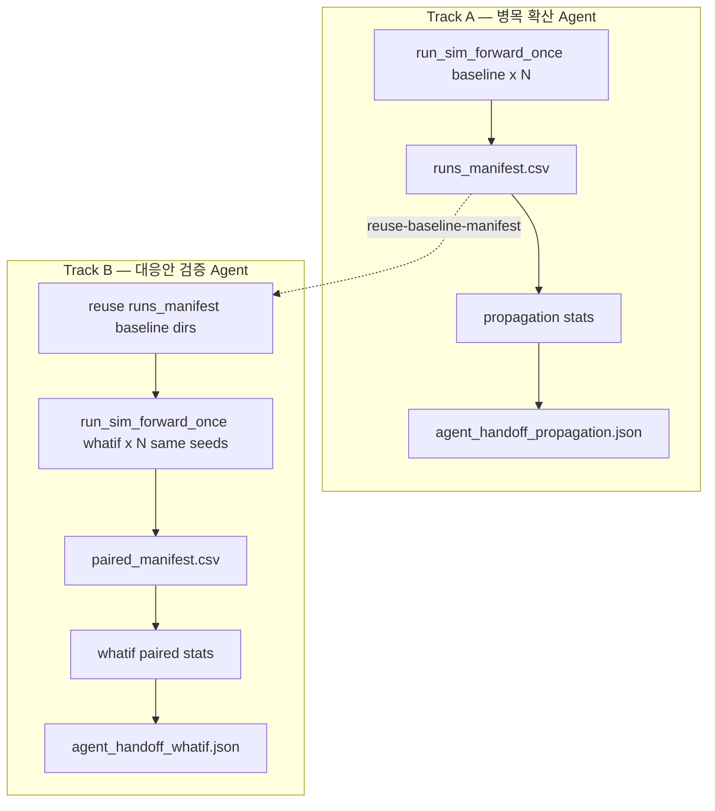

# 구현 프롬프트: 파이프라인 A(확산) · B(대응안) — N=30 통계 + Agent handoff

아래 블록 전체를 **시스템/역할 프롬프트**로 복사해 구현 에이전트에 붙여 넣으세요.

**목표:** FabGuard PoC용 **시뮬 배치(N=30) → 통계 logic → Agent handoff JSON** 을 `FAB_BEAR/simulation`에 구현한다.  
**운영 순서 (PoC):** **A(확산)** → 30× FORWARD CSV·`runs_manifest` **저장** → **병목 확산 Agent** → (대응안 시나리오 준비 후) **B(대응안)** → 30× what-if 시뮬 + baseline **재사용** → **대응안 검증 Agent**. A·B 통계·시뮬은 **독립**; B는 A의 `propagation_candidates`를 입력으로 쓰지 않는다.  
**근거 문서:** `docs/REPORT_COMPARE_BINOMIAL_VS_TTEST.md` (L1/L2/L3, Agent §7).

---

## 역할

당신은 `FAB_BEAR/simulation` Python 엔진·도구 구현자입니다.  
**Agent 서버·Spring·프론트는 수정하지 않는다.** 산출물은 **CLI + JSON/CSV** 로 Agent가 읽을 수 있게 한다.

---

## Locked decisions (변경 금지)

| # | 결정 |
|---|------|
| 1 | **N = 30** (기본값; `--n-runs`로 override 가능, 최소 5) |
| 2 | **H = 120** 분; `snapshot_time ≈ T0 + H` (tolerance 기본 1.0분, `compare_whatif` 동일) |
| 3 | **병목 SSOT** = `build_bottleneck_labels.assign_bottleneck_labels` on TG wide row @ T0+H (및 T0 스냅샷). 노트북 REPORT §4.3 정합; **Q_MAX hot-spot** 규칙은 노트북과 sync 시 `assign_bottleneck_labels` 확장 또는 `stats/common.py`에 `assign_bottleneck_report` 복제 |
| 4 | **G\*** = T0 ML+Rule 알림 TG 집합; **입력** = JSON/CSV 파일 (`--g-star-file`) — ML 서비스 미구현 시 수동·스텁 허용 |
| 5 | **확산:** `B ∉ G*` & `¬bn(B@T0)` & **binomtest(k_B,N,p=max(p̂_null,0.1),greater) < α(0.05)** → 후보. **emerge(k/N≥0.8)는 참고 tier**(근거 아님). p̂_null = mean(k_g/N \| g∉G*) |
| 6 | **대응안:** **paired** `D_i = whatif_i − baseline_i` same seed; **paired t** + 95% CI (L3); scope/KPI는 E2E STRONG 우선 + 전체 TG 옵션 |
| 7 | **seed:** `run_sim_forward_once.py`에 `--seed` → `FabEnv.reset(seed=...)` |
| 8 | **시나리오:** 병렬 시 `FWD_BASE_T26820_R01`…`R30` / `FWD_WHATIF_T26820_STRONG_R01`…`R30` 패턴 또는 동일 ID + run 후 `VALIDATED` 복원 — **문서화 필수** |
| 9 | **병합 handoff (선택):** `agent_handoff.json` — top-level `propagation` + `whatif` (한쪽만 실행 시 해당 섹션만 채우고 다른 쪽 `null`). `--mode both` 또는 `--write-combined-handoff` 시에만 작성 |
| 10 | **파이프라인 독립 + A→B 데이터 계약:** (1) `--mode propagation`만 baseline FORWARD N회·`runs_manifest.csv`·**`agent_handoff_propagation.json`** (2) `--mode whatif`는 **`--reuse-baseline-manifest`** 로 A의 baseline `csv_dir`·`seed`·`run_index` 재사용, baseline 시뮬 **재실행 금지**(manifest 행 전부 `status=ok`일 때) (3) what-if 시뮬 N회 후 `paired_manifest.csv`·**`agent_handoff_whatif.json`** (4) B 통계는 A 확산 JSON/CSV를 **읽지 않음** |

---

## 배경



- **파이프라인 A:** baseline FORWARD only → 확산·ML 2h 검증 (이항/L1) → **병목 확산 Agent**.
- **파이프라인 B:** A에서 저장한 baseline CSV + what-if N회 → 쌍별 compare → paired t → **대응안 검증 Agent**.
- **공통:** KPI 추출, REPORT bn, T0/T0+H 스냅샷 매칭 (`stats/common.py`).
- **시뮬 횟수:** A = N회 FORWARD; B = N회 what-if **추가**(baseline N회는 A 산출물 재사용).

---

## SSOT (읽고 재사용)

| 구분 | 경로 |
|------|------|
| 시뮬 러너 | `simulation/run_sim_forward_once.py` |
| 엔진 seed | `simulation/fab_env.py` `reset(seed=...)` |
| 병목 라벨 | `simulation/build_bottleneck_labels.py` |
| KPI compare | `simulation/tools/compare_whatif.py` (`_filter_snapshot`, `_KPI_FILES`) |
| 시나리오 | `tools/build_forward_scenario_from_csv.py`, `make_whatif_scenario_bundle.py`, `promote_scenario_validated.py` |
| E2E 참고 | `simulation/e2e_reports/E2E_T26820_STRONG_20260530.md` |
| 통계 리포트 | `docs/REPORT_COMPARE_BINOMIAL_VS_TTEST.md` |

---

## 산출물 (파일 트리)

```
FAB_BEAR/simulation/
  run_sim_forward_once.py          # PATCH: --seed
  stats/
    __init__.py
    common.py                      # KPI wide @ T0, T0+H; bn label; G* load
    propagation.py                 # Pipeline A core
    whatif_effect.py               # Pipeline B core
  tools/
    run_stat_batch.py              # NEW: orchestrate N runs + invoke A/B
    stat_propagation_report.py     # NEW: CLI wrapper A only (CSV+JSON)
    stat_whatif_paired_report.py   # NEW: CLI wrapper B only (CSV+JSON)
  tests/
    test_stats_common.py           # unit: label, snapshot filter (synthetic rows)
    test_stats_propagation_smoke.py
    test_stats_whatif_paired_smoke.py
docs/
  STAT_PIPELINE_AB.md              # NEW: operator guide (how to run N=30)
  schemas/
    agent_handoff.schema.json              # optional: merged
    agent_handoff_propagation.schema.json  # optional: Track A
    agent_handoff_whatif.schema.json       # optional: Track B
```

**런타임 출력 (예):**

```
simulation/out/stat_T26820/
  runs_manifest.csv                    # Track A: run_index, seed, scenario_id, run_id, csv_dir, status
  propagation_summary.csv
  propagation_candidates.csv
  agent_handoff_propagation.json       # 병목 확산 Agent (필수 산출)
  paired_manifest.csv                  # Track B: seed, baseline_csv_dir, whatif_csv_dir, ...
  whatif_paired_summary.csv
  agent_handoff_whatif.json            # 대응안 검증 Agent (필수 산출)
  agent_handoff.json                   # 선택: both / --write-combined-handoff
```

---

## Phase 0 — `run_sim_forward_once.py` 패치

### 요구

```python
p.add_argument("--seed", type=int, default=None,
    help="RNG seed for FabEnv.reset(seed=). Default: 0 if omitted.")
# ...
obs, _ = env.reset(seed=args.seed, options={"scenario_id": args.scenario_id})
```

- 기존 동작 유지 (`seed=None` → 0).
- stdout에 `seed=` 출력.

---

## Phase 1 — `stats/common.py`

### 함수 (최소)

| 함수 | 설명 |
|------|------|
| `load_g_star(path) -> set[str]` | JSON `{"toolgroups": [...]}` 또는 한 줄 CSV `toolgroup` |
| `read_kpi_toolgroup_wide(csv_dir, run_id, snapshot_time, tolerance) -> pd.DataFrame` | long `kpi_toolgroup.csv` → wide 1 row per TG (reuse compare 로직) |
| `bottleneck_flag(row, *, thresholds) -> bool` | `assign_bottleneck_labels` 1행 적용 |
| `snapshot_targets(t0, horizon) -> (t_t0, t_t2h)` | `t_t0=t0`, `t_t2h=t0+horizon` |
| `list_run_dirs(manifest_or_parent) -> list[RunMeta]` | run_index, seed, csv_dir, run_id |
| `build_paired_manifest_from_runs_manifest(baseline_manifest, whatif_rows) -> list[PairedRunMeta]` | A의 `runs_manifest` + B what-if run 행으로 `paired_manifest` 생성 (`run_index`·`seed` 정합 검사) |

### KPI @ T0 (스냅샷)

- **우선:** 첫 baseline run의 `kpi_toolgroup.csv` @ `snapshot_time ≈ T0` (mes 스냅샷과 정합 검증용).
- **옵션:** `mes_*` 스냅샷 DB에서 T0 KPI (범위 밖이면 CSV만).

### 의존성

- `pandas`, `scipy` (stats), `build_bottleneck_labels.assign_bottleneck_labels`.
- **scipy 없으면** binom_p / t 검정 skip + warning (L1만).

---

## Phase 2 — 파이프라인 A (`stats/propagation.py`)

### 입력

- `runs: list[RunMeta]` (N=30 baseline, same `t0`, `horizon`)
- `g_star: set[str]`
- `thresholds` (CLI or defaults from `build_bottleneck_labels` fixed thresholds)
- `anchor_tg: Optional[str]` (앵커 A; 없으면 G* 중 첫 번째 또는 CLI)

### 알고리즘

```text
FOR each run i, each toolgroup g:
  wide_t0  = KPI wide @ T0   (동일 스냅샷이면 run마다 같아야 함 — 불일치 시 warning)
  wide_t2h = KPI wide @ T0+H
  bn_t0(g)  = bottleneck(wide_t0)
  bn_t2h_i(g) = bottleneck(wide_t2h)
  k_g = sum_i bn_t2h_i(g)

p_null_hat = mean(k_g / N for g not in G_star)
FOR each g where g not in G_star:
  eligible = (g not in G_star) and (not bn_t0(g))
  emerge = eligible and (k_g / N >= emerge_ratio_cut)   # reference tier only (default 0.8)
  p0 = max(p_null_hat, p0_floor)   # default p0_floor=0.1
  binom_p = binomtest(k_g, n=N, p=p0, alternative='greater').pvalue  # scipy required for L2

propagation_candidates = {g: eligible and binom_p < alpha}   # L2 default; L1 legacy uses emerge
anchor: must be in G_star (CLI check)
```

### L3 optional (B2 one-sample t per TG)

- `μ0 = KPI_g(T0)` from first run / consensus T0 wide.
- `t2h_values = [KPI_g(T0+H) run i]`
- `scipy.stats.ttest_1samp(t2h_values, popmean=μ0)` → attach `t_vs_t0_optional` in JSON **only if `--include-t-test`**.

### CLI: `tools/stat_propagation_report.py`

```bash
cd FAB_BEAR/simulation
.venv/bin/python tools/stat_propagation_report.py \
  --runs-manifest out/stat_T26820/runs_manifest.csv \
  --g-star-file out/g_star_T26820.json \
  --t0 26820 --horizon 120 --n-runs 30 \
  --anchor-tg Diffusion_FE_120 \
  --out-dir out/stat_T26820 \
  --level L2
```

| Flag | 설명 |
|------|------|
| `--level` | `L1` \| `L2` \| `L3` (L2/L3=binom candidates; L1=legacy emerge) |
| `--alpha` | default `0.05` (L2 one-sided binomial) |
| `--emerge-ratio` | default `0.8` (reference tier only) |
| `--p0-floor` | default `0.1` |
| `--handoff-out` | default `{out-dir}/agent_handoff_propagation.json` |

### 출력 CSV 컬럼 (`propagation_summary.csv`)

`toolgroup`, `in_g_star`, `k_bn_t2h`, `bn_rate_t2h`, `bn_t0`, `p_null_hat`, `p0_used`, `binom_p`, `alpha`, `is_candidate`, `candidate_rule`, `emerge`, `emerge_tier`, `anchor_tg`

---

## Phase 3 — 파이프라인 B (`stats/whatif_effect.py`)

### 입력

- `paired_runs: list[PairedRunMeta]` — `{seed, baseline_csv_dir, whatif_csv_dir, baseline_run_id, whatif_run_id}`
- `t0`, `horizon`, `kpi_names` (optional filter; default TG instant KPIs + `q_len`)

### 알고리즘

```text
FOR each paired run i:
  rows_i = compare_dirs(baseline_dir, whatif_dir, t0, horizon)  # reuse or import

Aggregate per (level, scope, kpi_name):
  D_i = whatif_value - baseline_value
  paired_t, p = ttest_rel(whatif_vals, baseline_vals)  # or ttest_1samp(D, popmean=0)
  mean_D, CI = mean(D) ± t_crit * se(D)

Flag nonzero_delta_count (E2E style): count scopes where |mean_D| > eps
```

- **필수 scope 예 (E2E STRONG):** `Diffusion_FE_120#1` `q_len`, … — `--focus-scopes` CSV.
- **Primary KPIs:** `q_len`, `q_time_min`, `wait_ratio`, `wip`, `utilization_avg`.

### CLI: `tools/stat_whatif_paired_report.py`

```bash
.venv/bin/python tools/stat_whatif_paired_report.py \
  --paired-manifest out/stat_T26820/paired_manifest.csv \
  --t0 26820 --horizon 120 \
  --baseline-scenario-id FWD_BASE_T26820 \
  --whatif-scenario-id FWD_WHATIF_T26820_STRONG \
  --out-dir out/stat_T26820 \
  --level L3
```

| Flag | 설명 |
|------|------|
| `--paired-manifest` | 필수 (batch가 `--reuse-baseline-manifest`로 생성한 경우 동일 경로) |
| `--handoff-out` | default `{out-dir}/agent_handoff_whatif.json` |

### 출력

- `whatif_paired_summary.csv`
- **`agent_handoff_whatif.json`** (기본; Locked #10)
- (선택) `whatif` 섹션을 `agent_handoff.json`에 병합

---

## Phase 4 — 배치 오케스트레이션 (`tools/run_stat_batch.py`)

### 책임 (모드별)

| `--mode` | 시뮬 subprocess | manifest | 통계 CLI | Agent handoff |
|----------|-----------------|----------|----------|---------------|
| `propagation` | baseline FORWARD × N | `runs_manifest.csv` | `stat_propagation_report` | **`agent_handoff_propagation.json`** |
| `whatif` | what-if × N only (`--reuse-baseline-manifest` **필수**) | `paired_manifest.csv` (baseline 경로 = A manifest) | `stat_whatif_paired_report` | **`agent_handoff_whatif.json`** |
| `both` | baseline + what-if (개발·일괄 검증용) | 둘 다 | 둘 다 | 분리 JSON **+** 선택 병합 |

1. (옵션) 시나리오 R01…RN 복제 스크립트 호출 또는 문서화된 전제 조건 확인.
2. **propagation:** N회 baseline `run_sim_forward_once` → `runs_manifest.csv`.
3. **whatif:** `--reuse-baseline-manifest` 로 baseline `csv_dir` 고정 → N회 what-if (동일 `seed`/`run_index`) → `build_paired_manifest_from_runs_manifest` → `paired_manifest.csv`.
4. 해당 모드의 stat report만 호출 (A 결과를 B 입력으로 넘기지 않음).
5. **기본:** 분리 handoff 2종. **`--write-combined-handoff`** 시에만 `agent_handoff.json` 병합.

### 운영 순서 (권장 — Locked #10)

```bash
# Step 1 — Track A (병목 확산 Agent)
.venv/bin/python tools/run_stat_batch.py \
  --mode propagation \
  --baseline-scenario-id FWD_BASE_T26820 \
  --scenario-suffix-pattern "FWD_BASE_T26820_R{run:02d}" \
  --t0 26820 --horizon 120 --n-runs 30 \
  --g-star-file sample_csv/g_star_T26820.json \
  --anchor-tg Diffusion_FE_120 \
  --out-dir out/stat_T26820 \
  --parallel 6

# → runs_manifest.csv, agent_handoff_propagation.json → 병목 확산 Agent

# Step 2 — (what-if 시나리오 load + VALIDATED 후) Track B
.venv/bin/python tools/run_stat_batch.py \
  --mode whatif \
  --reuse-baseline-manifest out/stat_T26820/runs_manifest.csv \
  --whatif-scenario-id FWD_WHATIF_T26820_STRONG \
  --whatif-suffix-pattern "FWD_WHATIF_T26820_STRONG_R{run:02d}" \
  --t0 26820 --horizon 120 --n-runs 30 \
  --out-dir out/stat_T26820 \
  --parallel 6 \
  --skip-sim-if-manifest-exists

# → paired_manifest.csv, agent_handoff_whatif.json → 대응안 검증 Agent
```

### `--reuse-baseline-manifest` 계약

- **경로:** Track A가 쓴 `runs_manifest.csv` (동일 `--out-dir` 권장).
- **필수 컬럼:** `run_index`, `seed`, `csv_dir`, `run_id`, `status` (`status=ok` 행만 사용).
- **동작:** `paired_manifest` 각 행의 `baseline_csv_dir` / `baseline_run_id` = manifest 해당 `run_index` 행. **baseline `run_sim_forward_once` 호출 없음.**
- **검증:** `n-runs`와 manifest `ok` 행 수 일치; `seed` 중복·누락 시 **exit 1**.
- **whatif 행:** what-if 시뮬 후 `whatif_csv_dir`, `whatif_run_id` 채움 (`run_index`·`seed`는 baseline과 동일).
- **`--mode whatif`에서 플래그 없음** → exit 1 + 「Run Track A first or pass --reuse-baseline-manifest」.

### CLI (일괄 검증 예 — 비권장 운영)

```bash
.venv/bin/python tools/run_stat_batch.py \
  --mode both \
  --write-combined-handoff \
  --baseline-scenario-id FWD_BASE_T26820 \
  --whatif-scenario-id FWD_WHATIF_T26820_STRONG \
  --scenario-suffix-pattern "FWD_BASE_T26820_R{run:02d}" \
  --whatif-suffix-pattern "FWD_WHATIF_T26820_STRONG_R{run:02d}" \
  --t0 26820 --horizon 120 --n-runs 30 \
  --g-star-file sample_csv/g_star_T26820.json \
  --anchor-tg Diffusion_FE_120 \
  --out-dir out/stat_T26820 \
  --parallel 6 \
  --skip-sim-if-manifest-exists
```

| Flag | 설명 |
|------|------|
| `--mode` | `propagation` \| `whatif` \| `both` |
| `--reuse-baseline-manifest` | Track A `runs_manifest.csv`; **`whatif` 모드 필수**; `both`에서 A를 이미 돌렸으면 baseline 스킵 |
| `--parallel` | 동시 subprocess 상한 (default 4) |
| `--skip-sim-if-manifest-exists` | 해당 manifest에 `ok` 행이 N개면 해당 트랙 시뮬 스킵 |
| `--write-combined-handoff` | `agent_handoff.json` 추가 작성 (기본 false) |
| `--dry-run` | 커맨드만 print |

### 시나리오 상태

- 실행 전 `VALIDATED` 필요 (`run_sim_forward_once` 계약).
- 배치 종료 후 시나리오 `DONE` — **재실행 시** `promote_scenario_validated.py` 또는 DB update 스크립트 문서화.

---

## Phase 5 — Agent handoff (분리 + 선택 병합)

`STAT_PIPELINE_AB.md`에 **Agent별 읽을 파일** 표를 둔다.

| Agent (PoC) | 필수 JSON | 필수 CSV | 읽지 않음 |
|-------------|-----------|----------|-----------|
| **병목 확산** | `agent_handoff_propagation.json` | `propagation_summary.csv`, `propagation_candidates.csv` | `whatif_*`, `paired_manifest` |
| **대응안 검증** | `agent_handoff_whatif.json` | `whatif_paired_summary.csv` | `propagation_*`, `g_star` (B 통계 불필요) |

스키마: `docs/schemas/agent_handoff_propagation.schema.json`, `agent_handoff_whatif.schema.json`, (선택) `agent_handoff.schema.json`.

### `agent_handoff_propagation.json` (Track A — 필수)

```json
{
  "version": "1.0",
  "pipeline": "propagation",
  "target_agent": "bottleneck_propagation",
  "generated_at": "ISO8601",
  "t0_sim_minute": 26820,
  "horizon_minutes": 120,
  "n_runs": 30,
  "label_rule": "assign_bottleneck_labels / REPORT §4.3",
  "g_star_toolgroups": ["Diffusion_FE_120", "..."],
  "runs_manifest": "runs_manifest.csv",
  "propagation": {
    "anchor_tg": "Diffusion_FE_120",
    "p_null_hat": 0.07,
    "p0_floor": 0.1,
    "candidate_rule": "binom_L2",
    "significance_alpha": 0.05,
    "emerge_ratio_cut": 0.8,
    "candidates": ["..."],
    "summary_csv": "propagation_summary.csv",
    "candidates_csv": "propagation_candidates.csv"
  },
  "agent_notes": [
    "Use k_bn_t2h / bn_rate for propagation; do not infer bottleneck from t-test alone."
  ]
}
```

### `agent_handoff_whatif.json` (Track B — 필수)

```json
{
  "version": "1.0",
  "pipeline": "whatif",
  "target_agent": "whatif_verification",
  "generated_at": "ISO8601",
  "t0_sim_minute": 26820,
  "horizon_minutes": 120,
  "paired_n": 30,
  "paired_manifest": "paired_manifest.csv",
  "baseline_reused_from": "runs_manifest.csv",
  "whatif": {
    "baseline_scenario_id": "FWD_BASE_T26820",
    "whatif_scenario_id": "FWD_WHATIF_T26820_STRONG",
    "highlights": [
      {
        "scope": "Diffusion_FE_120#1",
        "kpi_name": "q_len",
        "mean_delta": -10.0,
        "ci_95": [-12.0, -8.0],
        "paired_t_p": 0.001,
        "verdict": "improved"
      }
    ],
    "summary_csv": "whatif_paired_summary.csv"
  },
  "agent_notes": [
    "Paired t on D_i = whatif_i - baseline_i; same seed as runs_manifest.",
    "Does not consume propagation_candidates."
  ]
}
```

### `agent_handoff.json` (선택 병합 — Locked #9)

`--write-combined-handoff` 또는 `--mode both` + 플래그 시: 위 두 payload의 `propagation` / `whatif` 블록을 한 파일에 합침. 한 트랙만 실행했으면 반대 섹션 `null`.

---

## Phase 6 — 테스트

| 테스트 | 내용 |
|--------|------|
| `test_stats_common.py` | synthetic wide row → label 0/1; G* load |
| `test_stats_propagation_smoke.py` | 3 fake runs, hand-built kpi CSV mini dirs → k/N, emerge |
| `test_stats_whatif_paired_smoke.py` | 3 paired dirs → mean_D sign |
| `test_build_paired_manifest.py` | fake `runs_manifest` + whatif rows → `run_index`/`seed` 정합 |

- DB/30회 full sim **필수 아님** (CI-friendly).
- 기존 `tests/test_scenario_forward_smoke.py` 회귀 유지.

---

## Phase 7 — 문서 `docs/STAT_PIPELINE_AB.md`

포함:

1. Locked decisions 표 ( **#10** A→B·reuse·분리 handoff 포함)  
2. **G* 파일 포맷** 예시  
3. R01…R30 시나리오 준비 (SQL or clone script stub)  
4. L1 vs L2 vs L3 실행 예  
5. **운영 2단:** `--mode propagation` → Agent A → `--mode whatif --reuse-baseline-manifest` → Agent B  
6. Agent 팀 전달: **`agent_handoff_propagation.json`** vs **`agent_handoff_whatif.json`** 필드 표  
7. **리뷰 Q&A** 3줄 (병목 SSOT, p₀, t≠확산) + 「B는 baseline 재시뮬 안 함」

---

## 비목표

- ML inference 서비스 구현 (G* 파일 stub으로 대체).
- Spring Agent orchestration.
- B1 과거 연속 차분 30 t-검정 배치.
- `fab_env.py` 시뮬 로직 변경 (seed 전달 제외).
- 30회 full sim **필수 실행** (구현자 로컬에서 smoke만).

---

## 완료 기준 (체크리스트)

- [ ] `--seed` in `run_sim_forward_once.py` + 테스트
- [ ] `stats/common.py` KPI @ T0/T0+H + bn label
- [ ] `stat_propagation_report.py` → CSV + **`agent_handoff_propagation.json`**
- [ ] `stat_whatif_paired_report.py` → CSV + **`agent_handoff_whatif.json`**
- [ ] `run_stat_batch.py` manifest + `--reuse-baseline-manifest` + mode별 시뮬 스킵
- [ ] `build_paired_manifest_from_runs_manifest` (common.py)
- [ ] (선택) `agent_handoff.json` 병합 (`--write-combined-handoff`)
- [ ] `STAT_PIPELINE_AB.md` + schema
- [ ] smoke tests pass: `pytest simulation/tests/test_stats_*.py`

---

## 구현 순서 권장

1. Phase 0 (`--seed`)  
2. Phase 1 (`common.py`)  
3. Phase 2 (A) + CLI  
4. Phase 3 (B) + CLI  
5. Phase 4 (batch) + handoff merge  
6. Phase 6–7 (tests + docs)

---

## 참고: E2E SSOT (T26820)

| 항목 | 값 |
|------|-----|
| T0 | 26820 |
| H | 120 |
| Baseline | `FWD_BASE_T26820` |
| What-if | `FWD_WHATIF_T26820_STRONG` |
| STRONG delta 예 | `Diffusion_FE_120#1` q_len −10 |

구현 검증 시 **1쌍 compare**가 E2E와 같으면 paired 30의 방향성이 맞는지 sanity check.

---

*프롬프트 버전: 2026-06-04b · N=30 · Locked #10 A→B reuse · 분리 Agent handoff · REPORT_COMPARE_BINOMIAL_VS_TTEST 합의*
