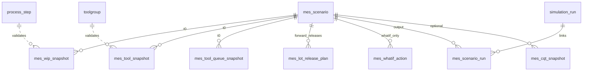

# Task: MES DB 스키마 V2 — REPLAY 폐기, FORWARD / WHAT-IF 전환 (FAB_BEAR)

## 배경 (반드시 읽을 것)

### 확정된 시뮬 목표
1. **FORWARD**: T0 스냅샷 + 마스터 + **T0 이후 신규 Lot release(기존 스케줄링/마스터 기반)** 만 반영하고, **나머지 x분은 FabEnv가 dispatch rule + 가공시간 분포 + PM/BD로 전개**한다.  
   - x분 전체의 TRACK_IN/OUT/툴#/시각을 DB에 넣지 않는다 (넣으면 시뮬 불필요 → 통계만 하면 됨).
2. **WHAT-IF**: FORWARD와 동일한 T0 스냅샷 + 엔진 전개이되, **Agent/운영 대응안(변경분만)** 을 DB에 넣어 override 한다.
3. **Full REPLAY** (MES가 x분 전체 일정을 이미 알고 있는 경우)는 **1차 범위에서 제외**한다.

### ML 비유
- T0 = train에서 본 시점까지의 관측
- T0~T0+x = **시뮬이 생성해야 하는 미래** (test label을 미리 넣지 않음)

### 기존 코드/스키마 (V001 — 수정 대상)
| 경로 | 내용 |
|------|------|
| `simulation/sql/flyway/V001__mes_replay_schema.sql` | REPLAY 중심 `mes_schedule_event`, `mode IN ('REPLAY','REPLAY_WHATIF')` |
| `simulation/models.py` | `MesScenario`, `MesScheduleEvent`, … |
| `docs/MES_REPLAY_SCHEMA.md` | REPLAY 문서 |
| `simulation/load_mes_schedule.py` | schedule CSV bulk load |
| `simulation/sample_csv/mes_schedule_event_template.csv` | TRACK_IN 중심 템플릿 |
| `simulation/fab_env.py` | `FabEnv`, `_build_simulation`, `lot_release` → `_source_process` |
| `simulation/init_db.py` | 마스터만 (변경 최소) |
| 결과 | `simulation_run`, `simulation_log`, `lot_event_log`, `tool_state_log`, `kpi_snapshot` (**유지**) |

### FabEnv 연동 (V2 이후)
```python
# reset(options={"scenario_id": "..."})
# - load mes_scenario (mode=FORWARD|WHATIF)
# - inject mes_wip_snapshot, mes_tool_snapshot, mes_tool_queue_snapshot, mes_cqt_snapshot
# - sim_env.now = t0_sim_minute; sim_end = t0 + horizon_minutes
# - FORWARD: spawn releases from mes_lot_release_plan (T0 이후만), NOT full mes_schedule TRACK_IN grid
# - skip global lot_release table OR filter master lot_release to [t0, t0+x] only
# - WHATIF: apply mes_whatif_action rows before/during run
# - dispatch: existing rule-based _dispatch_for_tool (NOT mes_replay)
```

---

## 설계 원칙

| 원칙 | 설명 |
|------|------|
| T0 스냅샷 = 공통 | `mes_wip_snapshot`, `mes_tool_snapshot`, (선택) queue/cqt |
| 미래 step 타이밍 = 엔진 | `process_step` + 분포 + dispatch rule |
| T0 이후 fab 외부 투입 = 명시 입력 | release 계획만 DB (마스터 `lot_release`의 T0-window projection) |
| WHAT-IF = sparse delta | 전체 스케줄 표 X, `mes_whatif_action` 등 |
| 마스터 테이블 | `init_db` / `toolgroup`, `process_step`, `lot_release`, … **무변경** (시나리오별 release는 별도 테이블 권장) |
| 결과 로그 | 기존 4+log + `mes_scenario_run` **유지** |

---

## 1) 유지 (KEEP) — 컬럼/테이블 거의 그대로

### `mes_scenario`
- **유지**: `scenario_id`, `t0_sim_minute`, `horizon_minutes`, `description`, `source_system`, `mes_extract_batch_id`, `status`, `created_at`, `created_by`, `master_snapshot_hash`, `sim_start_calendar`
- **변경**: `mode` CHECK → `'FORWARD' | 'WHATIF'` only (아래 REMOVE 참고)

### `mes_wip_snapshot`
- **유지** 전체 (T0 WIP 필수)
- **검토 추가** (선택): `product`, `is_super_hot`, `step_payload_json` (큐 permission_event 복원용)

### `mes_tool_snapshot`
- **유지** 전체

### `mes_tool_queue_snapshot`
- **유지** (T0 큐 순서 복원용, 권장)

### `mes_cqt_snapshot`
- **유지** (선택)

### `mes_scenario_run`
- **유지** (`scenario_id` ↔ `simulation_run.run_id`)

### 마스터 + 결과 (건드리지 않음)
- `toolgroup`, `process_step`, `setup_info_final`, `transport_time`, `pm_event`, `breakdown_event`, `lot_release`
- `simulation_run`, `simulation_log`, `lot_event_log`, `tool_state_log`, `kpi_snapshot`, …

---

## 2) 제거 / 축소 (REMOVE or DEPRECATE)

### `mes_scenario.mode`
- **제거 값**: `REPLAY`, `REPLAY_WHATIF`
- **대체**: `FORWARD`, `WHATIF`

### `mes_schedule_event` — REPLAY 중심 설계 **축소 또는 분리**
현재 문제:
- `TRACK_IN` / `TRACK_OUT` / `ARRIVE_QUEUE` 전구간 채우기 = Full REPLAY
- `uq_mes_schedule_track_in` (step당 1 track-in) = replay 전용
- `proc_time_planned`, `scheduled_end_time` = MES 고정 타임라인 (forward 예측과 충돌)

**권장 (택1 — 문서화 필수)**:

| 옵션 | 설명 |
|------|------|
| **A. 테이블 deprecate** | `mes_schedule_event` → rename `mes_forward_input_event` 로 축소 스키마만 남김 |
| **B. 테이블 유지·컬럼 삭제** | TRACK_IN/OUT 관련 unique index 제거, event_kind 축소 |

**제거할 event_kind (V2)**:
- `TRACK_IN`, `TRACK_OUT` — **1차 제거** (forward/what-if 엔진이 생성)
- `TRANSPORT_START` — 제거 (엔진 transport 샘플링)

**제거 또는 nullable-only 컬럼**:
- `proc_time_planned` (forward는 `process_step` 분포)
- `scheduled_end_time` as *planned* (결과는 `simulation_log`에만)
- `is_frozen` on full schedule rows — WHAT-IF 전용 테이블로 이동
- `uq_mes_schedule_track_in` index — **DROP**

**제거할 뷰**:
- `v_schedule_adherence` — REPLAY 전용; **DROP** 또는 WHAT-IF baseline vs run 비교용으로 **재정의** (planned=action intent, not MES full grid)

### 문서/스크립트 deprecate
- `docs/MES_REPLAY_SCHEMA.md` → archive or replace with `MES_FORWARD_WHATIF_SCHEMA.md`
- `sample_csv/mes_schedule_event_template.csv` (TRACK_IN grid) → replace
- `load_mes_schedule.py` → rename/refactor to `load_mes_scenario.py`

### FabEnv (구현 시)
- **`DISPATCH_MODE=mes_replay`** — **구현하지 않음** (V2 non-goal)

### 의도적으로 넣지 않음 (V2)
- `predecessor_event_id`
- Full x-minute MES TRACK_IN/OUT grid
- MES deterministic PM calendar (P2; master stochastic 유지)

---

## 3) 추가 (ADD)

### 3.1 `mes_lot_release_plan` (FORWARD 필수 — T0 이후 신규 투입)

마스터 `lot_release`를 시나리오별로 **T0 이후 [t0, t0+horizon]** 구간만 투영한 계획.

| 컬럼 | 타입 | 설명 |
|------|------|------|
| id | BIGSERIAL PK | |
| scenario_id | FK mes_scenario | |
| source_lot_release_id | INT nullable | 마스터 `lot_release.id` 참조 (추적용) |
| product_name | VARCHAR | |
| route_name | VARCHAR | |
| release_time | FLOAT NOT NULL | **절대 sim 분** (≥ t0) |
| lots_count | INT default 1 | 한 시각에 투입 lot 수 |
| release_interval | FLOAT nullable | 반복 투입 시 간격 |
| lot_name_prefix | VARCHAR nullable | |
| priority | INT | |
| due_date_sim | FLOAT | T0 기준 sliding due (FabEnv `_source_process` 로직과 정합) |
| wafers_per_lot | INT | |
| is_super_hot | BOOLEAN | |
| mes_row_hash | VARCHAR nullable | idempotent |

**인덱스**: `(scenario_id, release_time)`

**FabEnv**: `_source_process` 대신 또는 보조로 `release_time`에 맞춰 `_lot_process` spawn (T0 이전 release는 스냅샷에 이미 반영된 Lot으로 간주).

**채우는 방법**:
- ETL: `lot_release` + `calc_minutes(start_date)` → `release_time >= t0` 필터 → insert
- 또는 MES export “future releases only”

### 3.2 `mes_whatif_action` (WHAT-IF 필수 — 변경분만)

Agent/운영 대응안. **한 행 = 하나의 override**.

| 컬럼 | 타입 | 설명 |
|------|------|------|
| id | BIGSERIAL PK | |
| scenario_id | FK | mode must be WHATIF |
| seq | INT | 적용 순서 |
| action_kind | VARCHAR | 아래 enum |
| effective_time | FLOAT | 절대 sim 분 (≥ t0) |
| lot_id | VARCHAR nullable | |
| route_id | VARCHAR nullable | |
| step_seq | INT nullable | |
| tool_group | VARCHAR nullable | |
| tool_id | VARCHAR nullable | |
| payload_json | JSONB | kind별 파라미터 |
| source | VARCHAR | `AGENT` / `OPERATOR` |
| parent_scenario_id | VARCHAR nullable | FORWARD baseline scenario |

**`action_kind` enum (최소)**:
- `LOT_PRIORITY` — payload: `{"priority": 5}`
- `LOT_HOLD` / `LOT_RELEASE`
- `DISPATCH_RULE_OVERRIDE` — payload: `{"tool_group":"Litho_FE","rule":"FIFO",...}`
- `FORCE_TOOL` — **근접 1-step만** (다음 dispatch 1회만 `tool_id` 고정); full TRACK_IN 아님
- `SKIP_RELEASE` — 특정 `mes_lot_release_plan.id` 취소
- `ADD_RELEASE` — what-if 추가 투입

**금지**: x분 전체 step에 대한 `TRACK_IN` 행 나열 (그건 REPLAY)

### 3.3 `mes_scenario` 추가 컬럼 (권장)

| 컬럼 | 설명 |
|------|------|
| `baseline_scenario_id` | WHAT-IF가 FORWARD run과 diff |
| `trigger_meta` | JSONB: `{"tg":"Litho_FE","snapshot_time":10800,"model":"xgb",...}` |
| `use_master_lot_release` | BOOLEAN default false — true면 ETL 없이 lot_release 필터만 |

### 3.4 (선택 P2) `mes_operating_event`

Hold/Release/Scrap 등 **운영 이벤트만** (툴/가공 스케줄 아님).

| event_kind | 용도 |
|------------|------|
| HOLD, RELEASE | MES 확정 운영 |
| SCRAP, REWORK | MES가 미래에 확정 시 |

Forward에서 없으면 엔진 기본(stochastic rework / CQT scrap).

---

## 4) 변경 (CHANGE)

### `mes_schedule_event` → **`mes_forward_input_event`** (이름 변경 권장)

FORWARD에서만 쓰는 **sparse** 입력:

| event_kind (V2) | 용도 |
|-----------------|------|
| `FAB_ARRIVAL` | fab 최초 진입 (release와 통합 가능 → `mes_lot_release_plan`과 중복 시 하나만) |
| `HOLD`, `RELEASE` | MES 확정 Hold (없으면 `mes_operating_event`로) |

**컬럼 축소**:
- 필수: `scenario_id`, `lot_id`, `route_id`, `event_kind`, `scheduled_time`, `seq`, `mes_row_hash`
- step/tool: Hold/Release에만 필요 시 nullable
- **삭제**: `tool_id` required for all, `proc_time_planned`, `scheduled_end_time` as plan

또는 `mes_schedule_event` 유지하되 **CHECK constraint를 sparse kinds만** 허용.

### `mes_scenario.mode` migration

```sql
-- example
ALTER TABLE mes_scenario DROP CONSTRAINT IF EXISTS ck_mes_scenario_mode;
UPDATE mes_scenario SET mode = 'FORWARD' WHERE mode IN ('REPLAY', 'REPLAY_WHATIF');
ALTER TABLE mes_scenario ADD CONSTRAINT ck_mes_scenario_mode
  CHECK (mode IN ('FORWARD', 'WHATIF'));
```

### Validation rules (V2)

| Rule | FORWARD | WHATIF |
|------|---------|--------|
| `mes_wip_snapshot.snapshot_time = t0` | required | required |
| `mes_lot_release_plan.release_time ∈ [t0, t0+x]` | required if releases | optional |
| `mes_schedule_event` with TRACK_IN | **reject** | **reject** |
| `mes_whatif_action` | empty | ≥1 row |
| `tool_id` in snapshot/queue | exists in toolgroup | same |

---

## 5) FabEnv / Runner 산출물

### 새 runner
- `run_sim_forward_once.py --scenario-id ...` (기존 `run_sim_csv_once.py` 확장 가능)

### env vars
- `SIM_SCENARIO_ID`
- `SIM_MODE=forward|whatif`
- `SIM_END_MINUTES` → override with `t0 + horizon` from scenario

### DB output (기존 유지)
- Run 종료 후 `simulation_run` + logs/KPI
- `mes_scenario_run` insert
- (선택) `mes_scenario_comparison` view: FORWARD run_id vs WHATIF run_id KPI diff

---

## 6) Migration 전략

| 파일 | 내용 |
|------|------|
| `V001__mes_replay_schema.sql` | **frozen** (이미 적용된 환경용) |
| **`V002__mes_forward_whatif.sql`** | mode CHECK, drop track_in unique, new tables, deprecate columns, drop/recreate view |

**데이터 마이그레이션**:
- 기존 `mes_schedule_event` TRACK_IN rows → archive table `_archive_mes_schedule_replay` 또는 delete
- `REPLAY` scenarios → mark `status=DEPRECATED` or delete

---

## 7) ETL / CSV (V2)

### FORWARD bundle
1. `mes_scenario.csv` — 1 row
2. `mes_wip_snapshot.csv`
3. `mes_tool_snapshot.csv` + `mes_tool_queue_snapshot.csv`
4. `mes_lot_release_plan.csv` — **T0 이후 release만**
5. (선택) `mes_cqt_snapshot.csv`

### WHAT-IF bundle
- FORWARD bundle 복사 또는 `baseline_scenario_id` reference
- `mes_whatif_action.csv`

### CLI
```bash
load_mes_scenario.py --scenario-id X --mode FORWARD \
  --wip wip.csv --tools tools.csv --releases releases.csv --t0 10800 --horizon 180
load_mes_scenario.py --scenario-id X_WHATIF --mode WHATIF \
  --baseline X --actions actions.csv
```

---

## 8) ER (V2 target)



---

## 9) 산출물 요청

Please output:

1. **`V002__mes_forward_whatif.sql`** — full DDL (CREATE new, ALTER existing, DROP obsolete indexes/views)
2. **Updated SQLAlchemy models** in `models.py` (rename/deprecate MesScheduleEvent, add MesLotReleasePlan, MesWhatifAction)
3. **`docs/MES_FORWARD_WHATIF_SCHEMA.md`** — replaces REPLAY doc; mode matrix FORWARD vs WHATIF
4. **CSV templates** under `sample_csv/` for wip, tool, releases, whatif_action
5. **Validation SQL** list (10 queries)
6. **Open questions for MES** (releases only export format, Hold list, …)
7. **Explicit non-goals**: mes_replay dispatch, predecessor_event_id, full TRACK_IN grid

---

## 10) Open questions (MES team)

1. T0 이후 **release 목록**만 export 가능한가? (전체 x분 step 스케줄 X)
2. Release 시각: `start_date` 절대 분 vs T0 상대?
3. T0 WIP export에 **큐 순서**·**가공 잔여시간** 포함 여부?
4. Hold/Release가 x분 안에 있으면 **행 목록**으로 주는가?
5. WHAT-IF에서 Agent가 바꿀 수 있는 항목 whitelist (priority / hold / dispatch rule / …)?

---

## 참고: FORWARD에서 Lot release가 필요한 이유

- T0 스냅샷 = **이미 fab 안**인 Lot만 복원.
- **T0 이후 fab 외부에서 새 Lot 투입**은 마스터 `lot_release`(기존 스케줄링)와 동일 메커니즘 — 시뮬이 알아야 WIP·병목이 변함.
- 따라서 FORWARD = 스냅샷 + **`mes_lot_release_plan`** (또는 filtered `lot_release`), **전체 공정 스케줄 표 아님**.
