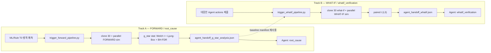

# FabGuard PoC — AI Agent팀용 Trigger 자동화 파이프라인 & handoff JSON 계약

**작성일:** 2026-06-07  
**독자:** AI Agent팀 (`root_cause` / `whatif_verification` / 대응안 제출 Agent 개발자)  
**작성 관점:** Simulation·Trigger 플랫폼 담당 (onboarding 문서)  
**Git SSOT:** [https://github.com/FabBear/Simulation.git](https://github.com/FabBear/Simulation.git) — repo 루트 = `FAB_BEAR` 내용 (`Final_Project/` 상위 폴더에서 push하지 않음)

---

## 1. Executive Summary

Agent팀이 15~25분 안에 기억해야 할 다섯 가지:

1. **Track A (FORWARD / 원인 분석)** — ML/Rule이 T0 병목을 예측하면 **플랫폼**이 `trigger_forward_pipeline.py`를 실행한다. Agent `root_cause`는 **`agent_handoff_g_star_analysis.json`만** 읽고 추론한다. Trigger를 발화하지 않는다.
2. **Track B (WHAT-IF / 대응안 검정)** — 대응안 Agent가 actions 1건을 제출하면 **플랫폼**이 `trigger_whatif_pipeline.py`를 실행한다. Agent `whatif_verification`은 **`agent_handoff_whatif.json`만** 읽는다.
3. **통계는 JSON 인라인 배열이 SSOT** — Track A: `g_star_analysis.g_star_kpi_evidence[]`, Track B: `whatif.whatif_paired_results[]`. CSV 포인터(`evidence_csv`, `summary_csv`, `highlights`)는 **사용하지 않음**.
4. **Monte Carlo N=30 병렬 sim은 Agent가 돌리지 않는다** — replica 30 clone, `--parallel 8`, Welch t / paired t, handoff 생성은 전부 플랫폼 책임. `run_sim_forward_once.py` 1회 호출로 MC를 기대하면 안 된다.
5. **PoC E2E 검증 완료** — Track A: `simulation/out/forward_trigger_T26820/`, Track B: `simulation/out/ml_whatif_mc_e2e/`. 아직 자동이 아닌 gap(ML→Trigger, actions→Trigger, HTTP API)은 **플랫폼 TODO**이며 Agent팀 작업 아님.

---

## 2. 전체 아키텍처

### PoC 상수

| 항목 | 값 |
|------|-----|
| T0 | `26820` sim minute |
| Horizon | `120` min |
| Monte Carlo N | `30` |
| Baseline template id | `FWD_BASE_T26820` |
| What-if template (PoC) | `FWD_WHATIF_T26820_STRONG` |
| Replica pattern | `{template}_R{run:02d}` (예: `FWD_BASE_T26820_R01`) |
| cold-start CSV | `simulation/sim_csv_out/` (루트; **`sim_csv_out/cold_start/` 아님**) |
| cold-start run_id (PoC) | `ece173272af7` |

### Track A / Track B 흐름



**Track A가 검증하는 것:** T0 시점 G* toolgroup 집합에 대해 baseline 대비 forward horizon KPI 변화가 통계적으로 유의한지 (Welch t, Ljung-Box 독립성, BH-FDR on G*×KPI).

**Track B가 검증하는 것:** 대응안(actions) 적용 what-if 시나리오가 baseline 대비 focus scope KPI를 개선했는지 (paired t, 동일 seed 30쌍).

---

## 3. R&R — Agent팀 vs 플랫폼

| 작업 | AI Agent팀 | 플랫폼(Trigger/시뮬) |
|------|:----------:|:-------------------:|
| ML T0 병목 탐지 | ❌ (ML팀/외부) | Trigger 연동 TODO |
| T0 MES snapshot / bundle | ❌ | ✅ |
| scenario replica 30 / clone | ❌ | ✅ |
| 병렬 sim N=30 | ❌ | ✅ |
| 통계 검정 | ❌ | ✅ |
| handoff JSON 생성 | ❌ | ✅ |
| Track B actions 제안 | ✅ | ❌ |
| handoff JSON **해석·추론** | ✅ | ❌ |
| HTTP/API Trigger | ❌ | TODO |

### Agent팀이 하지 않는 것 (안티패턴)

- T0 snapshot, replica 30 clone, sim 실행, stat 실행, handoff JSON 생성을 **직접 호출하지 않는다**.
- `run_sim_forward_once.py`만으로 Monte Carlo N=30 병렬 batch를 **기대하지 않는다** (항상 1 run).
- handoff JSON 외 CSV(`g_star_summary.csv`, `whatif_paired_summary.csv` 등)를 Agent 입력 SSOT로 **사용하지 않는다**.
- Trigger CLI를 Agent 코드에 embed하지 않아도 된다 — **결과 JSON consume만** 하면 된다.

---

## 4. Track A handoff 계약 — `root_cause`

### 파일 식별

| 항목 | 값 |
|------|-----|
| 파일명 | `agent_handoff_g_star_analysis.json` |
| PoC 경로 | `simulation/out/forward_trigger_T26820/agent_handoff_g_star_analysis.json` |
| JSON Schema | `docs/schemas/agent_handoff_g_star_analysis.schema.json` |
| `target_agent` | `"root_cause"` |
| `pipeline` | `"g_star_analysis"` |

### Agent 주 입력 (인라인 배열)

**필드:** `g_star_analysis.g_star_kpi_evidence[]`

- G* toolgroup × KPI 조합별 **25행** (PoC: 5 G* × 5 KPI)
- Agent는 **전체 25행**을 받는다 (`kpi_significant` 여부와 무관). 유의 판정은 `kpi_significant=1` 및 `t_p_adj`로 필터 가능.
- PoC 유의(`kpi_significant=1`) **4건** — 모두 `utilization_avg`:

| toolgroup | kpi | delta_mean | t_p_adj |
|-----------|-----|------------|---------|
| `DE_BE_66` | `utilization_avg` | +0.032 | 0.033 |
| `Dielectric_FE_30` | `utilization_avg` | +0.455 | 0.000302 |
| `EPI_38` | `utilization_avg` | +0.180 | 1.14e-06 |
| `TF_Met_FE_61` | `utilization_avg` | +0.042 | 1.78e-07 |

### evidence 1행 예시

```json
{
  "toolgroup": "Dielectric_FE_30",
  "kpi": "utilization_avg",
  "delta_mean": 0.455,
  "t_p_adj": 0.000302,
  "lb_independent": 1,
  "kpi_significant": 1,
  "status": "ok"
}
```

### 필드 glossary (행 단위)

| 필드 | 의미 |
|------|------|
| `toolgroup` | G* 분석 대상 toolgroup |
| `kpi` | KPI 이름 (`q_time_min`, `wait_ratio`, `wip`, `available_tool_ratio`, `utilization_avg`) |
| `direction` | 검정 방향 (`greater` 등) |
| `n_base`, `n_fwd` | baseline / forward run 수 (PoC 각 30) |
| `mean_base`, `mean_fwd` | baseline / forward 평균 KPI |
| `delta_mean` | `mean_fwd - mean_base` |
| `lb_pvalue`, `lb_independent` | Ljung-Box 독립성 검정 (α=0.01, `lb_independent=1`이면 통과) |
| `t_stat`, `t_p`, `t_p_adj` | Welch t 검정; `t_p_adj`는 G*×KPI BH-FDR 보정 p-value |
| `kpi_significant` | FDR 보정 후 α=0.05 유의 여부 (0/1) |
| `status` | `"ok"` 또는 `"not_in_g_star"` 등 |
| `anchor_tg` | PoC anchor toolgroup (`DE_BE_66`) |

### 상위 메타 (참고)

- `g_star_toolgroups[]` — ML G* 목록 (PoC 5개)
- `monte_carlo.execution_mode` — PoC `"parallel"`, `n_runs: 30`
- `g_star_analysis.multipletest` — `"fdr_bh"`, `fdr_scope: "g_star_x_kpi"`

---

## 5. Track B handoff 계약 — `whatif_verification`

### 파일 식별

| 항목 | 값 |
|------|-----|
| 파일명 | `agent_handoff_whatif.json` |
| PoC 경로 | `simulation/out/ml_whatif_mc_e2e/agent_handoff_whatif.json` |
| JSON Schema | `docs/schemas/agent_handoff_whatif.schema.json` |
| `target_agent` | `"whatif_verification"` |
| `pipeline` | `"whatif"` |

### Agent 주 입력 (인라인 배열)

**필드:** `whatif.whatif_paired_results[]`

- scope × KPI별 paired t 결과 (`D_i = whatif_i - baseline_i`, 동일 seed 30쌍)
- PoC focus scope: `Diffusion_FE_120#1`, KPI `q_len` — `mean_delta=-10`, `paired_t_p=0`, `verdict=improved`
- **`highlights` / `summary_csv` / `evidence_csv` — 사용하지 않음 (폐기)**

### paired 1행 예시

```json
{
  "scope": "Diffusion_FE_120#1",
  "kpi_name": "q_len",
  "paired_n": 30,
  "mean_delta": -10.0,
  "paired_t_p": 0.0,
  "verdict": "improved"
}
```

### 필드 glossary (행 단위)

| 필드 | 의미 |
|------|------|
| `level` | 집계 레벨 (PoC `"TOOL"`, 상위 `whatif.level`: `"L3"`) |
| `scope` | tool scope (예: `Diffusion_FE_120#1`) |
| `kpi_name` | KPI 이름 |
| `paired_n` | paired run 수 (PoC 30) |
| `mean_delta` | 30쌍 delta 평균 (whatif − baseline) |
| `ci_lo`, `ci_hi` | delta 신뢰구간 |
| `paired_t_p` | paired t 검정 p-value |
| `verdict` | `"improved"` / `"worsened"` / `"unchanged"` |
| `nonzero_delta` | delta ≠ 0인 run 존재 여부 (0/1) |

### 상위 메타 (참고)

- `whatif.baseline_scenario_id` — `FWD_BASE_T26820`
- `whatif.whatif_scenario_id` — `FWD_WHATIF_T26820_STRONG`
- `whatif.baseline_reused_from` — baseline sim **재실행 없이** 기존 manifest 재사용
- `monte_carlo.execution_mode` — PoC `"parallel"`, what-if replica `FWD_WHATIF_T26820_STRONG_R{run:02d}`

---

## 6. 실행 SSOT — Trigger CLI (플랫폼 참고 / Agent팀 복붙 검증용)

작업 디렉터리: `FAB_BEAR/simulation` (아래 명령은 `cd simulation` 후 실행).

**Track A:**

```bash
cd simulation
.venv/bin/python tools/trigger_forward_pipeline.py \
  --sim-csv-dir sim_csv_out \
  --run-id ece173272af7 \
  --t0 26820 --horizon 120 \
  --scenario-id FWD_BASE_T26820 \
  --g-star-file sample_csv/g_star_T26820.json \
  --baseline-csv-dir sim_csv_out \
  --n-runs 30 --parallel 8 \
  --out-dir out/forward_trigger_T26820
```

**Track B** (Track A manifest 재사용):

```bash
.venv/bin/python tools/trigger_whatif_pipeline.py \
  --baseline-scenario-id FWD_BASE_T26820 \
  --baseline-bundle-dir scenario_out/FWD_BASE_T26820 \
  --reuse-baseline-manifest out/forward_trigger_T26820/runs_manifest.csv \
  --whatif-scenario-id FWD_WHATIF_T26820_STRONG \
  --whatif-actions scenario_out/_templates/mes_whatif_action_strong_t26820.csv \
  --t0 26820 --horizon 120 \
  --focus-scopes "Diffusion_FE_120#1" \
  --n-runs 30 --parallel 8 \
  --out-dir out/whatif_trigger_strong
```

**단일 진입점 SSOT:**

| Track | 스크립트 |
|-------|----------|
| A | `tools/trigger_forward_pipeline.py` |
| B | `tools/trigger_whatif_pipeline.py` |
| MC batch (내부) | `tools/run_monte_carlo_batch.py` |

계약 상세: `docs/TRIGGER_CONTRACT.md`, 통계 정의: `docs/REPORT_STAT_PIPELINE_AB_20260605.md`.

---

## 7. E2E 검증 결과

### Track A — `out/forward_trigger_T26820/`

| 항목 | 결과 |
|------|------|
| `runs_manifest.csv` | **30/30** `status=ok`, scenario `FWD_BASE_T26820_R01` … `_R30` |
| handoff | `agent_handoff_g_star_analysis.json` (`generated_at`: 2026-06-07) |
| `g_star_kpi_evidence` | 25행, `kpi_significant=1` **4건** (§4 표) |
| `monte_carlo` | `n_runs=30`, `execution_mode=parallel` |
| anchor | `DE_BE_66`, G* 5 toolgroups |

### Track B — `out/ml_whatif_mc_e2e/`

| 항목 | 결과 |
|------|------|
| baseline | `runs_manifest.csv` 30/30 ok — `ml_propagation_e2e` baseline **재사용** (sim 재실행 없음) |
| what-if sim | `whatif_runs/run_01` … `run_30`, replica `FWD_WHATIF_T26820_STRONG_R01` … `_R30` |
| `paired_manifest.csv` | 30 seed-aligned baseline↔what-if 쌍 |
| handoff | `agent_handoff_whatif.json` |
| `whatif_paired_results` | focus `Diffusion_FE_120#1` / `q_len`: `verdict=improved`, `paired_t_p=0` |
| `monte_carlo` | `n_runs=30`, `execution_mode=parallel` |

---

## 8. FAQ / Troubleshooting

### 병렬 vs 직렬 — Agent팀이 sim을 직접 돌릴 필요 없음

| 실행 경로 | 동작 |
|-----------|------|
| `run_sim_forward_once.py` 1회 | 항상 **1 run**, batch 아님 |
| `run_stat_batch` + **단일** `scenario_id` | `_effective_parallel` → **parallel=1 강제**, N회 **직렬** |
| `trigger_*_pipeline` / `run_monte_carlo_batch` + **replica suffix** | **병렬 MC** (PoC `--parallel 8`) |

**올바른 MC 진입점:** `trigger_forward_pipeline.py` 또는 `trigger_whatif_pipeline.py` (또는 replica suffix가 있는 `run_monte_carlo_batch.py`). Agent는 결과 handoff JSON만 consume.

### `sim_csv_out/cold_start/` 경로 오류

cold-start CSV는 **`simulation/sim_csv_out/`** 루트에 있다. `--sim-csv-dir sim_csv_out/cold_start`는 **잘못된 경로**이며 `lot_events.csv` missing 오류가 난다. PoC cold-start `--run-id`는 **`ece173272af7`** (forward run id와 혼동 금지).

### 단일 scenario_id + parallel 실패

template 1개(`FWD_BASE_T26820`)에 `--parallel 8`만 주고 replica clone 없이 stat/sim을 돌리면 guard에 의해 **직렬** 또는 status 오류가 난다. MC는 **clone → `_R01.._R30`** 패턴 필수.

### `Final_Project` vs `FAB_BEAR` repo push

Git remote SSOT는 **`FAB_BEAR/`** 디렉터리 (`Simulation.git`). `Final_Project/`에서 push하면 submodule gitlink(160000)로만 올라가 실제 파일이 반영되지 않는다.

### CLI 붙여넣기 실수

- `<run_id>` placeholder → zsh redirection 오류
- `...` 생략 → `--g-star-file`, `--out-dir` 누락
- heredoc / 여러 줄 한 번에 붙여넣기 → zsh parse error. **한 줄씩** 복사 권장.

---

## 9. gap & 다음 단계

### 아직 자동이 아닌 gap (플랫폼 TODO — Agent팀 작업 아님)

| gap | 현재 상태 |
|-----|-----------|
| ML T0 → `trigger_forward_pipeline` | 수동 CLI |
| Agent actions JSON → `trigger_whatif_pipeline` | 수동 `--whatif-actions` CSV + CLI |
| REST/API wrapper | 미구현 |

### API 연동 시 Agent팀이 제공할 입력 스켈레톤 (제안)

**Track B actions (대응안 Agent → 플랫폼):**

```json
{
  "t0_sim_minute": 26820,
  "horizon_minutes": 120,
  "baseline_scenario_id": "FWD_BASE_T26820",
  "whatif_scenario_id": "FWD_WHATIF_T26820_STRONG",
  "focus_scopes": ["Diffusion_FE_120#1"],
  "actions": [
    {
      "action_type": "mes_override",
      "target_scope": "Diffusion_FE_120#1",
      "parameter": "q_len",
      "delta": -10
    }
  ],
  "monte_carlo": {
    "n_runs": 30,
    "parallel": 8
  }
}
```

**Track A trigger 요청 (ML → 플랫폼, 제안):**

```json
{
  "t0_sim_minute": 26820,
  "horizon_minutes": 120,
  "cold_start_run_id": "ece173272af7",
  "scenario_id": "FWD_BASE_T26820",
  "g_star_toolgroups": ["DE_BE_66", "DefMEt_FE_118", "Dielectric_FE_30", "EPI_38", "TF_Met_FE_61"],
  "monte_carlo": {
    "n_runs": 30,
    "parallel": 8
  }
}
```

플랫폼은 위 입력을 받아 기존 Trigger CLI 체인을 호출하고, Agent팀에는 §4·§5 handoff JSON만 전달하면 된다.

---

## 참고 SSOT 목록

| 문서/파일 | 용도 |
|-----------|------|
| `docs/TRIGGER_CONTRACT.md` | Trigger ↔ Engine, status machine, MC appendix, E2E 진입점 |
| `docs/REPORT_STAT_PIPELINE_AB_20260605.md` | Track A/B 통계 정의, N=30, G*, paired t |
| `docs/schemas/agent_handoff_g_star_analysis.schema.json` | Track A handoff 스키마 |
| `docs/schemas/agent_handoff_whatif.schema.json` | Track B handoff 스키마 |
| `simulation/tools/trigger_forward_pipeline.py` | Track A 단일 진입점 |
| `simulation/tools/trigger_whatif_pipeline.py` | Track B 단일 진입점 |
| `simulation/tools/run_monte_carlo_batch.py` | clone + 병렬 sim + stat |

---

*문서 버전: 2026-06-07 · Agent팀 onboarding · Trigger E2E + handoff JSON SSOT*
