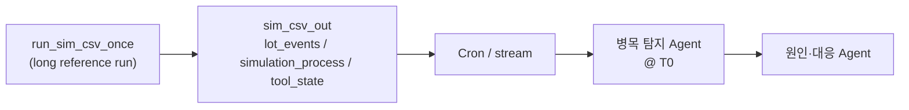
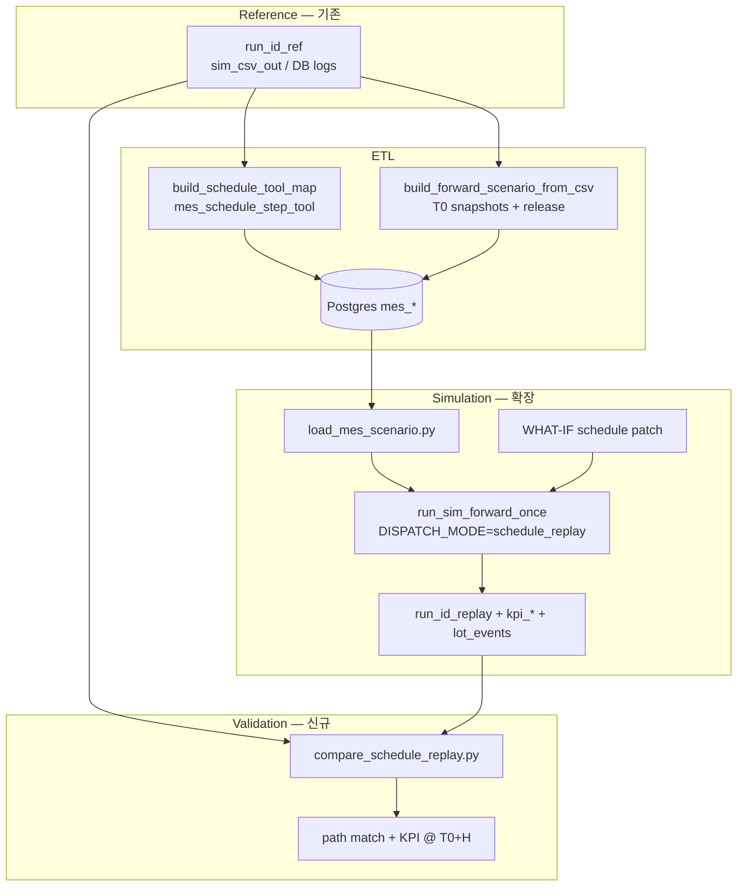

# Schedule Tool-Path Replay — FORWARD / WHAT-IF 기술 보고서

> **PoC direction (2026-05):** **Policy FORWARD + WHAT-IF** (`mes_whatif_action`, plan/snapshot diff, `compare_whatif.py`) is the **primary** path for baseline vs counterfactual KPI comparison. Schedule replay (`DISPATCH_MODE=schedule_replay`, `mes_schedule_event`) remains a **non-goal** for the current PoC; see [MES_WHATIF_ACTION.md](./MES_WHATIF_ACTION.md).

| 항목 | 내용 |
|------|------|
| 문서 번호 | FAB_BEAR-REP-SCHED-REPLAY-001 |
| 프로젝트 | FabGuard PoC — 병목 baseline 재현 및 대응안 시뮬레이션 |
| 관련 문서 | [PROMPT_IMPLEMENT_SCHEDULE_REPLAY.md](./PROMPT_IMPLEMENT_SCHEDULE_REPLAY.md), [REPORT_FORWARD_T0_FROM_CSV.md](./REPORT_FORWARD_T0_FROM_CSV.md), [MES_FORWARD_WHATIF_SCHEMA.md](./MES_FORWARD_WHATIF_SCHEMA.md), [FORWARD_WHATIF_ENGINE.md](./FORWARD_WHATIF_ENGINE.md) |
| SSOT 코드 (현재) | `build_forward_scenario_from_csv.py`, `load_mes_scenario.py`, `run_sim_forward_once.py`, `fab_env.py` |
| SSOT 코드 (예정) | `build_schedule_tool_map.py`, `compare_schedule_replay.py`, `mes_schedule_step_tool` |
| 작성 기준일 | 2026-05-26 |
| 상태 | **설계·구현 예정** (본 문서는 목표 아키텍처 SSOT) |

---

## 1. Executive Summary

FabGuard PoC에서는 cold-start 시뮬(`run_sim_csv_once`) 결과를 **스케줄링·실적 궤적**으로 활용하고, 병목 탐지 시각 **T0**에서 **H분(예: 2시간) 후 fab 상태**를 시뮬레이션으로 확인해야 한다.

**현재** `run_sim_forward_once` FORWARD는 T0 스냅샷 + `mes_lot_release_plan` + **dispatch 규칙(정책 시뮬)** 로 동작한다. 원 reference run의 **step별 Tool 배정**을 따르지 않아, baseline 검증·원인 분석에 **경로/KPI 괴리**가 생길 수 있다.

**제안**하는 다음 단계는 reference 로그에서 **`schedule_tool_map`** `(lot_id, step_seq) → tool_id` 를 추출하고, FabEnv **`DISPATCH_MODE=schedule_replay`** 로 tool 경로를 고정한 채 H분을 전개하는 것이다. WHAT-IF에서는 동일 map에 **Tool 재배치 patch**만 적용해 대응안 효과를 비교한다.

| 구분 | 정책 FORWARD (현재) | Schedule replay (목표) |
|------|---------------------|-------------------------|
| Tool 선택 | TG wakeup + ranking + CR | Ref run **tool pin** (fallback: rule) |
| 시간 축 | SimPy·분포·큐가 결정 | 동일 (1단계 non-goal: 절대 시각 리플레이 아님) |
| Baseline 용도 | “T0에서 규칙으로 H분 후” | **“Ref 스케줄 경로로 H분 후”** |
| WHAT-IF | `FORCE_TOOL` 등 sparse action | **Schedule patch** (step별 tool 변경) |

**핵심 결론 (설계)**

1. Reference CSV/DB(`simulation_process`, `lot_events`)에서 **투입·완료 시각 없이** step별 `tool_id` 만 추출한다.
2. 기존 T0 번들(`mes_wip` / `mes_tool` / `mes_queue` / `mes_lot_release_plan`)과 **병행** 적재한다.
3. `fab_env` 는 **옵션 모드**로 확장하여 cold-start·정책 FORWARD 회귀를 유지한다.
4. PoC 검증은 **path match rate** + **KPI @ T0+H** 로 ref run과 비교한다.

---

## 2. 배경 및 문제 정의

### 2.1 운영·Agent 파이프라인 (현재)



운영 관점에서 `lot_events`·`simulation_process` 는 **“각 lot이 각 step에서 어느 TG의 어느 Tool을 썼는지”** 를 담은 **스케줄링 표에 가깝다**.

### 2.2 병목 시나리오에서 필요한 질문

| 질문 | 정책 FORWARD로 답 가능? | Schedule replay로 답 |
|------|-------------------------|---------------------|
| T0 그대로 H분 후 fab KPI는? | △ (규칙·RNG에 따라 drift) | ◎ (tool 경로 정합) |
| Ref run과 같은 tool로 갔을 때 병목이 유지되는가? | △ | ◎ |
| Tool 재배치 대응안 시 KPI 변화는? | △ (`FORCE_TOOL` 일부만) | ◎ (patch table) |

### 2.3 기존 FORWARD PoC와의 관계

[REPORT_FORWARD_T0_FROM_CSV.md](./REPORT_FORWARD_T0_FROM_CSV.md) 에서 검증한 내용:

- T0 스냅샷 3종 + `mes_lot_release_plan` → runner **실행 가능**
- `use_master_lot_release=false` → master Excel 투입 **비활성**, horizon 구간 ARRIVAL만 반영

**본 보고서는 그 위에 “경로 레이어”를 추가**한다. T0·release ETL은 **재사용**한다.

### 2.4 왜 정책 시뮬만으로는 부족한가

FabEnv dispatch ([SMT2020_DISPATCH.md](./SMT2020_DISPATCH.md)):

- Queue: superhot → priority → least setup → critical ratio (+ TG `ranking_1/2/3`)
- Tool 선택: `tool_wakeup_ranking` (shortest queue, idle first, …)
- 불확실성: `proc_time` / BM / PM 분포 샘플링

동일 T0·동일 release plan이라도 **인접 시각 KPI는 자기상관**이 크고, **tool·queue 선택은 ref와 독립적으로 재샘플**된다. 따라서 “원 스케줄 2시간 후” baseline 으로 쓰기 어렵다.

---

## 3. 목표 · 비목표

### 3.1 목표 (G1–G5)

| ID | 목표 |
|----|------|
| G1 | `run_id_ref`, (T0, T0+H] 에서 `schedule_tool_map` ETL |
| G2 | `mes_schedule_step_tool` + 기존 `mes_*` DB 적재 |
| G3 | `DISPATCH_MODE=schedule_replay` — map hit 시 tool 고정, miss 시 rule fallback |
| G4 | FORWARD replay run ↔ ref run **경로·KPI 비교** 리포트 |
| G5 | WHAT-IF **schedule patch** → baseline replay 대비 diff |

### 3.2 비목표

| 항목 | 설명 |
|------|------|
| 절대 시각 리플레이 | ARRIVAL/FINISH 시각을 map에 넣지 않음; SimPy가 duration·큐 결정 |
| TRACK_IN/OUT 전체 그리드 | MES V2 non-goal과 동일 |
| Bit-identical KPI | queue·BM·batch로 완전 일치 불필요 |
| Cold-start 동작 변경 | `schedule_replay` OFF 시 **현행 100%** |

### 3.3 Locked 설계 결정

| ID | 결정 |
|----|------|
| L1 | Grain: `(scenario_id, lot_id, step_seq) → tool_id` |
| L2 | 소스 우선순위: `simulation_process` > `lot_events` (RUN/FINISH) |
| L3 | Lot 집합: T0 WIP (현재 step 이후) ∪ `(T0,T0+H]` release lot |
| L4 | `use_master_lot_release = false` 유지 |
| L5 | Inject 순서: tool → queue → wip → cqt → whatif → release |
| L6 | 1단계: `_choose_tool_for_lot` 만 pin; queue 순서는 rule 유지 가능 |

---

## 4. 목표 아키텍처



### 4.1 모드 매트릭스

| mode | schedule_replay | schedule patch | 질문 |
|------|-----------------|----------------|------|
| FORWARD (현재) | OFF | — | T0 + rule로 H분 후? |
| **FORWARD (목표)** | **ON** | — | Ref tool 경로로 H분 후? |
| WHAT-IF (현재) | OFF | `mes_whatif_action` | sparse override |
| **WHAT-IF (목표)** | **ON** | **patch rows** | Tool 재배치 효과? |

---

## 5. 데이터 모델

### 5.1 `mes_schedule_step_tool` (신규 제안)

| 컬럼 | 설명 |
|------|------|
| `scenario_id` | FK → `mes_scenario` |
| `source_run_id` | reference `run_id_ref` |
| `lot_id`, `route_id`, `step_seq` | grain |
| `tool_id`, `tool_group` | `TG#k` / 파생 TG명 |
| `source` | `simulation_process` \| `lot_events` |
| `mes_row_hash` | optional |

**Unique**: `(scenario_id, lot_id, step_seq)`.

DDL 후보: `simulation/sql/flyway/V004__mes_schedule_step_tool.sql`  
(V1 `mes_schedule_event` 는 [MES_REPLAY_SCHEMA.md](./MES_REPLAY_SCHEMA.md) 참고 — 본 설계는 step grain으로 단순화)

### 5.2 WHAT-IF patch (신규 제안)

| 방식 | 설명 |
|------|------|
| A | `mes_schedule_step_tool_override` (baseline scenario FK + patch rows) |
| B | `mes_whatif_action.action_kind = SCHEDULE_TOOL_OVERRIDE` + `payload_json` |

엔진 우선순위: **patch > baseline map > dispatch rule**.

### 5.3 기존 테이블 (재사용)

| 테이블 | 역할 (변경 없음) |
|--------|------------------|
| `mes_scenario` | T0, H, mode, `use_master_lot_release=false` |
| `mes_wip_snapshot` | T0 fab lot |
| `mes_tool_snapshot` | T0 장비 상태 |
| `mes_tool_queue_snapshot` | T0 queue |
| `mes_lot_release_plan` | (T0, T0+H] 신규 lot 투입 |

---

## 6. `schedule_tool_map` 추출

### 6.1 입력 소스

| 소스 | schedule | T0 snapshot |
|------|----------|-------------|
| `simulation_process.csv` | **Primary** — step 완료 시 `tool_id` | — |
| `lot_events.csv` | **Secondary** — RUN/FINISH 보강 | ARRIVAL |
| `tool_state.csv` | — | `mes_tool_snapshot` |
| `kpi_toolgroup.csv` | — | 병목 T0·비교 |

### 6.2 Active lot 집합

```text
WIP_SET     = mes_wip_snapshot @ T0
RELEASE_SET = mes_lot_release_plan (release_time ∈ (T0, T0+H])
ACTIVE_LOTS = WIP_SET ∪ RELEASE_SET
```

- **WIP**: `step_seq >= current_step_seq` 만 map
- **Release**: ref run에서 관측된 step 범위; 미관측 시 rule fallback

### 6.3 필터 (simulation_process)

```text
run_id = run_id_ref
AND end_time > T0 AND start_time <= T0 + H
AND lot_id ∈ ACTIVE_LOTS
→ (lot_id, step_seq) → tool_id
```

`lot_events` 보강: `(T0, T0+H]`, `RUN`/`FINISH`, map 미존재 step만. 충돌 시 **process 우선**.

### 6.4 의도적 제외

- `start_time`, `end_time` (map에 미포함)
- Queue position (T0만 `mes_tool_queue_snapshot`)
- Dispatch rule 문자열 (마스터 / WHAT-IF 별도)

---

## 7. FabEnv · Runner 확장

### 7.1 `DISPATCH_MODE=schedule_replay`

| 항목 | 내용 |
|------|------|
| 진입점 | `_choose_tool_for_lot` |
| 동작 | `(lot, step_seq)` map hit → 지정 `tool_id` (LTL·setup 검사) |
| Miss | 기존 wakeup + ranking rule |
| 회귀 | mode 미설정 또는 `rule` → **현행과 동일** |

환경 변수 예:

```bash
export DISPATCH_MODE=schedule_replay
export SIM_SCENARIO_ID=<scenario_id>
```

### 7.2 Fallback · 충돌

| 조건 | 동작 |
|------|------|
| Map 없음 | Rule dispatch |
| Tool DOWN / setup 불가 | `validation_report` warning + rule fallback |
| LTL lock vs map | **LTL 우선** (Locked) |
| T0 queue vs map tool | T0 queue inject 우선; 이후 step부터 map |

### 7.3 `run_sim_forward_once.py`

- 변경: scenario load 시 schedule table 읽기 트리거, `DISPATCH_MODE` env 전달
- 불변: `VALIDATED` only, status `RUNNING` → `DONE`, CSV 출력 경로

---

## 8. 검증 전략

### 8.1 ETL 검증

- Active lot 존재 시 schedule row count > 0
- WIP: `current_step_seq` 미만 step 없음
- Release-only lot without process → warning

### 8.2 Replay run 검증

- `schedule_replay` FORWARD 완료, `mes_scenario.status = DONE`
- `sim_env.now ≈ horizon` at terminate

### 8.3 Ref vs replay 비교 (PoC 목표 — 조정 가능)

| 메트릭 | 설명 | PoC 목표 (예) |
|--------|------|----------------|
| **Path match rate** | (T0,T0+H] process step 중 `tool_id` 일치율 | ≥ 85% (non-batch TG) |
| **TG KPI 방향** | 병목 TG `q_time_min` @ T0+H 부호 | 정성 일치 |
| **Release count** | horizon ARRIVAL 수 | ±10% |

도구: `tools/compare_schedule_replay.py` → JSON/MD 리포트.

### 8.4 WHAT-IF 검증

- Patch 1건 적용 시 해당 step replay `tool_id` = patch 값
- `compare_whatif.py` / `kpi_whatif_diff` 에 delta

---

## 9. 구현 로드맵

| Phase | 내용 | 산출 | 기간 (1인 추정) |
|-------|------|------|----------------|
| **P0** | `build_schedule_tool_map.py` | CSV + confidence | 3–5일 |
| **P1** | DDL + `load_mes_scenario --schedule` | DB | 2–3일 |
| **P2** | `fab_env` schedule_replay + unit test | 엔진 | 5–8일 |
| **P3** | E2E pipeline script | run_id_replay | 2–3일 |
| **P4** | `compare_schedule_replay.py` | 리포트 | 2–3일 |
| **P5** | WHAT-IF patch + diff | Agent 대응안 | 5–10일 |

**합계 (P0–P4)**: 약 **2–3주** · **P5 포함**: **3–5주**

### 9.1 파일 체크리스트

| 파일 | 상태 |
|------|------|
| `tools/build_schedule_tool_map.py` | 예정 |
| `tools/compare_schedule_replay.py` | 예정 |
| `sql/flyway/V004__mes_schedule_step_tool.sql` | 예정 |
| `models.py` — `MesScheduleStepTool` | 예정 |
| `load_mes_scenario.py` — `--schedule` | 예정 |
| `fab_env.py` — schedule_replay | 예정 |
| `run_sim_forward_once.py` — env | 예정 |
| `tests/test_schedule_replay_smoke.py` | 예정 |

---

## 10. End-to-end 운영 시나리오

```text
1. ML/Agent: run_id_ref, T0(병목), H=120 결정
2. build_forward_scenario_from_csv  → scenario_out/ (T0 bundle)
3. build_schedule_tool_map         → mes_schedule_step_tool.csv
4. load_mes_scenario (snapshots + releases + schedule)
5. promote_scenario_validated
6. DISPATCH_MODE=schedule_replay run_sim_forward_once  → run_id_replay
7. compare_schedule_replay(ref, replay)  → report
8. (Optional) Agent tool patch → WHATIF scenario → 6–7 diff
```

---

## 11. 리스크 및 완화

| 리스크 | 영향 | 완화 |
|--------|------|------|
| Batch step 다lot | map 단일 tool 모호 | leader tool 기준; 문서화 |
| Ref end in-flight | process row 없음 | T0 `processing_remaining_min` + rule |
| Tool DOWN @ replay | map tool 사용 불가 | fallback + report |
| Map vs T0 queue 불일치 | 첫 dispatch 어긋남 | T0 queue 우선; 이후 map |
| 정책 FORWARD와 혼동 | 잘못된 baseline | mode·문서·리포트에 **replay** 명시 |
| Partial DB load | stale schedule | `load_mes_scenario` 4-table + schedule 일괄 load |

---

## 12. 기존 PoC와의 차이 (요약 표)

| 레이어 | FORWARD T0 CSV PoC (완료) | Schedule replay (본 보고서) |
|--------|---------------------------|-----------------------------|
| T0 상태 | `mes_wip/tool/queue` | **동일** |
| 신규 lot | `mes_lot_release_plan` | **동일** |
| Step→Tool | dispatch **규칙** | ref **`schedule_tool_map`** |
| 검증 | schema OK, run 완료 | **path match vs ref** |
| WHAT-IF | `FORCE_TOOL`, hold, … | **+ schedule patch** |

---

## 13. 결론 및 권고

1. **문제 인식은 타당**하다. Cron·Agent가 쓰는 cold-start 로그는 사실상 스케줄 궤적이며, 병목 후 H분 baseline은 **tool 경로 재현**이 필요하다.
2. **현재 FORWARD는 그 baseline이 아니다.** 정책 시뮬은 “대응안·규칙 실험”에 적합하고, ref 대비 검증에는 **schedule replay** 가 필요하다.
3. **구현은 가능**하며 `fab_env` **옵션 모드**로 넣으면 기존 시뮬 로직을 망가뜨리지 않고 확장할 수 있다.
4. **1단계는 tool pin만** (시간·queue 순서 제외)으로 PoC하고, path match·KPI로 수용 기준을 맞춘 뒤 WHAT-IF patch를 붙이는 것을 권고한다.

구현 SSOT: [PROMPT_IMPLEMENT_SCHEDULE_REPLAY.md](./PROMPT_IMPLEMENT_SCHEDULE_REPLAY.md)

---

## 부록 A. 용어집

| 용어 | 정의 |
|------|------|
| Reference run | `run_sim_csv_once` 등 장기 cold-start run |
| Policy FORWARD | T0 + release + dispatch rule |
| Schedule replay | T0 + release + **schedule_tool_map** tool pin |
| schedule_tool_map | `(lot_id, step_seq) → tool_id` |
| H | `horizon_minutes` (예: 120) |

## 부록 B. 관련 명령 (예정)

```bash
# T0 bundle (기존)
.venv/bin/python tools/build_forward_scenario_from_csv.py \
  --run-id <ref> --t0 620 --horizon 120 --scenario-id FWD_REPLAY_f5178_T620 \
  --sim-csv-dir ./sim_csv_out --out ./scenario_out/FWD_REPLAY_f5178_T620

# Schedule map (신규)
.venv/bin/python tools/build_schedule_tool_map.py \
  --run-id <ref> --t0 620 --horizon 120 --scenario-id FWD_REPLAY_f5178_T620 \
  --sim-csv-dir ./sim_csv_out \
  --wip-csv ./scenario_out/FWD_REPLAY_f5178_T620/mes_wip_snapshot.csv \
  --releases-csv ./scenario_out/FWD_REPLAY_f5178_T620/mes_lot_release_plan.csv

# Load + run (신규 env)
.venv/bin/python load_mes_scenario.py ... --schedule ./scenario_out/.../mes_schedule_step_tool.csv
.venv/bin/python tools/promote_scenario_validated.py --scenario-id FWD_REPLAY_f5178_T620
DISPATCH_MODE=schedule_replay .venv/bin/python run_sim_forward_once.py --scenario-id FWD_REPLAY_f5178_T620

# Compare (신규)
.venv/bin/python tools/compare_schedule_replay.py \
  --ref-run-id <ref> --replay-csv-dir <replay_out> --t0 620 --horizon 120
```

---

*End of report.*
