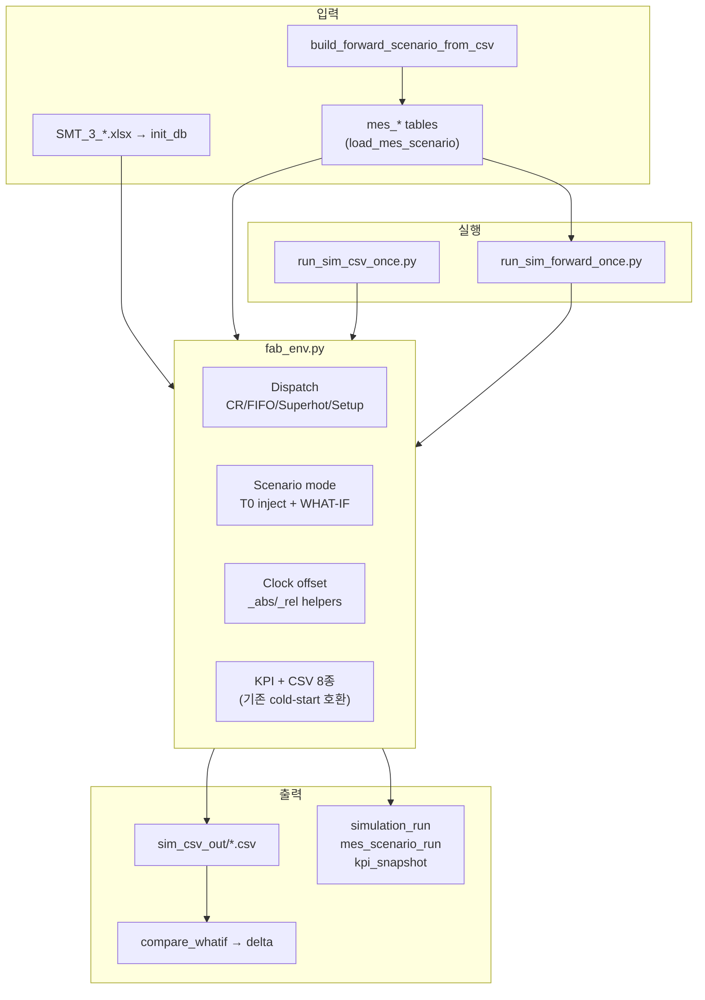

# FAB_BEAR 시뮬레이션 엔진·Runner 수정 기술 보고서

| 항목 | 내용 |
|------|------|
| 문서 번호 | FAB_BEAR-REP-SIM-MOD-001 |
| 보안 등급 | **대외비** |
| 프로젝트 | FabGuard PoC — FORWARD / WHAT-IF 시뮬레이션 |
| SSOT 코드 | `simulation/fab_env.py`, `run_sim_forward_once.py`, `load_mes_scenario.py`, `tools/*` |
| Git 기준 | `e4b7e45` (FORWARD T0 pipeline), `ea9615e` (WHAT-IF P0/P1) |
| 작성 기준일 | 2026-05-30 |
| 선행 문서 | [SMT2020_SIM_PATCHES.md](./SMT2020_SIM_PATCHES.md), [SMT2020_DISPATCH.md](./SMT2020_DISPATCH.md), [FORWARD_WHATIF_ENGINE.md](./FORWARD_WHATIF_ENGINE.md), [REPORT_FORWARD_T0_FROM_CSV.md](./REPORT_FORWARD_T0_FROM_CSV.md) |
| E2E 증빙 | `simulation/e2e_reports/E2E_T26820_20260530.md`, `E2E_T26820_STRONG_20260530.md` |

---

## 목차

1. [Executive Summary](#1-executive-summary)
2. [변경 범위 개요](#2-변경-범위-개요)
3. [Dispatch 엔진 (CR / FIFO / Superhot)](#3-dispatch-엔진-cr--fifo--superhot)
4. [SMT2020 정합성 패치 (P0~P5)](#4-smt2020-정합성-패치-p0p5)
5. [FORWARD / WHAT-IF 엔진 확장](#5-forward--what-if-엔진-확장)
6. [`run_sim_forward_once.py`](#6-run_sim_forward_oncepy)
7. [주변 파이프라인 (ETL · Tools)](#7-주변-파이프라인-etl--tools)
8. [검증 결과](#8-검증-결과)
9. [미구현·향후 과제](#9-미구현향후-과제)
10. [부록 — 주요 파일·환경변수](#10-부록--주요파일환경변수)

---

## 1. Executive Summary

FabGuard PoC에서 `FAB_BEAR/simulation`은 **cold-start Gym 시뮬**에서 **MES T0 스냅샷 기반 FORWARD/WHAT-IF 시뮬**로 확장되었다. 동시에 SMT2020 데이터셋에 맞춰 **dispatch 규칙(CR, FIFO, Superhot, Setupavoidance, Tool wakeup ranking)** 을 `fab_env.py`에 반영했다.

| 축 | 변경 전 (초기) | 변경 후 (현재 PoC) |
|----|----------------|-------------------|
| 실행 진입점 | `run_sim_csv_once.py` (0분 cold start) | **`run_sim_forward_once.py`** (DB `mes_scenario` 기반) |
| 시간축 | SimPy `now` = 절대 fab 분 | T0 offset: **`sim_env.now` 상대, 로그/KPI 절대** |
| Dispatch | 단순 rule | **TG Ranking 1/2/3 + CR + Superhot + Setupavoidance** |
| What-if | 스텁 / in-memory API | **`mes_whatif_action` DB 주입 + 8 action kind** |
| Agent 연동 | 없음 | **TRIGGER_CONTRACT** (DB DRAFT→VALIDATED→RUN) |

**핵심 결론**

1. **Dispatch 엔진**: SMT2020 `DISPATCHING` / `TOOL WAKE UP Ranking` 컬럼을 파싱해 queue dispatch·tool 선택에 반영. CR은 `(due − now) / rem_steps`로 **FIFO 다음 tie-break**에 항상 포함.
2. **FORWARD runner**: T0 snapshot 4종 + `mes_lot_release_plan`으로 H분 전개. cold-start와 **동일 FabEnv·동일 CSV 8종** 산출.
3. **WHAT-IF**: baseline 대비 action override(`LOT_HOLD`, `DISPATCH_RULE_OVERRIDE`, `REQUEUE_TOOL` 등)가 **lot_events·KPI에 실제 diff** 발생함을 strong E2E로 확인.
4. **Python 코어**: PoC 범위 내 **기능·파이프라인 정상**. Agent API(FastAPI)는 별도 레이어로 추가 예정.

---

## 2. 변경 범위 개요



| 레이어 | 수정 여부 | 비고 |
|--------|-----------|------|
| `fab_env.py` | **대폭** | P0~P5 패치 + scenario inject + what-if hooks |
| `run_sim_forward_once.py` | **신규** | FORWARD/WHAT-IF 전용 runner |
| `run_sim_csv_once.py` | 유지 | ML 데이터·회귀용 cold start |
| `load_mes_scenario.py` | **확장** | V2 schema, validate-only |
| `tools/build_forward_scenario_from_csv.py` | **신규** | ref CSV → T0 scenario |
| `tools/compare_whatif.py` | **확장** | baseline vs what-if KPI diff |
| FastAPI `main_api.py` | **미연동** | Gym/RL·Twin UI용 (별 트랙) |

---

## 3. Dispatch 엔진 (CR / FIFO / Superhot)

SSOT: [`SMT2020_DISPATCH.md`](./SMT2020_DISPATCH.md), `fab_env._select_dispatch_candidate`, `_choose_tool_for_lot`, `_parse_dispatch_flags`.

### 3.1 Queue 내 lot 선택 (`_select_dispatch_candidate`)

한 tool queue에서 **다음 dispatch lot**을 고를 때 적용 순서:

| 순위 | 규칙 | 구현 |
|------|------|------|
| 0 | WHAT-IF `FORCE_TOOL` | 해당 physical tool queue에서 lot **jump** |
| 1 | `hold_lots` / Setupavoidance | 후보 제외 |
| 2 | **Superhotlot** | queue에 super_hot lot 있으면 **그 subset만** 후보 (RUN 선점 없음) |
| 3 | TG **Ranking 1/2/3** | Excel: `Highest Lotpriority`, `Least Setuptime`, **`FIFO`** (`enqueue_time`) |
| 4 | **CR (Critical Ratio)** | ranking 뒤 **항상** 적용: `(due_date − now) / rem_steps` — **작을수록 급함** |
| 5 | Tie-break | queue index `idx` |

Ranking 컬럼이 **전부 비어 있을 때** 기본 순서:

```text
superhot → priority(↓) → setup_time → FIFO(enqueue_time) → CR → idx
```

코어 정렬 키 (요약):

```python
# fab_env._select_dispatch_candidate — ranked tuple
(super_hot_key, -priority, setup_time, enqueue_time, cr, idx)
```

WHAT-IF `DISPATCH_RULE_OVERRIDE`는 `_parse_dispatch_flags`에서 TG별 rule string을 **런타임 override**:

```python
# 예: "superhotlot setupavoidance"
{
  "setup_avoidance": "setupavoidance" in rule,
  "superhot_enabled": "superhotlot" in rule,
}
```

### 3.2 CR 정의

```python
def _critical_ratio(self, due_date, rem_steps):
    remain_time = max(1.0, due_date - self.sim_env.now)
    return remain_time / max(1.0, float(rem_steps))
```

- **시나리오 모드**에서 `due_date`는 ingest 시 `_abs_to_rel()`로 **상대 시각** 변환 후 비교.
- RL observation에도 CR 급박 여부(`cr < 1.0`) feature 포함 — Gym/PPO 트랙과 공유.

### 3.3 Tool 선택 vs Queue dispatch (구분)

| 함수 | 역할 | Ranking 소스 |
|------|------|--------------|
| `_choose_tool_for_lot` | lot이 **어느 #Tool에 enqueue**할지 | `TOOL WAKE UP Ranking`: Shortest Queue, Least Setuptime, Idle First + suffix |
| `_select_dispatch_candidate` | 이미 queue에 있는 lot **dispatch 순서** | TG `DISPATCHING` Ranking 1/2/3 + CR |

→ **FIFO/CR은 queue dispatch**. Tool wakeup은 **장비 선택**에만 적용 (SMT2020 의미와 일치).

### 3.4 Setupavoidance

- `DISPATCHING`에 `Setupavoidance` 포함 시 `min_run_length` 미충족 setup 변경 lot은 dispatch 후보에서 제외.
- `Setups` 테이블 `MINMAL NUMBER OF RUNS`와 `SetupManager.min_run_len()` 연동.

---

## 4. SMT2020 정합성 패치 (P0~P5)

상세: [`SMT2020_SIM_PATCHES.md`](./SMT2020_SIM_PATCHES.md).

| ID | 내용 | 대표 함수/필드 |
|----|------|----------------|
| **P0** | CQT 구간 타이머 (anchor→target) | `_start_cqt_timer`, `_end_cqt_timer`, `cqt_anchor_step` |
| **P1** | PM piece counter, FOA stagger | `_pm_piece_count`, tool_index 기반 PM 분산 |
| **P2** | TOOL WAKE UP Ranking | `_tool_wakeup_sort_tuple`, `_choose_tool_for_lot` |
| **P3/P4** | DISPATCHING + Superhot 4b | `_parse_dispatch_flags`, `_select_dispatch_candidate` |
| **P5** | Lotrelease sliding due | Engineering xlsx **import 제외** |

**의도적 제외:** Superhot RUN 선점(4c), Implant_Gas setup matrix, schedule replay.

---

## 5. FORWARD / WHAT-IF 엔진 확장

상세: [`FORWARD_WHATIF_ENGINE.md`](./FORWARD_WHATIF_ENGINE.md), [`TRIGGER_CONTRACT.md`](./TRIGGER_CONTRACT.md).

### 5.1 시계 (Locked decision §1)

| 개념 | 프레임 |
|------|--------|
| `sim_env.now` | `0 .. horizon` (SimPy 상대) |
| `_sim_clock_offset` | `t0_sim_minute` (절대) |
| `_sim_now_abs()` | 모든 log/KPI timestamp |
| DB 입력 (`due_date_sim`, `release_time`, …) | 절대 → `_abs_to_rel()` on ingest |

Cold start(`offset=0`) 동작은 **기존과 bit-equivalent**.

### 5.2 `reset(options={"scenario_id": ...})`

| Step | 동작 |
|------|------|
| 1 | `MesScenario` 로드, horizon·offset 설정 |
| 2 | `_skip_master_lot_release` — FORWARD/WHATIF는 master spawn **기본 skip** |
| 3 | `_build_simulation()` — master route/tool/PM/BD |
| 4 | `_apply_scenario_overrides()` — T0 inject + what-if + release plan |
| 5 | `VALIDATED → RUNNING`, `mes_scenario_run` 생성 |

### 5.3 T0 스냅샷 inject (`_apply_scenario_overrides`)

순서 (중요):

1. `_inject_t0_tools` — setup, `op_state`, DOWN_PM/BM hold
2. `_inject_t0_queues` — queue order seed (**WIP보다 먼저**)
3. `_inject_t0_wip` — PROCESSING resume / QUEUING spawn / HOLD → `hold_lots`
4. `_inject_t0_cqt`
5. (WHATIF) `_load_whatif_actions`
6. `_spawn_lot_release_plan` — `mes_lot_release_plan` → `_source_process`

`validation_report`에 `missing_tools`, `missing_routes`, `warnings`, `action_errors`, `unknown_actions` 수집.

### 5.4 WHAT-IF action kinds (P0 + P1)

| kind | 효과 | Phase |
|------|------|-------|
| `LOT_HOLD` / `LOT_RELEASE` | `hold_lots` | P0 |
| `LOT_PRIORITY` | active + queue payload priority | P0 |
| `DISPATCH_RULE_OVERRIDE` | TG dispatch rule string override | P0 |
| `FORCE_TOOL` | tool pin + queue jump (`once`) | P0 |
| `SKIP_RELEASE` / `ADD_RELEASE` | release plan 조정 | P0 |
| **`SET_SUPER_HOT`** | super_hot flag → dispatch ranking | **P1** |
| **`REQUEUE_TOOL`** | 동일 TG 내 다른 #Tool queue로 이동 | **P1** |

`FORCE_TOOL` vs `REQUEUE_TOOL` 가이드: [`MES_WHATIF_ACTION.md`](./MES_WHATIF_ACTION.md).

### 5.5 종료

`finalize_mes_scenario_run()` → `mes_scenario.status = DONE`, `validation_report` persist.

---

## 6. `run_sim_forward_once.py`

**역할:** DB에 `VALIDATED` 상태로 올라온 `mes_scenario` 1건을 FabEnv 1 episode로 실행.

### 6.1 주요 동작

| 항목 | 내용 |
|------|------|
| Preconditions | `status == VALIDATED` 아니면 **exit 1** (Trigger/operator 승격 필수) |
| Horizon | `SIM_END_MINUTES = scenario.horizon_minutes` (cold-start default override) |
| Scenario binding | `env.reset(options={"scenario_id": ...})`, `SIM_SCENARIO_ID` env fallback |
| Dispatch | 기본 `DISPATCH_MODE=rule`; `--rl` + PPO optional |
| Loop | `gym.step(0)` (rule) 또는 `model.predict` (rl) until terminated or `--max-steps` |
| Post | `finalize_mes_scenario_run()`, run summary stdout |

### 6.2 cold-start runner와 차이

| | `run_sim_csv_once.py` | `run_sim_forward_once.py` |
|--|----------------------|---------------------------|
| 입력 | master DB only | **`mes_scenario` + snapshots** |
| T0 | 0 | **`t0_sim_minute`** |
| Release | master `lot_release` | **`mes_lot_release_plan`** |
| What-if | 없음 | **`mes_whatif_action`** |
| 용도 | ML 학습 CSV, 장기 run | **Agent/FORWARD PoC** |

### 6.3 실행 예

```bash
cd FAB_BEAR/simulation

# Trigger가 VALIDATED 승격 후:
.venv/bin/python run_sim_forward_once.py \
  --scenario-id FWD_WHATIF_T26820_STRONG \
  --csv-dir ./sim_csv_out/fwd_whatif_t26820_strong \
  --max-steps 50000
```

---

## 7. 주변 파이프라인 (ETL · Tools)

| 도구 | 역할 |
|------|------|
| `tools/build_forward_scenario_from_csv.py` | ref run CSV → T0 4 snapshot + release plan CSV |
| `load_mes_scenario.py` | CSV → Postgres `mes_*`, status=`DRAFT` |
| `tools/promote_scenario.py` | `DRAFT → VALIDATED` |
| `tools/make_whatif_scenario_bundle.py` | baseline 복제 + what-if action/plan patch |
| `tools/compare_whatif.py` | baseline vs what-if KPI @ T0+H → delta CSV/DB |
| `tools/debug_whatif_healthcheck.py` | action smoke check |

T0 역추정 상세: [`REPORT_FORWARD_T0_FROM_CSV.md`](./REPORT_FORWARD_T0_FROM_CSV.md).

---

## 8. 검증 결과

### 8.1 단위·회귀 테스트

```bash
cd FAB_BEAR/simulation
.venv/bin/python -m pytest tests/ -q   # 15+ passed @ ea9615e
```

| 테스트 파일 | 검증 대상 |
|-------------|-----------|
| `test_tool_wakeup_and_superhot.py` | wakeup ranking, superhot dispatch |
| `test_whatif_set_super_hot.py` | SET_SUPER_HOT → ranking |
| `test_whatif_requeue_tool.py` | REQUEUE_TOOL queue 이동 |
| `test_scenario_forward_smoke.py` | scenario forward smoke |
| `test_compare_whatif.py` | compare tool |
| `test_cqt_interval.py`, `test_pm_counter_foa.py` | P0/P1 패치 |

### 8.2 E2E @ T0=26820

| Run | 시나리오 | run_id | compare delta |
|-----|----------|--------|---------------|
| Baseline | `FWD_BASE_T26820` | `38c1e997140c` | — |
| Weak what-if | `FWD_WHATIF_T26820` (5 actions) | `97c10baa6271` | **0 / 14529** (파이프라인 OK, action 효과 미약) |
| **Strong what-if** | `FWD_WHATIF_T26820_STRONG` (98 actions) | `36d68ea2e525` | **8 / 14529** + **205 lot_events diff** |

Strong what-if에서 확인된 action outcome:

- `Lot_Product_4_520` **LOT_HOLD** → baseline LOADING @26821, what-if **0 events**
- Dispatch path **Diffusion_FE_120#2 → #5** 이동
- `Diffusion_FE_120#1` q_len 457→447, `#5` q_len 0→39, utilization 0→1

리포트: `simulation/e2e_reports/E2E_T26820_*.md`.

---

## 9. 미구현·향후 과제

| 항목 | 상태 |
|------|------|
| Agent / FastAPI (MES scenario lifecycle) | **설계만** (`TRIGGER_CONTRACT`) |
| Spring facade ↔ 새 runner | 기존 gym API contract, **FORWARD 미연동** |
| Schedule replay | **비목표** (policy: WHAT-IF primary) |
| PPO 실운영 dispatch | 실험 (`DISPATCH_MODE=rl`) |
| `MODIFY_RELEASE`, P2 CR-first override | **제외** (WHAT-IF P0/P1 scope) |
| ref run bit-identical 재현 | **비목표** |
| KPI diff ≠ 0 (약한 action + 짧은 H) | action 강도·horizon 조정 필요 |

**Agent 연동 권장:** 기존 Gym FastAPI가 아닌 **`load → promote → run_sim_forward_once → compare`** 를 감싼 **scenario API** + OpenAPI contract.

---

## 10. 부록 — 주요 파일·환경변수

### 10.1 파일 맵

```
simulation/
├── fab_env.py                 # SimPy engine + Gym + scenario/what-if
├── run_sim_forward_once.py    # FORWARD/WHAT-IF runner
├── run_sim_csv_once.py        # cold-start runner
├── load_mes_scenario.py       # CSV → mes_*
├── models.py                  # MesScenario, MesWhatifAction, ...
├── tools/
│   ├── build_forward_scenario_from_csv.py
│   ├── compare_whatif.py
│   ├── make_whatif_scenario_bundle.py
│   └── promote_scenario.py
├── e2e_reports/               # T0=26820 E2E 증빙
└── tests/                     # pytest
```

### 10.2 환경변수 (runner)

| 변수 | 기본 | FORWARD run 시 |
|------|------|----------------|
| `SIM_SCENARIO_ID` | — | scenario id (optional fallback) |
| `SIM_CSV_DIR` | `./sim_csv_out` | CSV 출력 dir |
| `SIM_END_MINUTES` | 200000 | **scenario.horizon으로 override** |
| `SIM_CSV_MAX_STEPS` | 200000 | `--max-steps` safety cap |
| `DISPATCH_MODE` | `rule` | `rl` + PPO optional |
| `KPI_INSTANT_PERIOD_MIN` | 60 | KPI cadence |

### 10.3 상태 전이

```text
DRAFT ──(load_mes_scenario)──► DRAFT
DRAFT ──(promote_scenario)───► VALIDATED
VALIDATED ──(run_sim_forward_once reset)──► RUNNING
RUNNING ──(finalize_mes_scenario_run)──► DONE
```

---

## Verdict

| 영역 | PoC 상태 |
|------|----------|
| CR / FIFO / Superhot dispatch | **구현·문서화·테스트 완료** |
| SMT2020 P0~P5 패치 | **적용** (일부 gap 명시적 제외) |
| FORWARD T0 → H분 전개 | **E2E PASS** |
| WHAT-IF action injection | **E2E PASS (strong run에서 outcome 검증)** |
| `run_sim_forward_once.py` | **운영 runner로 사용 가능** |
| Agent HTTP 연동 | **다음 단계** (Python 코어는 준비됨) |

**Overall:** 시뮬레이션 **Python 코어 및 runner 수정은 PoC 목적 달성**. 팀 Agent와의 연동은 동일 계약을 **FastAPI scenario facade**로 노출하면 된다.
