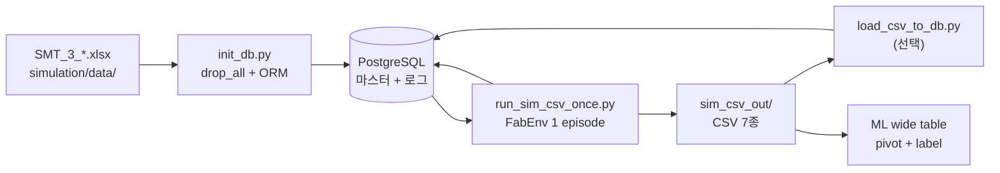
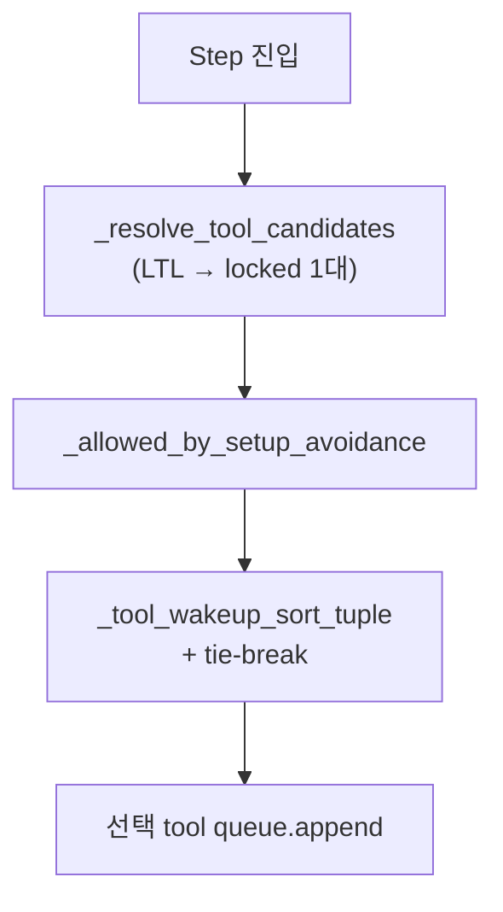
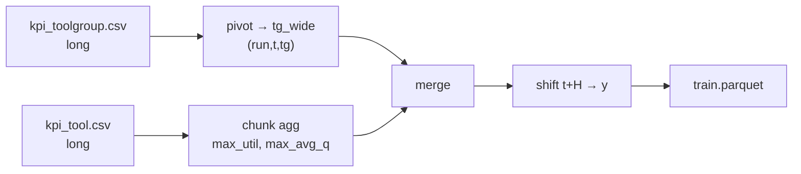

# FAB_BEAR 시뮬레이션·KPI 파이프라인 기술 보고서

| 항목 | 내용 |
|------|------|
| 문서 번호 | FAB_BEAR-REP-001 |
| 프로젝트 | FabGuard PoC — 공정 병목 대응 AI Agent |
| 대상 독자 | SKALA 3기 2팀, FabGuard PoC 이해관계자 |
| 보안 등급 | 대외비 |
| SSOT 코드 | `FAB_BEAR/simulation/fab_env.py`, `models.py` |
| 작성 기준일 | 2026-05-20 |

---

## 목차

1. [Executive Summary](#1-executive-summary)
2. [시뮬레이션 아키텍처](#2-시뮬레이션-아키텍처)
3. [Raw 로그 CSV 3종](#3-raw-로그-csv-3종)
4. [KPI CSV 4종](#4-kpi-csv-4종)
5. [SMT2020 데이터셋 반영 현황](#5-smt2020-데이터셋-반영-현황)
6. [Tool 배정·Queue 동작](#6-tool-배정queue-동작)
7. [FabGuard ML·병목 라벨링 설계](#7-fabguard-ml병목-라벨링-설계)
8. [운영·검증 가이드](#8-운영검증-가이드)
9. [부록](#9-부록)
10. [검증 체크리스트](#10-검증-체크리스트)

---

## 1. Executive Summary

### 1.1 FabGuard PoC에서 FabEnv의 역할

FabGuard PoC는 반도체 FAB에서 **병목 위험 Tool Group을 조기에 식별**하고, 원인 분석·대응안 제시까지 이어지는 **Agentic AI**를 목표로 합니다.  
`FAB_BEAR`는 그중 **배치 시뮬레이션(SimPy FabEnv)** 과 **로그·KPI CSV 생성**을 담당하는 Python 전용 프로젝트입니다.

| 역할 | 설명 |
|------|------|
| **합성 Fab 데이터** | SMT2020(H) 기반 엑셀 마스터 → Postgres → FabEnv 1회 실행 |
| **이벤트 로그** | Lot·스텝·장비 상태의 시계열 raw CSV |
| **KPI 스냅샷** | FAB / Process / ToolGroup / Tool 4레벨 지표 (long-format) |
| **ML 라벨 oracle** | 규칙 기반 weak label (TG scope, t → t+60분 예측) |

프론트 Digital Twin(`fab-dashboard`), K8s, PPO 학습, what-if 실행기는 **본 프로젝트 범위 밖**이거나 스텁 단계입니다.

### 1.2 생성물 8종 CSV

| # | 파일 | grain (한 행) | DB 테이블 |
|---|------|---------------|-----------|
| 1 | `simulation_process.csv` | Lot·스텝 처리 완료 1건 | `simulation_log` |
| 2 | `lot_events.csv` | Lot 이벤트 1건 | `lot_event_log` |
| 3 | `lot_release_ledger.csv` | Lot **release 시 1회** (due·priority·…) | `lot_release_ledger` |
| 4 | `tool_state.csv` | ToolGroup 또는 unit 상태 변화 1건 | `tool_state_log` |
| 5 | `kpi_fab.csv` | FAB × 시각 × KPI 1개 | `kpi_snapshot` |
| 6 | `kpi_process.csv` | Process × 시각 × KPI 1개 | `kpi_snapshot` |
| 7 | `kpi_toolgroup.csv` | ToolGroup × 시각 × KPI 1개 | `kpi_snapshot` |
| 8 | `kpi_tool.csv` | Tool × 시각 × KPI 1개 | `kpi_snapshot` |

**Agent T0 CR:** `CR(lot, T0) = (due_date_sim_min - T0) / rem_steps` — `due_date_sim_min`은 `lot_release_ledger` (신규 release lot), `rem_steps`는 T0 `mes_wip_snapshot` join (`lot_id`).

### 1.3 장기 run 실측 (`sim_csv_out`)

**출처:** `FAB_BEAR/simulation/sim_csv_out/` (단일 에피소드)

| 항목 | 값 |
|------|-----|
| `run_id` | `3e11c2ef42da` |
| 시뮬 시계 | `snapshot_time` **60 ~ 305,160** (분) |
| instant 스냅샷 수 | **5,086** (`KPI_INSTANT_PERIOD_MIN=60` 가정 시 일치) |
| Tool 수 (`kpi_tool` scope) | **1,535** |
| ToolGroup 수 (`kpi_toolgroup` scope) | **106** |

| 파일 | 데이터 행 수 | 파일 크기 |
|------|-------------|-----------|
| `kpi_fab.csv` | 25,854 | 1.9 MB |
| `kpi_process.csv` | 366,192 | 34 MB |
| `kpi_toolgroup.csv` | 3,234,696 | 207 MB |
| `kpi_tool.csv` | **70,263,090** | **5.2 GB** |
| `lot_events.csv` | 3,175,318 | 372 MB |
| `simulation_process.csv` | 1,533,186 | 275 MB |
| `tool_state.csv` | 6,068,980 | 493 MB |
| **합계** | **84,667,316** | **~6.5 GB** |

행 수 검증: `5,086 × 1,535 × 9 = 70,263,090` (`kpi_tool`) · `5,086 × 106 × 6 = 3,234,696` (`kpi_toolgroup`).

### 1.4 핵심 설계 결정

1. **KPI는 raw 이벤트 CSV와 분리** — 시간축·grain 충돌 방지, `kpi_snapshot` / KPI CSV 4파일.
2. **long-format 저장, 분석 시 wide pivot** — `(run_id, snapshot_time, scope)` 기준.
3. **FabGuard 병목 ML의 scope = Tool Group** — 행 단위 TG, pooled 모델 + Top-K ranking.
4. **`kpi_tool`은 raw 5GB보다 TG 집계(`max_util`, `max_avg_q_time`)가 실무 핵심** — 라벨·1차 학습은 `kpi_toolgroup` 중심.
5. **RTF는 납기 준수율** (`on_time / due_due`), 누적 완료율은 `completion_rate`로 분리.

---

## 2. 시뮬레이션 아키텍처

### 2.1 파이프라인 개요



### 2.2 실행 경로

```bash
cd FAB_BEAR
docker compose up -d db          # Postgres only

cd simulation
.venv/bin/python init_db.py      # 엑셀 → DB, ORM 테이블 생성 (drop_all)

export SIM_CSV_DIR=./sim_csv_out
export SIM_END_MINUTES=1500000   # 예: 장기 run
export KPI_INSTANT_PERIOD_MIN=60
export DISPATCH_MODE=rule

.venv/bin/python run_sim_csv_once.py \
  --csv-dir ./sim_csv_out \
  --end-minutes 1500000 \
  --max-steps 1500000
```

| 단계 | 스크립트 | 비고 |
|------|----------|------|
| DB 기동 | `docker compose up -d db` | `.env`의 `POSTGRES_*` |
| 마스터 적재 | `init_db.py` | **전용 DB 권장** (`drop_all` 포함) |
| 시뮬 1회 | `run_sim_csv_once.py` | CSV + (연결 시) DB 동시 기록 |
| CSV → DB | `load_csv_to_db.py` | 배치 적재, `--truncate-run` 옵션 |

환경 변수 로드: `simulation/database.py` → `FAB_BEAR/.env` → 상위 `Final_Project/.env`.

### 2.3 FabEnv 실행 루프

| 개념 | 설명 |
|------|------|
| **SimPy 시계** | 분(minute) 단위, `sim_env.now` |
| **Gym `step()`** | 디스패치 1회 + `_resume_simulation()` (최대 ~1분 진행) |
| **종료 조건** | `sim_env.now >= SIM_END_MINUTES` **또는** `steps >= --max-steps` |
| **`reset()`** | DB에서 route/tool/lotrelease 읽기, `run_id` 12자 hex 발급 |

```329:345:FAB_BEAR/simulation/fab_env.py
    def step(self, action):
        ...
        self._resume_simulation()
        ...
        terminated = self.sim_env.now >= self.sim_end_minutes
        return self._get_observation(), reward, terminated, False, {}
```

**주의:** `--max-steps`와 `--end-minutes`를 **둘 다 크게** 맞춰야 합니다. `end-minutes`만 작으면 step 상한에 도달하기 전에 시뮬 시계에서 종료됩니다.  
장기 run 실측은 **시뮬 305,160분**에서 종료된 것으로 보이며(5,086 스냅샷), 1,500,000분 설정이었다면 **다른 요인(조기 terminated 등)** 은 터미널 로그로 별도 확인이 필요합니다.

### 2.4 디스패치 모드

| `DISPATCH_MODE` | 동작 |
|-----------------|------|
| `rule` (기본) | 규칙 디스패치 + `_choose_tool_for_lot` |
| `rl` | PPO `model.predict` → queue 인덱스 (`--rl --model`) |

PoC·KPI·라벨 데이터 생성은 **`rule` 권장**.

### 2.5 FAB_BEAR vs Simulation

`FAB_BEAR/simulation/fab_env.py`와 `Simulation/SMT_2000_Simulation/fab_env.py`는 **diff 약 12줄** — 핵심 시뮬·KPI 로직 동일, **에이전트 디버그 로그 경로** 등만 상이합니다.  
`FAB_BEAR`는 프론트/K8s/PPO logs 제외한 **배치 파이프라인 분리본**입니다.

---

## 3. Raw 로그 CSV 3종

### 3.1 공통 규칙

- 모든 CSV에 **`run_id`** (에피소드 키).
- DB insert 실패 시 **조용히 skip** 가능 → CSV만 쌓이는 경우 있음.
- `SIM_CSV_DIR` 미설정 시 CSV 미기록.

### 3.2 `simulation_process.csv`

| 항목 | 내용 |
|------|------|
| **grain** | Lot이 한 route step을 **처리 완료**한 1건 |
| **주요 컬럼** | `lot_id`, `route_id`, `step_seq`, `step_name`, `tool_group`, `tool_id`, `arrive_time`, `start_time`, `end_time`, `queue_time`, `process_time` |
| **DB** | `simulation_log` |

### 3.3 `lot_events.csv`

| 항목 | 내용 |
|------|------|
| **grain** | Lot **이벤트** 1건 (`ARRIVAL`, `LOADING`, `FINISH`, `REWORK`, `CQT_*`, `SCRAP`, …) |
| **주요 컬럼** | `event_type`, `event_time`, `detail_1`, `detail_2` |
| **DB** | `lot_event_log` |
| **용도** | 지연 원인·배치·CQT 타임라인 추적 |

### 3.4 `tool_state.csv`

| 항목 | 내용 |
|------|------|
| **grain** | ToolGroup **또는** unit(`tool_id`)의 상태 **변화** 1건 |
| **상태** | `IDLE`, `RUN`, `SETUP`, `DOWN_PM`, `DOWN_BM` |
| **unit 행** | `tool_id` 채움 (예: `Litho_FE#3`) — BM/PM/RUN이 **어느 #k**인지 추적 |
| **집계 행** | `tool_id` 빈 문자열 + `idle_units`, `run_units`, … |
| **DB** | `tool_state_log` |

**왜 unit + aggregate 병행?**  
`lot_events`는 `tool_id`가 있으나, 초기 구현은 TG 집계만 기록해 **unit별 DOWN/RUN 추적 불가**였음. 현재는 둘 다 기록.

---

## 4. KPI CSV 4종

### 4.1 공통 long-format 스키마

```153:162:FAB_BEAR/simulation/fab_env.py
_SIM_CSV_KPI_FIELDS = (
    "run_id", "snapshot_time", "scope", "kpi_name", "value",
    "window_minutes", "numerator", "denominator", "meta",
)
_KPI_CSV_BY_LEVEL = {
    "FAB": "kpi_fab.csv",
    "PROCESS": "kpi_process.csv",
    "TOOLGROUP": "kpi_toolgroup.csv",
    "TOOL": "kpi_tool.csv",
}
```

| 컬럼 | 설명 |
|------|------|
| `run_id` | 에피소드 ID |
| `snapshot_time` | 시뮬 시계(분) |
| `scope` | **파일마다 의미 상이** (아래 표) |
| `kpi_name` | 지표 이름 |
| `value` | 계산값 |
| `window_minutes` | 윈도우 KPI만 (예: 60, 1440) |
| `numerator` / `denominator` | 감사·재계산용 |
| `meta` | JSON (선택) |

DB `level`은 CSV에 없고 **파일명**으로 결정 (`load_csv_to_db.py`).

#### `scope` 의미 (파일별)

| 파일 | `scope` 값 | 예시 |
|------|------------|------|
| `kpi_fab.csv` | 전 FAB | `*` |
| `kpi_process.csv` | 공정(area)명 | (DB process 키) |
| `kpi_toolgroup.csv` | ToolGroup명 | `Planar_FE_76` |
| `kpi_tool.csv` | **Tool ID** | `DE_BE_11#3` (**`*` 아님**) |

### 4.2 Cadence (환경변수)

```mermaid
gantt
    title KPI emit 타임라인 (기본 env, 개념도)
    dateFormat X
    axisFormat %s분

    section instant_60
    FAB_PROCESS_TG_TOOL instant :a1, 60, 120
    instant repeat :a2, 120, 305160

    section util_60
    util OEE all levels :b1, 60, 305160

    section tat_60
    FAB tat_min :c1, 60, 305160

    section tput_1440
    FAB throughput_24h :d1, 1440, 305160
```



| 변수 | 기본 | 역할 |
|------|------|------|
| `KPI_INSTANT_PERIOD_MIN` | 60 | 순간 KPI 주기 |
| `KPI_UTIL_WINDOW_MIN` | 60 | util·OEE lookback·emit |
| `KPI_TAT_WINDOW_MIN` | 60 | FAB `tat_min` |
| `KPI_THROUGHPUT_WINDOW_MIN` | 1440 | FAB `throughput_24h` |

- **t=0 스냅샷 없음.**
- `instant_p` due 시 → 4레벨 **순간 KPI 동시** emit (`_emit_all_kpis`, L1781–1785).
- `util_w` due 시 → 4레벨 **윈도우 util·OEE** emit.

루프 진입: `_kpi_snapshot_loop` → `_emit_all_kpis` (`fab_env.py` L1763–1797).

### 4.3 `kpi_fab.csv` — FAB 전체 (7 KPI)

| kpi_name | 유형 | window | 정의 |
|----------|------|--------|------|
| `rtf` | 순간 | — | **납기 준수율**: `due_date ≤ t` lot 중 `finish_time ≤ due_date` 비율 |
| `completion_rate` | 순간 | — | 누적 route 완료 / 누적 릴리즈 |
| `q_time_min` | 순간 | — | 전 fab queue 평균 대기(분) |
| `wip` | 순간 | — | waiting + processing lot 수 |
| `utilization` | 윈도우 | 60 | 전 tool RUN 시간 / (window × N_tool) |
| `tat_min` | 윈도우 | 60 | 윈도우 내 완료 lot 평균 TAT |
| `throughput_24h` | 윈도우 | 1440 | 윈도우 내 완료 lot 수 |

#### RTF vs completion_rate

```1799:1823:FAB_BEAR/simulation/fab_env.py
    def _emit_fab_kpis_instant(self, t_now):
        ...
        rtf_value = (on_time / due_due) if due_due > 0 else 0.0
        ...
        completion_rate = (finished / released) if released > 0 else 0.0
```

| | `rtf` | `completion_rate` |
|--|-------|-------------------|
| 질문 | 납기 도래 lot 중 정시 완료? | 지금까지 몇 % 완료? |
| 분모 | due 도래 lot | 릴리즈 lot |
| 초반 | `due_due=0` → 0 | 릴리즈 대비 완료율 |

### 4.4 `kpi_process.csv` — 공정 (6 KPI)

| kpi_name | 유형 | window |
|----------|------|--------|
| `wip` | 순간 | — |
| `q_time_min` | 순간 | — |
| `utilization` | 윈도우 | 60 |
| `performance` | 윈도우 | 60 |
| `quality` | 윈도우 | 60 |
| `oee_estimate` | 윈도우 | 60 |

`oee_estimate = utilization × min(performance, 1) × quality` (finish/standard/rework/scrap deque 기반).

### 4.5 `kpi_toolgroup.csv` — Tool Group (6 KPI)

| kpi_name | 유형 | window | 정의 |
|----------|------|--------|------|
| `available_tool_ratio` | 순간 | — | IDLE/RUN/SETUP tool 수 / 그룹 tool 수 |
| `wip` | 순간 | — | waiting + processing (그룹 합) |
| `q_time_min` | 순간 | — | 그룹 전체 queue lot의 평균 대기(분) |
| `wait_ratio` | 순간 | — | `waiting / max(1, 가용_tool_수)` |
| `utilization_avg` | 윈도우 | 60 | unit별 RUN/window 비율의 **산술평균** |
| `setup_ratio_avg` | 윈도우 | 60 | unit별 SETUP/window 비율의 산술평균 |

#### utilization 지표 비교 (혼동 주의)

| 지표 | 레벨 | 측정 |
|------|------|------|
| FAB `utilization` | FAB | 시간 가동 (전 tool 합) |
| TG `available_tool_ratio` | TG | **스냅샷** 가용 **대수** 비율 |
| TG `utilization_avg` | TG | unit util의 **평균** (avg-of-avgs) |
| Tool `utilization` | Tool | 해당 unit RUN/window |

### 4.6 `kpi_tool.csv` — 개별 Tool (9 KPI)

| kpi_name | 유형 | window | 정의 |
|----------|------|--------|------|
| `q_len` | 순간 | — | queue **건수** |
| `processing_count` | 순간 | — | SimPy `resource.count` (동시 가공 lot 수; capacity=1 → 0/1) |
| `avg_q_time` | 순간 | — | **해당 tool** queue 평균 대기(분) |
| `utilization` | 윈도우 | 60 | RUN / window |
| `setup_ratio` | 윈도우 | 60 | SETUP / window |
| `down_ratio` | 윈도우 | 60 | (DOWN_PM + DOWN_BM) / window |
| `performance` | 윈도우 | 60 | Σstd / Σactual |
| `quality` | 윈도우 | 60 | (finish − rework − scrap) / finish |
| `oee_estimate` | 윈도우 | 60 | util × min(perf,1) × quality |

**이름 차이:** TG·Process·FAB의 대기 시간 KPI는 `q_time_min`, Tool만 `avg_q_time`.

```2027:2041:FAB_BEAR/simulation/fab_env.py
    def _emit_tool_kpis_instant(self, t_now):
        ...
            processing = float(td["resource"].count)
            ...
            self._log_kpi_snapshot("TOOL", tid, "processing_count", processing, ...)
```

### 4.7 행 수 추정식 및 실측

```
N_snap ≈ T_sim / KPI_INSTANT_PERIOD_MIN     (t=0 제외, 첫 스냅샷 @60)

rows_toolgroup ≈ N_snap × N_toolgroup × 6
rows_tool      ≈ N_snap × N_tool × 9
rows_fab       ≈ N_snap × (4 instant + 1 util) + N_snap_tat + N_snap_tput
```

| 실측 (run `3e11c2ef42da`) | 계산 | 결과 |
|---------------------------|------|------|
| `kpi_tool` | 5,086 × 1,535 × 9 | 70,263,090 ✓ |
| `kpi_toolgroup` | 5,086 × 106 × 6 | 3,234,696 ✓ |

---

## 5. SMT2020 데이터셋 반영 현황

### 5.1 잘 반영된 항목

| 영역 | 내용 |
|------|------|
| Route / ToolGroup | 엑셀 route 고정 TG, batch min/max, cascading |
| Transport / Loading | 이동·로딩 시간 |
| PM / BM | counter PM, FOA stagger (P1) |
| Setup | `Setups.xlsx` 행렬, setup avoidance (P3) |
| Dispatch | critical ratio, wakeup ranking (P2), superhot queue (P4) |
| LTL | dedication step → single tool lock |
| Sampling / Rework | route·시뮬 로직 |
| CQT | anchor→target 구간 타이머 (P0) |
| KPI | 4레벨 long-format CSV + DB `kpi_snapshot` |
| RTF | 납기 준수율 재정의 + `completion_rate` 분리 |

상세 패치: [SMT2020_SIM_PATCHES.md](SMT2020_SIM_PATCHES.md)

### 5.2 P0~P5 패치 요약

| ID | 내용 |
|----|------|
| P0 | CQT `cqt_anchor_step` / `cqt_target_step`, 구간 타이머 |
| P1 | PM piece counter per tool, FOA stagger |
| P2 | `TOOL WAKE UP Ranking` → `_choose_tool_for_lot` |
| P3/P4 | `DISPATCHING` 파싱, superhot queue 우선 (RUN 선점 없음) |
| P5 | Lotrelease sliding due, Engineering xlsx import 제외 |

### 5.3 제외·Gap

| 항목 | 상태 |
|------|------|
| `SMT_3_Lotrelease_Engineering.xlsx` | FabEnv import **제외** (P5) |
| `SMT_3_Setup_Matrix_Implant_Gas.xlsx` | **미반영** (명시 제외) |
| Superhot RUN 선점 (4c) | **미구현** |
| What-if (`core/runner.py`) | FabEnv 스냅샷 재실행과 **미연동** (스텁) |

---

## 6. Tool 배정·Queue 동작

### 6.1 Queue grain

- Queue는 **Tool Group 공유가 아니라 `tool_id`별** `PriorityResource` queue.
- Lot은 step 진입 시 **한 tool에만** enqueue; **중간 reroute 없음**.

### 6.2 Tool 선택 (`_choose_tool_for_lot`)



| 단계 | 함수 | 비고 |
|------|------|------|
| 후보 | `_resolve_tool_candidates` | LTL lock 또는 TG 전 tool |
| 필터 | `_allowed_by_setup_avoidance` | Setupavoidance |
| 정렬 | `_tool_wakeup_sort_tuple` | Excel wakeup + queue/setup/busy |
| 배정 | `tools[selected].queue` | P2 이전에도 정렬 있었으나 wakeup 미반영 |

### 6.3 TG KPI vs Tool KPI 불일치

| 현상 | 원인 |
|------|------|
| TG `utilization_avg` 낮은데 특정 #k `utilization` 0.8+ | avg-of-avgs; idle unit이 평균을 깎음 |
| 장기 run 샘플 | `max_tool util≥0.8` & `TG util_avg<0.5` 약 **30%** (360분 간격 샘플) |

**병목 TG 식별**에는 TG KPI + Tool **`max(utilization)`**, **`max(avg_q_time)`** 집계를 함께 쓰는 것이 합의됨.

---

## 7. FabGuard ML·병목 라벨링 설계

### 7.1 목표

| 항목 | 설계 |
|------|------|
| **예측 단위** | Tool Group |
| **입력 시각** | `t` (KPI wide + Δ) |
| **라벨 시각** | **`t + 60`분** (instant period와 정렬) |
| **과제** | 이진 `y` (병목 / 비병목) |
| **추론** | pooled classifier → **행별 P(y=1)** → 동일 `t`에서 **Top-K TG** |
| **UI tier** | 0.85 / 0.70 / 0.40 — **확률 calibration 후** cutoff (라벨 임계값 아님) |

### 7.2 라벨 oracle (weak label)

**TG 조건 (t+H):**

```text
y = 1  if
  ( q_time_min >= Q  AND  ( wait_ratio >= W  OR  wip >= N ) ) #기본 기준 : TG의 대기가 늘어나면서 재공이 많거나, 설비 가용수보다 대기 수가 더 많아지는 경우
  OR ( available_tool_ratio <= A )
  OR ( max_util >= U_hi  AND  utilization_avg < U_lo )    # Tool 집계
  OR ( max_avg_q_time >= Q  AND  wait_ratio >= W)         # 선택
```

| 파라미터 | 가이드 초기값 | 비고 |
|----------|---------------|------|
| Q | 30~60 (분) | 긴 run EDA로 조정 |
| W | 1~2 (cap 20 권장) | `wait_ratio` 폭주 방지 |
| N | 3~5 | |
| A | 0.5 | |
| U_hi / U_lo | 0.8 / 0.5 | hot-spot |

`wait_ratio` 높음(예: 가용 1대·대기 10건 → 10)은 **병목 신호로 유효**; ML에서는 scale cap/log 고려.

**LTL TG (Litho 등):** 별도 플래그 또는 non-LTL만 메인 학습.

### 7.3 데이터 준비



| 규칙 | 내용 |
|------|------|
| Pivot key | `run_id`, `snapshot_time`, `toolgroup` |
| Tool | `scope` = `tool_id` → `#` 앞을 TG로 매핑 후 groupby max |
| Split | **`run_id` 또는 시간 블록** — 행 단위 random **금지** |
| 제외 | `kpi_tool` 1535열 wide **불필요** |

### 7.4 PoC에서 줄일 수 있는 KPI

| 우선순위 | 데이터 |
|----------|--------|
| **필수** | `kpi_toolgroup.csv` + tool `utilization`, `avg_q_time` 집계 |
| **선택** | `kpi_process` 문맥, FAB `rtf` |
| **생략 가능** | tool `processing_count`, OEE 3종, `down_ratio`/`setup_ratio` (용량 절감) |

---

## 8. 운영·검증 가이드

### 8.1 `kpi_tool.csv` (5GB) 다루기

| 방법 | 명령/도구 |
|------|-----------|
| 앞부분만 | `head -n 21 sim_csv_out/kpi_tool.csv` |
| KPI 종류 확인 | Python csv streaming / `wc -l` |
| 분석 | pandas `chunksize`, **DuckDB**, parquet 변환 |
| **비권장** | Excel 전체 열기 |

### 8.2 장기 run 권장 env

```bash
export SIM_CSV_DIR=./sim_csv_out
export SIM_END_MINUTES=1500000
export KPI_INSTANT_PERIOD_MIN=60    # 120으로 올리면 KPI 행 ~1/2
export DISPATCH_MODE=rule
```

### 8.3 CSV → DB

```bash
cd simulation
.venv/bin/python load_csv_to_db.py --csv-dir ./sim_csv_out
```

### 8.4 디스크·메모리 리스크

| 리스크 | 완화 |
|--------|------|
| `kpi_tool` 수천만 행 | instant 주기↑, tool KPI 2종만 emit (코드 변경 시), 집계 후 raw 삭제 |
| pivot 메모리 | chunk + parquet 출력 |
| `init_db` | **전용 DB** — `drop_all` |

---

## 9. 부록

### 9.1 환경변수 표

| 변수 | 기본 | 설명 |
|------|------|------|
| `SIM_CSV_DIR` | — | CSV 출력 경로 |
| `SIM_END_MINUTES` | 200000 (`fab_env`), 8000 (`run_sim_csv_once`) | 종료 시각(분) |
| `SIM_CSV_MAX_STEPS` | 200000 | Gym step 상한 |
| `DISPATCH_MODE` | `rule` | `rl` 시 PPO |
| `KPI_INSTANT_PERIOD_MIN` | 60 | 순간 KPI |
| `KPI_UTIL_WINDOW_MIN` | 60 | util·OEE |
| `KPI_TAT_WINDOW_MIN` | 60 | FAB TAT |
| `KPI_THROUGHPUT_WINDOW_MIN` | 1440 | FAB throughput |
| `KPI_CSV_LEGACY_COMBINED` | 0 | 1이면 `kpi_snapshot.csv` 단일 파일 |

### 9.2 병목 징후 cheat sheet

| 패턴 | 해석 |
|------|------|
| TG `q_time_min`↑ + `wait_ratio`↑ | 적체·가용 대비 대기 과다 |
| TG `available_tool_ratio`↓ | DOWN/PM으로 가용 대수 부족 |
| TG `utilization_avg` 낮음 + `max(util)` 높음 | **unit 쏠림** hot-spot |
| PROCESS `q_time_min`↑ + TG↑ | area 전체 + 국소 TG |
| FAB `rtf`↓ | 납기 압박 (라벨보다 문맥) |

### 9.3 참조 문서 (repo)

| 문서 | 경로 |
|------|------|
| KPI 4종 가이드 | [KPI_CSV_4FILES.md](KPI_CSV_4FILES.md) |
| Docker·실행 | [README_DOCKER.md](README_DOCKER.md) |
| CSV↔DB | [CSV_DB_MAPPING.md](CSV_DB_MAPPING.md) |
| SMT 패치 | [SMT2020_SIM_PATCHES.md](SMT2020_SIM_PATCHES.md) |
| 프로젝트 개요 | [../README.md](../README.md) |

### 9.4 용어집

| 용어 | 설명 |
|------|------|
| **TG** | Tool Group — 장비군 (예: `Planar_FE_76`) |
| **scope** | KPI CSV에서 집계 범위 (파일마다 다름) |
| **RTF** | Return to Forecast — 본 PoC에서 **납기 준수율** (`on_time/due_due`) |
| **wait_ratio** | TG waiting lot 수 / 가용 tool 수 |
| **OEE** | Availability × Performance × Quality (estimate) |
| **LTL** | Long-Term Lot — 특정 step 이후 **한 tool에 lock** |
| **long / wide** | KPI 저장: KPI당 1행 / scope당 1행(컬럼=KPI명) |

---

## 10. 검증 체크리스트

- [x] KPI 4파일 종류 수가 코드 emit과 일치 (FAB 7, PROCESS 6, TG 6, TOOL 9)
- [x] `scope` 의미가 파일별로 구분됨 (FAB `*`, TOOL `tool_id`)
- [x] `rtf` 정의가 `on_time / due_due` (L1799–1814)
- [x] ML 라벨 grain이 **Tool Group**
- [x] `sim_csv_out` 실측 수치·`run_id`=`3e11c2ef42da` 명시

---

*본 문서는 코드·CSV 기반으로 작성되었으며, 시뮬 조기 종료 원인 등 터미널 미확인 항목은 운영 로그로 보완하십시오.*
