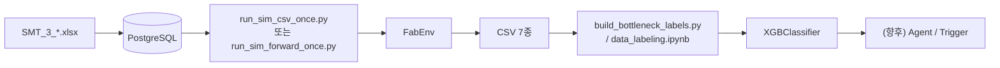
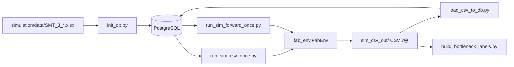
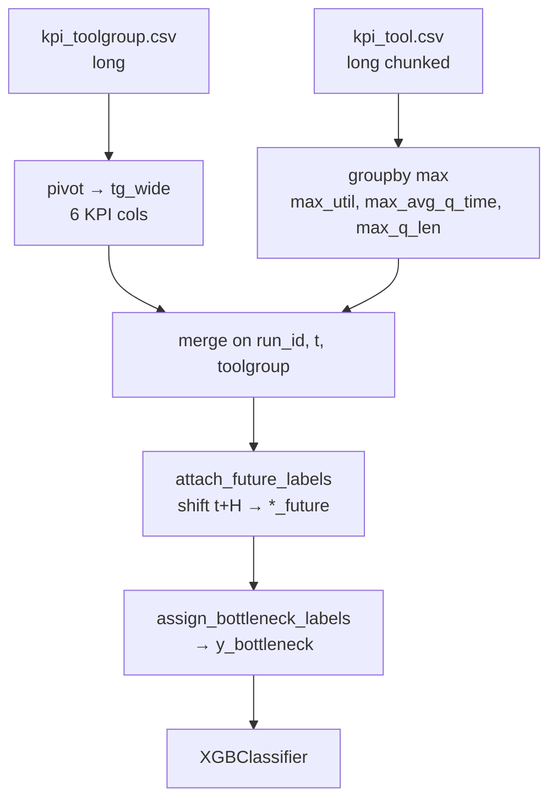
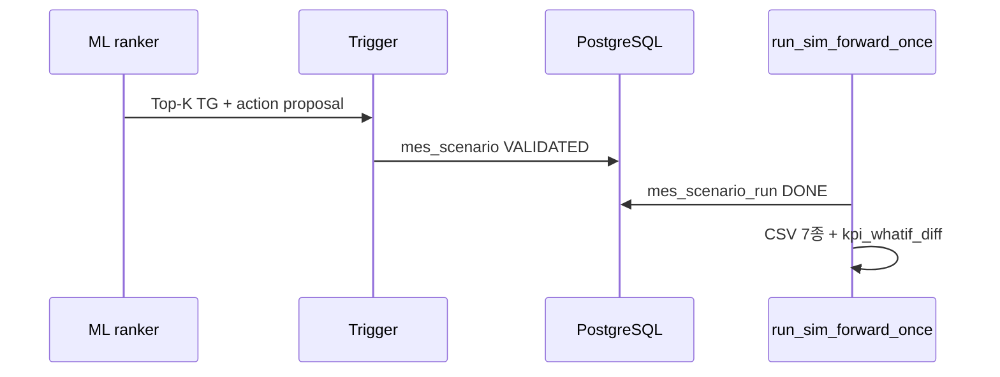

# FAB_BEAR 시뮬레이션·CSV·ML 구현 기술 보고서

| 항목 | 내용 |
|------|------|
| 문서 번호 | FAB_BEAR-REP-002 |
| 보안 등급 | **대외비** |
| 프로젝트 | FabGuard PoC — 공정 병목 대응 AI Agent |
| 대상 독자 | SKALA 3기 2팀, FabGuard PoC 이해관계자 |
| SSOT 코드 | `FAB_BEAR/simulation/fab_env.py`, `models.py` |
| 작성 기준일 | 2026-05-22 |
| 선행 문서 | [REPORT_SIMULATION_KPI.md](./REPORT_SIMULATION_KPI.md), [KPI_CSV_4FILES.md](./KPI_CSV_4FILES.md) |

---

## 목차

1. [Executive Summary](#1-executive-summary)
2. [시뮬레이션 실행 가이드](#2-시뮬레이션-실행-가이드)
3. [데이터 설계 — 산출물](#3-데이터-설계--산출물)
4. [ML 구현](#4-ml-구현)
5. [SMT2020 반영·Gap](#5-smt2020-반영gap)
6. [운영·리스크](#6-운영리스크)
7. [부록](#7-부록)

---

## 1. Executive Summary

### 1.1 FabGuard PoC에서 FAB_BEAR의 위치

FabGuard PoC는 반도체 FAB에서 **병목 위험 Tool Group(TG)을 조기에 식별**하고, 원인 분석·대응안까지 이어지는 Agentic AI를 목표로 한다.  
`FAB_BEAR`는 그중 **SimPy 기반 배치 시뮬레이션(FabEnv)** 과 **로그·KPI CSV 생성**, **규칙 기반 weak label**, **XGBoost PoC 학습**까지를 담당하는 Python 프로젝트이다.



| 단계 | 산출 | 역할 |
|------|------|------|
| 시뮬 | CSV 7종 + (연결 시) DB 로그 | 합성 Fab 이벤트·KPI 시계열 |
| 라벨 | `tg_bottleneck_labeled.csv` | TG 단위 이진 `y_bottleneck` (oracle) |
| ML | 확률·Top-K TG | 병목 위험 순위 (PoC) |
| FORWARD | 동일 CSV + `mes_scenario_run` | MES T0 스냅샷에서 전방 시뮬 |

**범위 밖·스텁:** `fab-dashboard` 프론트, K8s 운영, PPO 실운영 dispatch, Agent가 WHAT-IF를 자동 주입하는 E2E는 미완 또는 설계 단계.

### 1.2 한 번의 배치 run이 만드는 CSV 7종

| # | 파일 | grain | DB 테이블 |
|---|------|-------|-----------|
| 1 | `simulation_process.csv` | Lot·스텝 처리 완료 1건 | `simulation_log` |
| 2 | `lot_events.csv` | Lot 이벤트 1건 | `lot_event_log` |
| 3 | `tool_state.csv` | Tool/TG 상태 변화 1건 | `tool_state_log` |
| 4 | `kpi_fab.csv` | FAB × 시각 × KPI 1개 | `kpi_snapshot` |
| 5 | `kpi_process.csv` | Process × 시각 × KPI 1개 | `kpi_snapshot` |
| 6 | `kpi_toolgroup.csv` | ToolGroup × 시각 × KPI 1개 | `kpi_snapshot` |
| 7 | `kpi_tool.csv` | Tool × 시각 × KPI 1개 | `kpi_snapshot` |

KPI 4파일은 **long-format** (`kpi_name`당 1행). 병목 ML의 1차 입력은 **`kpi_toolgroup.csv` + `kpi_tool.csv` 집계**이다.

### 1.3 ML 한 줄 요약

| 항목 | 내용 |
|------|------|
| 예측 단위 | **Tool Group** (`toolgroup`) |
| 입력 | 시각 `t`의 KPI wide feature |
| 라벨 | 시각 **`t + H`** KPI로 계산한 규칙 기반 `y_bottleneck` |
| 모델 | `XGBClassifier` (pooled, TG `LabelEncoder` 포함) |
| 추론 설계 | 행별 P(y=1) → 동일 `t`에서 Top-K TG |

### 1.4 Cold start vs FORWARD/WHAT-IF

| 모드 | 실행기 | 시작 조건 | 시계 |
|------|--------|-----------|------|
| **Cold start** | `run_sim_csv_once.py` | 마스터 `lot_release`만 | SimPy 0부터, offset=0 |
| **FORWARD** | `run_sim_forward_once.py` | `mes_scenario` + T0 스냅샷 | SimPy 0..H, 로그는 `t0_sim_minute + now` |
| **WHAT-IF** | 동일 + `mes_whatif_action` | baseline 위 sparse override | KPI diff는 `kpi_whatif_diff` |

ML 학습 데이터는 주로 **Cold start 장기 run**으로 생성한다. FORWARD는 MES 연동·Agent Trigger 검증용이며 **CSV 7종 형식은 동일**하다.

---

## 2. 시뮬레이션 실행 가이드

### 2.1 아키텍처



### 2.2 Cold start 실행 (`run_sim_csv_once.py`)

**용도:** 엑셀→DB 마스터만으로 Fab 전체를 **0분부터** 한 에피소드 돌려 PoC 데이터·ML 학습용 CSV를 만든다.

```bash
cd FAB_BEAR
docker compose up -d db          # POSTGRES_PORT=5433 등 .env 확인

cd simulation
.venv/bin/pip install -r requirements.txt
.venv/bin/python init_db.py      # 전용 DB 권장 (drop_all)

export SIM_CSV_DIR=./sim_csv_out
export SIM_END_MINUTES=2000      # 짧은 검증 run
export KPI_INSTANT_PERIOD_MIN=60
export DISPATCH_MODE=rule

.venv/bin/python run_sim_csv_once.py \
  --csv-dir ./sim_csv_out \
  --end-minutes 2000 \
  --max-steps 500
```

| 환경변수 | 기본 | 설명 |
|----------|------|------|
| `SIM_CSV_DIR` | — | CSV 출력 디렉터리 (필수) |
| `SIM_END_MINUTES` | 8000 (runner), 200000 (`fab_env`) | 종료 시각(분) |
| `SIM_CSV_MAX_STEPS` | 200000 | Gym step 상한 |
| `KPI_INSTANT_PERIOD_MIN` | 60 | 순간 KPI 주기 (t=0 스냅샷 없음) |
| `DISPATCH_MODE` | `rule` | `rl` 시 PPO (`--rl --model`) |

**FabEnv 동작 요약**

- `reset()`: DB에서 route/tool/lot release 로드, `run_id` 발급, SimPy 프로세스 기동
- Lot: release 스케줄 → step 진입 → `_choose_tool_for_lot` → queue → 가공 → KPI 기록
- 부가: PM/BM, setup matrix, CQT, LTL lock, superhot queue (P4)
- `_kpi_snapshot_loop`: cadence마다 FAB/PROCESS/TOOLGROUP/TOOL KPI emit → DB + CSV append

### 2.3 FORWARD / WHAT-IF (요약)

1. `load_mes_scenario.py` → `mes_scenario` 및 스냅샷 테이블, status=`DRAFT`
2. 운영/Trigger가 `VALIDATED`로 승격
3. `run_sim_forward_once.py --scenario-id <ID>`

시나리오 run 시 `reset(options={"scenario_id": ...})`가 T0 WIP·tool·queue·CQT를 주입하고, `mes_lot_release_plan`으로 추가 release를 스폰한다. WHAT-IF는 `mes_whatif_action`으로 HOLD/FORCE_TOOL 등을 적용한다. 상세: [FORWARD_WHATIF_ENGINE.md](./FORWARD_WHATIF_ENGINE.md), [TRIGGER_CONTRACT.md](./TRIGGER_CONTRACT.md).

### 2.4 실측 결과

**보고서 작성 환경:** Docker/Postgres 미기동으로 **신규 2000분 run은 미실행**. 아래는 저장소에 존재하는 run을 **2026-05-22 기준 재집계**한 값이다.

#### (A) 중기 run — `simulation/sample_csv/` (검증·라벨 재현용)

| 항목 | 값 |
|------|-----|
| `run_id` | `48a57f5fd08d` |
| `snapshot_time` | **60 ~ 4,740** (분) |
| `KPI_INSTANT_PERIOD_MIN` | 60 (추정, 79 instant 스냅) |

| 파일 | 데이터 행 수 | 크기 |
|------|-------------|------|
| `simulation_process.csv` | 2,638 | 483 KB |
| `lot_events.csv` | 5,663 | 741 KB |
| `tool_state.csv` | (집계 생략) | 857 KB |
| `kpi_fab.csv` | 324 | 19 KB |
| `kpi_process.csv` | 5,688 | 474 KB |
| `kpi_toolgroup.csv` | 50,244 | 3.0 MB |
| `kpi_tool.csv` | 727,590 | 42 MB |

**라벨 재현 (H=60):** `build_bottleneck_labels.py --csv-dir ./sample_csv` → **positive 616 / 8,268 (7.45%)**

#### (B) 장기 run — `simulation/sim_csv_out/` (ML·EDA SSOT)

| 항목 | 값 |
|------|-----|
| `run_id` | `3e11c2ef42da` |
| `snapshot_time` | **60 ~ 305,160** (분) |
| instant 스냅 수 | **5,086** |
| Tool / TG 수 | 1,535 / 106 |

| 파일 | 데이터 행 수 | 크기 |
|------|-------------|------|
| `kpi_fab.csv` | 25,854 | 1.9 MB |
| `kpi_process.csv` | 366,192 | 34 MB |
| `kpi_toolgroup.csv` | 3,234,696 | 207 MB |
| `kpi_tool.csv` | **70,263,090** | **5.2 GB** |
| `lot_events.csv` | 3,175,318 | 372 MB |
| `simulation_process.csv` | 1,533,186 | 275 MB |
| `tool_state.csv` | 6,068,980 | 493 MB |
| **합계** | **84,667,316** | **~6.5 GB** |

검증: `5,086 × 1,535 × 9 = 70,263,090` (`kpi_tool`) · `5,086 × 106 × 6 = 3,234,696` (`kpi_toolgroup`).

**라벨 (H=60, 기생성 파일):** `tg_bottleneck_labeled.csv` — **203,660 / 539,010 (37.78%)**

> 장기 run은 단일 `run_id`이므로 XGBoost의 stratified random split은 **시간·TG 교차 일반화를 보장하지 않는다** (§4.5).

---

## 3. 데이터 설계 — 산출물

### 3.1 Raw 로그 3종

#### `simulation_process.csv` → `simulation_log`

| 항목 | 내용 |
|------|------|
| grain | Lot가 한 route step을 **한 tool에서 완료**한 1건 |
| 주요 컬럼 | `lot_id`, `step_seq`, `tool_group`, `tool_id`, `arrive_time`, `start_time`, `end_time`, `queue_time`, `process_time` |
| 기록 | `fab_env._log_process` — step/batch 완료 시 DB + CSV |
| ML 용도 | 이벤트 감사·TAT 분석; **병목 분류 1차 입력 아님** |

#### `lot_events.csv` → `lot_event_log`

| 항목 | 내용 |
|------|------|
| grain | Lot 단위 이벤트 1건 (release, enqueue, hold 등) |
| 주요 컬럼 | `event_type`, `event_time`, `detail_1`, `detail_2` |
| 기록 | `_log_lot_event` — `event_time`은 `_sim_now_abs()` (FORWARD 시 offset 반영) |
| ML 용도 | 시나리오·이상 추적 |

#### `tool_state.csv` → `tool_state_log`

| 항목 | 내용 |
|------|------|
| grain | Tool unit 또는 TG **집계** 상태 변화 1건 |
| 주요 컬럼 | `state`, `state_change_time`, `idle_units`…`down_bm_units` |
| 기록 | `_emit_tool_state_row` / `_log_tool_state` — unit·aggregate 동시 기록 가능 |
| ML 용도 | DOWN/SETUP 타임라인; KPI `available_tool_ratio`와 상호 보완 |

### 3.2 KPI 4종 (long format)

**공통 스키마:** `run_id`, `snapshot_time`, `scope`, `kpi_name`, `value`, `window_minutes`, `numerator`, `denominator`, `meta`

**cadence:** `_kpi_snapshot_loop`가 `KPI_INSTANT_PERIOD_MIN`(기본 60분)마다 instant KPI 4레벨 동시 emit. **t=0 스냅샷 없음** (첫 행 @60).

| 파일 | scope | KPI 종류 수 | 대표 KPI |
|------|-------|-------------|----------|
| `kpi_fab.csv` | `*` | 7 | `rtf`, `completion_rate`, `wip`, `utilization` |
| `kpi_process.csv` | process(area)명 | 6 | `q_time_min`, `oee_estimate` |
| `kpi_toolgroup.csv` | toolgroup명 | 6 | `q_time_min`, `wait_ratio`, `available_tool_ratio` |
| `kpi_tool.csv` | `Group#k` | 9 | `avg_q_time`, `utilization`, `q_len` |

**이름 차이 (중요):** TG·FAB·Process는 대기 **`q_time_min`**, Tool만 **`avg_q_time`**.

**행 수 추정 (instant 주기 P분, 시뮬 T분):**

```text
N_snap ≈ T / P   (t=0 제외)
rows_tool      ≈ N_snap × N_tool × 9
rows_toolgroup ≈ N_snap × N_toolgroup × 6
```

### 3.3 DB 적재

| 경로 | 설명 |
|------|------|
| **런타임** | FabEnv가 `SessionLocal()`로 `simulation_log`, `kpi_snapshot` 등에 **동시 insert** (DB 연결 실패 시 CSV만 남음) |
| **배치** | `load_csv_to_db.py --csv-dir <dir>` — CSV 7종 → 동일 테이블 bulk 적재 |

매핑 SSOT: [CSV_DB_MAPPING.md](./CSV_DB_MAPPING.md).

### 3.4 FORWARD 전용 테이블 (부록)

| 테이블 | 역할 |
|--------|------|
| `mes_scenario` | T0, horizon, status (`DRAFT`→`VALIDATED`) |
| `mes_wip_snapshot` | T0 WIP (WAIT/PROCESSING) |
| `mes_tool_snapshot` | T0 tool op_state (DOWN_PM/BM 포함) |
| `mes_tool_queue_snapshot` | T0 queue 선점 |
| `mes_lot_release_plan` | FORWARD 구간 추가 release |
| `mes_whatif_action` | HOLD, FORCE_TOOL 등 sparse override |
| `mes_scenario_run` | 시나리오별 run 메타·상태 |
| `kpi_whatif_diff` | WHAT-IF vs baseline KPI 차이 (`tools/compare_whatif.py`) |

---

## 4. ML 구현

### 4.1 문제 정의

| 항목 | 내용 |
|------|------|
| 예측 단위 | Tool Group |
| 입력 시각 | `t` — wide KPI + (선택) 파생 feature |
| 라벨 시각 | **`t + H`** — 미래 KPI로 oracle 계산 |
| 과제 | 이진 `y_bottleneck` |
| 운영 추론(설계) | P(y=1) ranking → Top-K; UI tier는 calibration 후 0.85/0.70/0.40 |

### 4.2 Feature engineering 파이프라인



| 단계 | 구현 | 비고 |
|------|------|------|
| TG pivot | `build_bottleneck_labels.pivot_toolgroup_long` | instant + util KPI |
| Tool 집계 | `aggregate_tool_long` | `tool_id` → `#` 앞 TG; **max** |
| Lookahead | `attach_future_labels` | inner merge → 끝 **2×H/P** 스텝 손실 |
| 배치 출력 | `tg_bottleneck_labeled.csv` | 장기 run 539,010행 |
| 실험 | `ML/data_labeling.ipynb` | EDA, 분위수 라벨, XGBoost |

### 4.3 라벨 oracle (weak label)

**REPORT 규칙** — `t+H` 시점 KPI (`*_future`)에 적용:

```text
y = 1  if
  ( q_time_min >= Q  AND  ( wait_ratio >= W  OR  wip >= N ) )
  OR ( available_tool_ratio <= A )
  OR ( max_util >= U_hi  AND  utilization_avg < U_lo )
  OR ( max_avg_q_time >= Q  AND  wait_ratio >= W )
```

| 파라미터 | 기본값 | 의미 |
|----------|--------|------|
| Q | 30 | 대기 시간(분) |
| W | 1 | wait_ratio |
| N | 3 | wip |
| A | 0.5 | 가용 tool 비율 하한 |
| U_hi / U_lo | 0.8 / 0.5 | unit hot-spot (max util 높은데 TG 평균 util 낮음) |

코드 SSOT: `build_bottleneck_labels.assign_bottleneck_labels`, 노트북 `assign_y_bottleneck_report`.

#### Lookahead H: 60 vs 120

| 출처 | H | positive rate (참고) |
|------|---|----------------------|
| `build_bottleneck_labels.py` (기본 `--horizon 60`) | 60분 | sample_csv **7.45%**; 장기 labeled **37.78%** |
| `data_labeling.ipynb` §7 | **120분** | 노트북 출력 **37.88%** (538,904행 기준) |

**차이 이유:** H가 길수록 미래 혼잡·DOWN이 반영되어 positive가 증가한다. 스냅 주기 60분일 때 H=120은 **+2 스텝** lookahead이다.  
**권장:** 운영·Agent Trigger와 맞추려면 **하나의 H로 통일**하고, 스크립트·노트북·문서에 동일 값을 명시한다.

#### 노트북 추가: 분위수 라벨 `y_bottleneck_pct` (§6)

- EDA 분위수로 upper/lower tail flag → OR 결합
- 노트북 예시 positive rate **~50.97%** (전체 `wide` 기준 분위 — **train만 ref** 쓰지 않으면 누수 위험)
- REPORT 규칙 라벨과 **별도 실험용**; 최종 PoC는 `y_bottleneck` + XGBoost §8이 SSOT

### 4.4 EDA (`data_labeling.ipynb` §5)

`EDA_COLS`: `q_time_min`, `wait_ratio`, `wip`, `available_tool_ratio`, `utilization_avg`, `max_util`, `max_avg_q_time`

- 분포: log1p 히스토그램 (0 많고 꼬리 긴 변수)
- `wait_ratio`: 가용 1대·대기 다수 시 **10 이상** 가능 → 병목 신호이나 ML에서는 scale cap/log 검토
- **hot-spot:** TG `utilization_avg`는 낮은데 `max_util`은 높음 → TG 평균만으로는 unit 쏠림을 놓침 → Tool max 집계가 라벨·feature에 포함되는 이유

### 4.5 모델 학습 (`data_labeling.ipynb` §8)

| 항목 | 설정 |
|------|------|
| 알고리즘 | `XGBClassifier`, `objective=binary:logistic` |
| Feature | numeric KPI ( `_future`, `y_*`, `run_id` 제외) + `LabelEncoder(toolgroup)` → `toolgroup_enc` |
| Split | stratified **70 / 15 / 15** (test 15% 먼저, 잔여 85%에서 train:val = 70:15) |
| 불균형 | `scale_pos_weight = n_neg / n_pos` |
| 하이퍼파라미터 | `n_estimators=500`, `max_depth=8`, `learning_rate=0.06`, `subsample=0.85`, `colsample_bytree=0.85` |
| 평가 | accuracy, ROC-AUC, confusion matrix, classification report (val / test) |

**한계 (향후 과제):**

1. **단일 `run_id`** 장기 run → 행 단위 random split은 **동일 fab 상태의 복제**에 가깝다.
2. 권장 split: **`run_id` 블록** 또는 **시간 블록** hold-out, 다중 run 수집 후 재학습.
3. LTL TG(Litho 등)는 별도 플래그 또는 non-LTL만 학습 검토.

### 4.6 FabGuard Agent 연결 (설계)



- ML: TG별 위험 확률 → Top-K
- Trigger: `VALIDATED` 승격 후 FORWARD run ([TRIGGER_CONTRACT.md](./TRIGGER_CONTRACT.md))
- UI tier: 확률 **calibration 후** cutoff (라벨 임계값과 동일하지 않음)

---

## 5. SMT2020 반영·Gap

| 구분 | 내용 |
|------|------|
| 반영 | Route/TG, transport, PM/BM, setup, dispatch(P2 wakeup), LTL, CQT, sampling/rework, KPI 4레벨 |
| 제외 | `SMT_3_Lotrelease_Engineering.xlsx`, `SMT_3_Setup_Matrix_Implant_Gas.xlsx` |
| Gap | Superhot RUN 선점 미구현; `core/runner.py` what-if는 FabEnv 시나리오와 **별도 스텁** |

상세: [SMT2020_SIM_PATCHES.md](./SMT2020_SIM_PATCHES.md), [REPORT_SIMULATION_KPI.md](./REPORT_SIMULATION_KPI.md) §5.

---

## 6. 운영·리스크

| 리스크 | 완화 |
|--------|------|
| `kpi_tool.csv` ~5GB | `chunksize` 집계, DuckDB, `KPI_INSTANT_PERIOD_MIN`↑, parquet 변환 |
| `init_db.py` drop_all | FabGuard **전용 DB** |
| `DATABASE_URL` host | Docker `db` vs 로컬 `localhost:5433` ([README.md](../README.md)) |
| CSV·DB 불일치 | DB 미연결 시 CSV만 생성됨 — 적재 전 연결 확인 |

**재현 체크리스트 (작성자용):**

```bash
cd FAB_BEAR/simulation
.venv/bin/python run_sim_csv_once.py --csv-dir ./sim_csv_out_report --end-minutes 2000 --max-steps 500
.venv/bin/python build_bottleneck_labels.py --csv-dir ./sim_csv_out_report --horizon 60
```

---

## 7. 부록

### 7.1 환경변수 (요약)

| 변수 | 기본 | 설명 |
|------|------|------|
| `SIM_CSV_DIR` | — | CSV 출력 경로 |
| `SIM_END_MINUTES` | — | 종료 시각(분) |
| `KPI_INSTANT_PERIOD_MIN` | 60 | 순간 KPI 주기 |
| `KPI_UTIL_WINDOW_MIN` | 60 | util·OEE 윈도우 |
| `DISPATCH_MODE` | `rule` | `rl` + PPO |
| `KPI_CSV_LEGACY_COMBINED` | 0 | 1이면 `kpi_snapshot.csv` 단일 파일 |

### 7.2 검증 체크리스트

- [x] CSV 7종 + KPI 4파일 역할 구분
- [x] 장기 run `run_id=3e11c2ef42da` 실측 행 수·용량
- [x] sample_csv 라벨 H=60 재현 (7.45%)
- [x] ML grain = Tool Group
- [x] H=60 vs H=120·단일 run split 한계 명시
- [ ] 신규 2000분 run (Postgres 기동 후 보완 권장)

### 7.3 참조 문서

| 문서 | 경로 |
|------|------|
| KPI 4종 | [KPI_CSV_4FILES.md](./KPI_CSV_4FILES.md) |
| CSV↔DB | [CSV_DB_MAPPING.md](./CSV_DB_MAPPING.md) |
| KPI·장기 run 상세 | [REPORT_SIMULATION_KPI.md](./REPORT_SIMULATION_KPI.md) |
| FORWARD 엔진 | [FORWARD_WHATIF_ENGINE.md](./FORWARD_WHATIF_ENGINE.md) |
| 보고서 작성 프롬프트 | [PROMPT_SIMULATION_ML_REPORT.md](./PROMPT_SIMULATION_ML_REPORT.md) |
| Docker | [README_DOCKER.md](./README_DOCKER.md) |

### 7.4 용어

| 용어 | 설명 |
|------|------|
| TG | Tool Group |
| long / wide | KPI당 1행 vs scope당 1행(컬럼=KPI) |
| RTF | 납기 준수율 `on_time / due_due` |
| weak label | 규칙 oracle; 인간 라벨 아님 |

---

*본 문서는 [PROMPT_SIMULATION_ML_REPORT.md](./PROMPT_SIMULATION_ML_REPORT.md) 지침에 따라 작성되었으며, 시뮬 재실행은 Postgres 가동 후 §2.2 명령으로 보완할 수 있다.*
