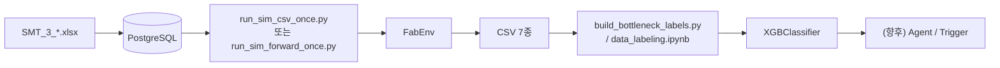
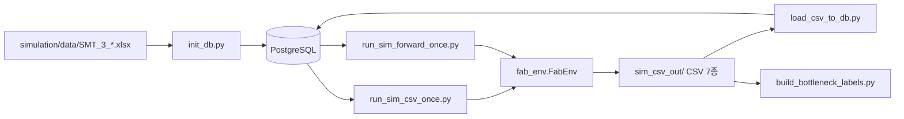
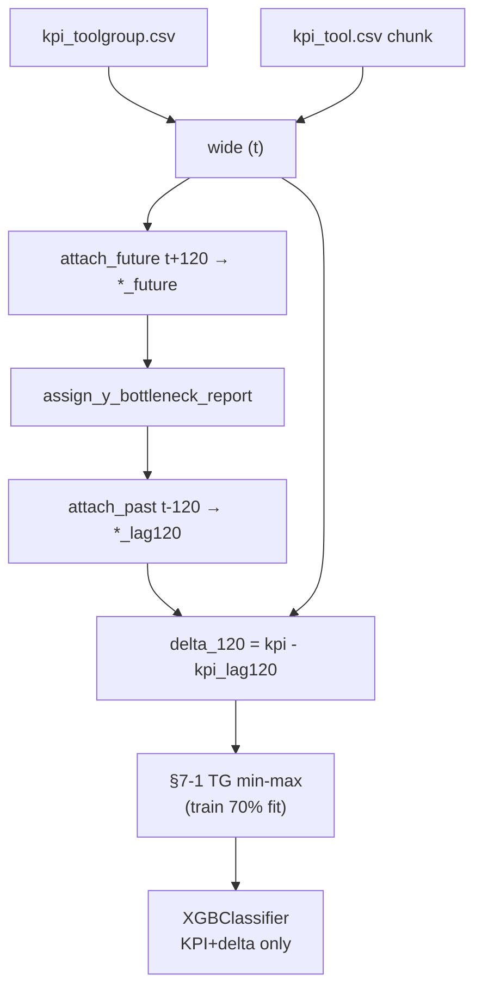
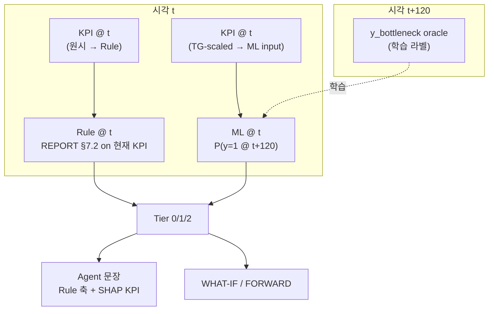
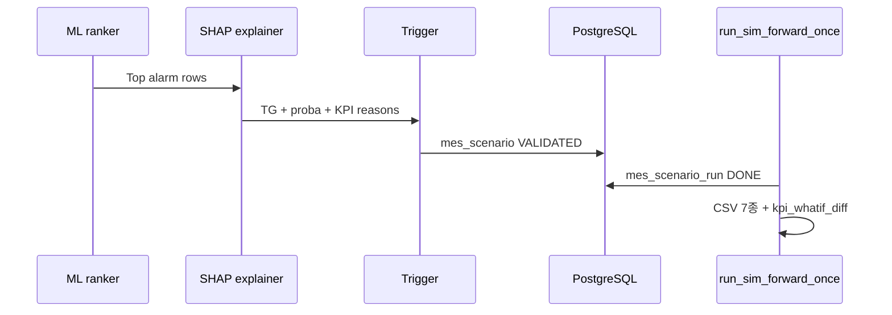

# FAB_BEAR 시뮬레이션·CSV·ML 구현 기술 보고서

| 항목 | 내용 |
|------|------|
| 문서 번호 | FAB_BEAR-REP-002 |
| 보안 등급 | **대외비** |
| 프로젝트 | FabGuard PoC — 공정 병목 대응 AI Agent |
| 대상 독자 | SKALA 3기 2팀, FabGuard PoC 이해관계자 |
| SSOT 코드 | `FAB_BEAR/simulation/fab_env.py`, `models.py` |
| 작성 기준일 | 2026-06-01 (§7-1 TG scaling · §9 SHAP · enc off 권장 설정 반영) |
| SSOT 노트북 | `FAB_BEAR/simulation/ML/data_labeling.ipynb` |
| 선행 문서 | [REPORT_SIMULATION_KPI.md](./REPORT_SIMULATION_KPI.md), [KPI_CSV_4FILES.md](./KPI_CSV_4FILES.md) |

---

## 목차

1. [Executive Summary](#1-executive-summary)
2. [시뮬레이션 실행 가이드](#2-시뮬레이션-실행-가이드)
3. [데이터 설계 — 산출물](#3-데이터-설계--산출물)
4. [ML 구현](#4-ml-구현)
5. [SMT2020 반영·Gap](#5-smt2020-반영gap)
6. [운영·리스크](#6-운영리스크)
7. [부록](#7-부록)

---

## 1. Executive Summary

### 1.1 FabGuard PoC에서 FAB_BEAR의 위치

FabGuard PoC는 반도체 FAB에서 **병목 위험 Tool Group(TG)을 조기에 식별**하고, 원인 분석·대응안까지 이어지는 Agentic AI를 목표로 한다.  
`FAB_BEAR`는 그중 **SimPy 기반 배치 시뮬레이션(FabEnv)** 과 **로그·KPI CSV 생성**, **규칙 기반 weak label**, **XGBoost PoC 학습**까지를 담당하는 Python 프로젝트이다.



| 단계 | 산출 | 역할 |
|------|------|------|
| 시뮬 | CSV 7종 + (연결 시) DB 로그 | 합성 Fab 이벤트·KPI 시계열 |
| 라벨 | `tg_bottleneck_labeled.csv` | TG 단위 이진 `y_bottleneck` (oracle) |
| ML | 확률·Top-K TG | 병목 위험 순위 (PoC) |
| FORWARD | 동일 CSV + `mes_scenario_run` | MES T0 스냅샷에서 전방 시뮬 |

**범위 밖·스텁:** `fab-dashboard` 프론트, K8s 운영, PPO 실운영 dispatch, Agent가 WHAT-IF를 자동 주입하는 E2E는 미완 또는 설계 단계.

### 1.2 한 번의 배치 run이 만드는 CSV 7종

| # | 파일 | grain | DB 테이블 |
|---|------|-------|-----------|
| 1 | `simulation_process.csv` | Lot·스텝 처리 완료 1건 | `simulation_log` |
| 2 | `lot_events.csv` | Lot 이벤트 1건 | `lot_event_log` |
| 3 | `tool_state.csv` | Tool/TG 상태 변화 1건 | `tool_state_log` |
| 4 | `kpi_fab.csv` | FAB × 시각 × KPI 1개 | `kpi_snapshot` |
| 5 | `kpi_process.csv` | Process × 시각 × KPI 1개 | `kpi_snapshot` |
| 6 | `kpi_toolgroup.csv` | ToolGroup × 시각 × KPI 1개 | `kpi_snapshot` |
| 7 | `kpi_tool.csv` | Tool × 시각 × KPI 1개 | `kpi_snapshot` |

KPI 4파일은 **long-format** (`kpi_name`당 1행). 병목 ML의 1차 입력은 **`kpi_toolgroup.csv` + `kpi_tool.csv` 집계**이다.

### 1.3 ML 한 줄 요약 (2026-06-01 권장 설정)

| 항목 | 내용 |
|------|------|
| 예측 단위 | **Tool Group** × 시각 `t` (패널: 스냅당 **106 TG**) |
| 입력 | 시각 **`t`** KPI + **`Δ(t−120)`** — **§7-1 TG별 min-max(0~1)** 후 **`toolgroup_enc` 없음** (`USE_TOOLGROUP_ENC=False`) |
| 라벨 | 시각 **`t + 120`** KPI에 REPORT §7.2 oracle → `y_bottleneck` (원시 KPI 기준, scaling 미적용) |
| 임계값 | `wide` 분위수 → `Q`, **`Q_MAX`**, `W`, `WIP`, `A`, `U_hi`, `U_lo` · 분류 cutoff는 val **F1** 스윕(`BEST_THRESHOLD`, 예: 0.60) |
| 모델 | `XGBClassifier`, **시간 블록 split** 70/15/15 |
| PoC test (권장) | ROC-AUC **0.945**, 병목(1) F1 **0.807** @ proba≥0.7 (`ece173272af7`, enc off + TG scaling) |
| 설명 | §9 **SHAP TreeExplainer** — 건별 KPI 기여 + REPORT 4축 한글 매핑 |
| Agent 설계 | **Rule @ t**(현재 병목) + **ML @ t+120**(조기 경보) · Tier 0/1/2 (§4.10) |

### 1.4 Cold start vs FORWARD/WHAT-IF

| 모드 | 실행기 | 시작 조건 | 시계 |
|------|--------|-----------|------|
| **Cold start** | `run_sim_csv_once.py` | 마스터 `lot_release`만 | SimPy 0부터, offset=0 |
| **FORWARD** | `run_sim_forward_once.py` | `mes_scenario` + T0 스냅샷 | SimPy 0..H, 로그는 `t0_sim_minute + now` |
| **WHAT-IF** | 동일 + `mes_whatif_action` | baseline 위 sparse override | KPI diff는 `kpi_whatif_diff` |

ML 학습 데이터는 주로 **Cold start 장기 run**으로 생성한다. FORWARD는 MES 연동·Agent Trigger 검증용이며 **CSV 7종 형식은 동일**하다.

---

## 2. 시뮬레이션 실행 가이드

### 2.1 아키텍처



### 2.2 Cold start 실행 (`run_sim_csv_once.py`)

**용도:** 엑셀→DB 마스터만으로 Fab 전체를 **0분부터** 한 에피소드 돌려 PoC 데이터·ML 학습용 CSV를 만든다.

```bash
cd FAB_BEAR
docker compose up -d db          # POSTGRES_PORT=5433 등 .env 확인

cd simulation
.venv/bin/pip install -r requirements.txt
.venv/bin/python init_db.py      # 전용 DB 권장 (drop_all)

export SIM_CSV_DIR=./sim_csv_out
export SIM_END_MINUTES=2000      # 짧은 검증 run
export KPI_INSTANT_PERIOD_MIN=60
export DISPATCH_MODE=rule

.venv/bin/python run_sim_csv_once.py \
  --csv-dir ./sim_csv_out \
  --end-minutes 2000 \
  --max-steps 500
```

| 환경변수 | 기본 | 설명 |
|----------|------|------|
| `SIM_CSV_DIR` | — | CSV 출력 디렉터리 (필수) |
| `SIM_END_MINUTES` | 8000 (runner), 200000 (`fab_env`) | 종료 시각(분) |
| `SIM_CSV_MAX_STEPS` | 200000 | Gym step 상한 |
| `KPI_INSTANT_PERIOD_MIN` | 60 | 순간 KPI 주기 (t=0 스냅샷 없음) |
| `DISPATCH_MODE` | `rule` | `rl` 시 PPO (`--rl --model`) |

**FabEnv 동작 요약**

- `reset()`: DB에서 route/tool/lot release 로드, `run_id` 발급, SimPy 프로세스 기동
- Lot: release 스케줄 → step 진입 → `_choose_tool_for_lot` → queue → 가공 → KPI 기록
- 부가: PM/BM, setup matrix, CQT, LTL lock, superhot queue (P4)
- `_kpi_snapshot_loop`: cadence마다 FAB/PROCESS/TOOLGROUP/TOOL KPI emit → DB + CSV append

### 2.3 FORWARD / WHAT-IF (요약)

1. `load_mes_scenario.py` → `mes_scenario` 및 스냅샷 테이블, status=`DRAFT`
2. 운영/Trigger가 `VALIDATED`로 승격
3. `run_sim_forward_once.py --scenario-id <ID>`

시나리오 run 시 `reset(options={"scenario_id": ...})`가 T0 WIP·tool·queue·CQT를 주입하고, `mes_lot_release_plan`으로 추가 release를 스폰한다. WHAT-IF는 `mes_whatif_action`으로 HOLD/FORCE_TOOL 등을 적용한다. 상세: [FORWARD_WHATIF_ENGINE.md](./FORWARD_WHATIF_ENGINE.md), [TRIGGER_CONTRACT.md](./TRIGGER_CONTRACT.md).

### 2.4 실측 결과

**보고서 작성 환경:** Docker/Postgres 미기동으로 **신규 2000분 run은 미실행**. 아래는 저장소에 존재하는 run을 **2026-05-22 기준 재집계**한 값이다.

#### (A) 중기 run — `simulation/sample_csv/` (검증·라벨 재현용)

| 항목 | 값 |
|------|-----|
| `run_id` | `48a57f5fd08d` |
| `snapshot_time` | **60 ~ 4,740** (분) |
| `KPI_INSTANT_PERIOD_MIN` | 60 (추정, 79 instant 스냅) |

| 파일 | 데이터 행 수 | 크기 |
|------|-------------|------|
| `simulation_process.csv` | 2,638 | 483 KB |
| `lot_events.csv` | 5,663 | 741 KB |
| `tool_state.csv` | (집계 생략) | 857 KB |
| `kpi_fab.csv` | 324 | 19 KB |
| `kpi_process.csv` | 5,688 | 474 KB |
| `kpi_toolgroup.csv` | 50,244 | 3.0 MB |
| `kpi_tool.csv` | 727,590 | 42 MB |

**라벨 재현 (H=60):** `build_bottleneck_labels.py --csv-dir ./sample_csv` → **positive 616 / 8,268 (7.45%)**

#### (B) 장기 run — `simulation/sim_csv_out/` (노트북 SSOT, 2026-06-01)

| 항목 | 값 |
|------|-----|
| `run_id` | **`ece173272af7`** (`data_labeling.ipynb` 로드 기준) |
| `snapshot_time` | **60 ~ 313,560** (분) |
| instant 스냅 수 | **5,226** (= 313560/60) |
| TG 수 | **106** |
| wide grain 행 | **553,956** (= 5,226 × 106) |

| 파일 | 데이터 행 수 (참고) |
|------|---------------------|
| `kpi_toolgroup.csv` | 3,323,736 long (= 553,956 × 6 KPI) |
| `kpi_tool.csv` | chunk 집계 → `max_util`, `max_avg_q_time` |

**노트북 라벨 (H=120, 분위 임계):** `y_bottleneck` positive **155,711 / 553,744 (28.12%)**  
**학습 행 (§7 delta 후):** **553,532** (= 앞·뒤 각 2스냅 × 106 TG drop)

> 이전 보고서의 `run_id=3e11c2ef42da`는 동일 파이프라인의 **다른 장기 run** 예시. ML 노트북은 현재 **`sim_csv_out/` + `ece173272af7`** 기준.

**split:** 노트북 §8은 **시간 블록** 70/15/15 (stratified random **아님**). 단일 run이어도 test는 **미래 시점** hold-out.

---

## 3. 데이터 설계 — 산출물

### 3.1 Raw 로그 3종

#### `simulation_process.csv` → `simulation_log`

| 항목 | 내용 |
|------|------|
| grain | Lot가 한 route step을 **한 tool에서 완료**한 1건 |
| 주요 컬럼 | `lot_id`, `step_seq`, `tool_group`, `tool_id`, `arrive_time`, `start_time`, `end_time`, `queue_time`, `process_time` |
| 기록 | `fab_env._log_process` — step/batch 완료 시 DB + CSV |
| ML 용도 | 이벤트 감사·TAT 분석; **병목 분류 1차 입력 아님** |

#### `lot_events.csv` → `lot_event_log`

| 항목 | 내용 |
|------|------|
| grain | Lot 단위 이벤트 1건 (release, enqueue, hold 등) |
| 주요 컬럼 | `event_type`, `event_time`, `detail_1`, `detail_2` |
| 기록 | `_log_lot_event` — `event_time`은 `_sim_now_abs()` (FORWARD 시 offset 반영) |
| ML 용도 | 시나리오·이상 추적 |

#### `tool_state.csv` → `tool_state_log`

| 항목 | 내용 |
|------|------|
| grain | Tool unit 또는 TG **집계** 상태 변화 1건 |
| 주요 컬럼 | `state`, `state_change_time`, `idle_units`…`down_bm_units` |
| 기록 | `_emit_tool_state_row` / `_log_tool_state` — unit·aggregate 동시 기록 가능 |
| ML 용도 | DOWN/SETUP 타임라인; KPI `available_tool_ratio`와 상호 보완 |

### 3.2 KPI 4종 (long format)

**공통 스키마:** `run_id`, `snapshot_time`, `scope`, `kpi_name`, `value`, `window_minutes`, `numerator`, `denominator`, `meta`

**cadence:** `_kpi_snapshot_loop`가 `KPI_INSTANT_PERIOD_MIN`(기본 60분)마다 instant KPI 4레벨 동시 emit. **t=0 스냅샷 없음** (첫 행 @60).

| 파일 | scope | KPI 종류 수 | 대표 KPI |
|------|-------|-------------|----------|
| `kpi_fab.csv` | `*` | 7 | `rtf`, `completion_rate`, `wip`, `utilization` |
| `kpi_process.csv` | process(area)명 | 6 | `q_time_min`, `oee_estimate` |
| `kpi_toolgroup.csv` | toolgroup명 | 6 | `q_time_min`, `wait_ratio`, `available_tool_ratio` |
| `kpi_tool.csv` | `Group#k` | 9 | `avg_q_time`, `utilization`, `q_len` |

**이름 차이 (중요):** TG·FAB·Process는 대기 **`q_time_min`**, Tool만 **`avg_q_time`**.

**행 수 추정 (instant 주기 P분, 시뮬 T분):**

```text
N_snap ≈ T / P   (t=0 제외)
rows_tool      ≈ N_snap × N_tool × 9
rows_toolgroup ≈ N_snap × N_toolgroup × 6
```

### 3.3 DB 적재

| 경로 | 설명 |
|------|------|
| **런타임** | FabEnv가 `SessionLocal()`로 `simulation_log`, `kpi_snapshot` 등에 **동시 insert** (DB 연결 실패 시 CSV만 남음) |
| **배치** | `load_csv_to_db.py --csv-dir <dir>` — CSV 7종 → 동일 테이블 bulk 적재 |

매핑 SSOT: [CSV_DB_MAPPING.md](./CSV_DB_MAPPING.md).

### 3.4 FORWARD 전용 테이블 (부록)

| 테이블 | 역할 |
|--------|------|
| `mes_scenario` | T0, horizon, status (`DRAFT`→`VALIDATED`) |
| `mes_wip_snapshot` | T0 WIP (WAIT/PROCESSING) |
| `mes_tool_snapshot` | T0 tool op_state (DOWN_PM/BM 포함) |
| `mes_tool_queue_snapshot` | T0 queue 선점 |
| `mes_lot_release_plan` | FORWARD 구간 추가 release |
| `mes_whatif_action` | HOLD, FORCE_TOOL 등 sparse override |
| `mes_scenario_run` | 시나리오별 run 메타·상태 |
| `kpi_whatif_diff` | WHAT-IF vs baseline KPI 차이 (`tools/compare_whatif.py`) |

---

## 4. ML 구현

### 4.1 문제 정의

| 항목 | 내용 |
|------|------|
| 예측 단위 | Tool Group × snapshot_time (**패널 데이터**) |
| 입력 시각 | **`t`** — KPI 수준 + (선택) **Δ(t−120)** |
| 라벨 시각 | **`t + 120`** — REPORT oracle (`*_future` KPI) |
| 과제 | 이진 `y_bottleneck` |
| 운영 추론(설계) | P(y=1) ranking → Top-K; UI tier는 calibration 후 0.85/0.70/0.40 |

**패널 해석:** 한 `snapshot_time`에 **106 TG 행**이 동시에 존재. ML 한 행 = “시각 t, TG g에서 2시간 뒤 병목 여부”. 추론 시 t마다 106개 확률 → **랭킹**.

### 4.2 `data_labeling.ipynb` 파이프라인 (SSOT)

| § | 내용 |
|---|------|
| **0~2** | 경로, `kpi_toolgroup.csv` long 로드 (`run_id`, 106 TG, t=60…313560) |
| **3** | TG pivot → `tg_wide` (6 KPI) |
| **4** | `kpi_tool.csv` chunk → TG별 `max_util`, `max_avg_q_time` merge → **`wide`** (553,956 × 10) |
| **5** | EDA: 결측, 상관(Pearson/Spearman), describe, log1p 히스토그램, boxplot |
| **6** | REPORT 라벨 H=120, 분위 임계 → `y_bottleneck` → **`wide_train`** |
| **7** | lag 120분 merge → **`{kpi}_delta_120`** 5종 → **`wide_train`** (553,532행) |
| **7-1** | **TG별 min-max(0~1)** — train 시간 70%만 fit, level+delta transform |
| **8** | XGBoost, 시간 split 70/15/15, `USE_TOOLGROUP_ENC` 토글 |
| **8-1** | validation threshold 스윕 → `BEST_THRESHOLD` |
| **8+** | `_report`, feature importance, test 시계열 plot |
| **9** | **SHAP** — 병목 예측 상위 N건 건별 KPI 근거 |



**행 수 변화 (60분 스냅, 106 TG):**

| 단계 | 행 수 | drop |
|------|------:|-----:|
| `wide` | 553,956 | — |
| §6 t+120 inner | 553,744 | 212 (= 2×106, run **끝** 2스냅) |
| §7 t−120 inner | 553,532 | 212 (= 2×106, run **앞** 2스냅) |
| **학습 usable** | **553,532** | `wide` 대비 **424행** (= 4스냅×106) |

### 4.3 라벨 oracle — REPORT §7.2 (`y_bottleneck`)

**조건 (전부 `t+120` KPI, `*_future` 컬럼):**

```text
y = 1  if
  ( q_time_min >= Q  AND  ( wait_ratio >= W  OR  wip >= N ) )
  OR ( available_tool_ratio <= A )
  OR ( max_util >= U_hi  AND  utilization_avg < U_lo )
  OR ( max_avg_q_time >= Q_MAX  AND  wait_ratio >= W )
```

| 파라미터 | 노트북 설정 | 비고 |
|----------|-------------|------|
| Q | `q_time_min` upper **q=0.97** → ≈981 min | TG congestion |
| **Q_MAX** | `max_avg_q_time` upper **q=0.97** → ≈1063 min | hot-spot queue (**Q와 독립**) |
| W | `wait_ratio` upper q=0.97 → 4.5 | |
| N (WIP) | `wip` upper q=0.97 → 44 | |
| A | `available_tool_ratio` lower q=0.01 → 0.5 | |
| U_hi / U_lo | `max_util` q=0.75 / `utilization_avg` lower q=0.95 | hot-spot util |

- `USE_FIXED_THRESHOLDS=True` → 문서 가이드 상수 (Q=30, Q_MAX=30, …)
- `THR_REF_DF=None` → `wide` 전체 분위 (EDA용); **train-only ref** 권장 (누수 방지)
- **삭제됨:** §6 분위수 OR weak label `y_bottleneck_pct` (REPORT와 무관, PoC에서 제외)

코드 SSOT: 노트북 `assign_y_bottleneck_report` · 배치 `build_bottleneck_labels.py` (Q_MAX 미반영 시 스크립트와 diff 주의)

#### Lookahead H

| 출처 | H | positive rate |
|------|---|---------------|
| `build_bottleneck_labels.py` (기본 60) | 60분 | sample **7.45%**; 구 `tg_bottleneck_labeled.csv` **37.78%** |
| **`data_labeling.ipynb` §6 (현행)** | **120분** | **28.12%** (553,744행) |

**권장:** Agent horizon(120분)과 **노트북 H=120** 통일. 스크립트 재생성 시 `--horizon 120` + Q_MAX 반영 필요.

### 4.4 Feature engineering (§7 · §7-1)

#### §7 — Delta `Δ(t − 120)`

| 종류 | 컬럼 | 설명 |
|------|------|------|
| **Level @ t** | `q_time_min`, `wait_ratio`, `wip`, `available_tool_ratio`, `utilization_avg`, `max_util` | TG instant + tool max (**원시 단위**로 delta 계산) |
| **Delta @ t** | `{kpi}_delta_120` × 5 | `q_time_min`, `wait_ratio`, `wip`, `max_util`, `max_avg_q_time` |
| **제외 (level)** | `max_avg_q_time`, `setup_ratio_avg` | 고상관·상수; delta만 사용 |
| **제외 (중간)** | `*_future`, `*_lag120` | 라벨·lag |
| **제외 (키)** | `snapshot_time`, `run_id`, `y_bottleneck` | 메타 |

**순서:** 원시 KPI → lag merge → **delta = cur − lag** → (다음 §7-1 scaling).  
delta를 scaling **이후**에 만들지 않음 (물리 단위 2h 변화 의미 유지).

#### §7-1 — TG별 Min-Max scaling (0~1)

| 항목 | 내용 |
|------|------|
| **목적** | TG마다 WIP·`q_time_min` 절대 규모가 다름 → **“이 TG 평소 대비”** 상대화 |
| **대상** | `KPI_COLS` + `DELTA_FEATURE_COLS` (13컬럼) |
| **미적용** | `*_future`, `*_lag120`, `y_bottleneck`, `toolgroup` |
| **fit** | §8과 동일 **시간 train 70%** 구간, **TG × feature** 별 `min`/`max` |
| **transform** | `wide_train` 전체 (val/test 포함) |
| **상수 구간** | `min == max` → `0.5`, 이후 `[0,1]` clip |
| **토글** | `USE_TG_MINMAX_SCALE` |

**전역 min-max vs TG별:** 교과서적 MinMax는 보통 전역 1쌍/feture. Fab 패널에서는 **within-TG** 정규화가 “WIP=2의 TG별 의미 차이”에 더 적합. `wait_ratio`는 이미 비율 축으로 **보완** 관계.

**통계 테이블:** `tg_minmax_stats` (행 = toolgroup × feature, `vmin`, `vmax`, `n_train`).

#### §8 — 모델 입력 피처 (권장 PoC)

| 종류 | 컬럼 | 비고 |
|------|------|------|
| **Level + Delta** | §7-1 scaling 후 11컬럼 | `USE_LEVEL_FEATURES` / `USE_DELTA_FEATURES` |
| **TG ID** | `toolgroup_enc` | **`USE_TOOLGROUP_ENC=False` 권장** (§7-1 후) |
| **식별** | `toolgroup` (문자열) | **X에 미포함**, 예측·SHAP·Agent 출력용으로 **항상 유지** |

§8 토글: `USE_LEVEL_FEATURES`, `USE_DELTA_FEATURES`, `USE_TOOLGROUP_ENC`, `EXCLUDE_FEATURE_COLS`

**권장 feature 수:** level 6 + delta 5 = **11** (enc off)

#### `toolgroup_enc` 제거와 EXCLUDE_NAMES

- `EXCLUDE_NAMES`는 `wide_train` **기존 컬럼**만 필터 → `toolgroup_enc`는 §8에서 **나중에 생성**되므로 `EXCLUDE_NAMES`에 넣어도 **무효**.
- enc 제거는 **`USE_TOOLGROUP_ENC=False`** + `FEATURE_COLS = num_cols` 로 제어.
- enc + raw KPI 사용 시 SHAP에서 enc가 50~70%를 차지하는 사례 다수 → scaling 후에도 enc를 두면 **설명 credit이 enc로 몰릴 수 있음**.

### 4.5 EDA 요약 (§5)

- `q_time_min`: ~91% 행이 0 — 정상 (비병목 TG·시점 다수)
- `q_time_min` ↔ `max_avg_q_time`: r≈**1.0** — hot-spot=TG 평균인 경우 많음 → level `max_avg_q_time` 제외, delta는 유지
- `wait_ratio`: 10+ 가능 (가용 1대·대기 다수) — 병목 신호; scale cap/log는 후속
- `setup_ratio_avg`: 상수에 가까워 상관 히트맵·피처에서 제외

### 4.6 모델 학습 (§8 · §8-1)

| 항목 | 설정 |
|------|------|
| 알고리즘 | `XGBClassifier`, `binary:logistic` |
| Split | **`temporal_split_by_snapshot_time`** 70/15/15 (동일 t의 106 TG는 같은 fold) |
| Train / val / test | 387,430 / 82,998 / 83,104 · t: **180→219420** / **219480→266400** / **266460→313440** |
| 불균형 | `scale_pos_weight = n_neg / n_pos` (train) |
| 하이퍼파라미터 | `n_estimators` 300~500, `max_depth` 8~10, `lr=0.06`, `subsample=0.85`, `colsample_bytree=0.85` |
| 임계값 | §8-1 val F1 스윕 → `BEST_THRESHOLD` (예: **0.60**); `_report` 셀은 **0.7** 고정 예시 |

#### Test hold-out — 설정별 비교

| 설정 | ROC-AUC | Acc @cutoff | P(1) | R(1) | F1(1) | 비고 |
|------|---------|-------------|------|------|-------|------|
| delta + **`toolgroup_enc`**, raw KPI | **0.951** | 0.886 @0.8 | 0.861 | **0.738** | 0.795 | SHAP enc 50~70% 다수 |
| **§7-1 TG scaling**, **enc off** | **0.945** | **0.885 @0.7** | **0.812** | **0.802** | **0.807** | **권장 PoC** · SHAP KPI 다양 |

**권장 설정 confusion @0.7** (`ece173272af7`, test 83,104행):

```text
[[53486  4641]   TN / FP
 [ 4958 20019]]   FN / TP
```

| 클래스 | precision | recall | F1 |
|--------|-----------|--------|-----|
| 0 (정상) | 0.915 | 0.920 | 0.918 |
| 1 (병목) | 0.812 | 0.802 | **0.807** |

**해석:**

- enc 제거 + TG scaling 후에도 **AUC ≈ 0.95**, 병목 F1 **≈ 0.81** 유지 → 예측력과 설명 가능성 **양립 가능(PoC)**.
- FP·FN 규모 비슷 (~4.6k / ~5.0k) — 한쪽 쏠림 없음; 운영은 `BEST_THRESHOLD`로 미탐·오경보 trade-off 조정.
- XGBoost는 scaling **필수는 아님**; 본 scaling은 **TG 상대 KPI + SHAP/Agent 문장화** 목적이 큼.

**한계·후속:**

1. 단일 `run_id` — 다중 run 검증
2. `THR_REF_DF=train` 분위·`LabelEncoder` train-only (enc 사용 시)
3. 시점별 SHAP 샘플: test **첫 시각** 10건만 보면 “TG별” 차이 위주 — **시간 10개 × proba 1위 TG** 샘플링 권장
4. 시점 단위 Top-K hit rate 지표 추가

### 4.7 배치 스크립트 vs 노트북

| | `build_bottleneck_labels.py` | `data_labeling.ipynb` |
|--|-------------------------------|------------------------|
| 출력 | `tg_bottleneck_labeled.csv` | in-memory `wide_train` |
| H 기본 | 60 | **120** |
| Q_MAX | 미분리 (Q 공용) | **Q_MAX 독립** |
| Delta | 없음 | **§7** |
| Split | 없음 | **§8 temporal** |

PoC SSOT는 **노트북**. CSV 재생성 시 스크립트를 노트북과 **동기화**할 것.

### 4.9 SHAP — 병목 예측 근거 (§9, XAI)

**배경 (제조7팀 요구):** “병목 가능성 있음”만이 아니라 **대기시간 증가·작업량 집중·가동률 저하·WIP 불균형** 등 **판단 근거** 제시.

| 항목 | 내용 |
|------|------|
| 방법 | `shap.TreeExplainer` + train background subsample |
| 대상 | test에서 `proba ≥ BEST_THRESHOLD` 인 예측 (기본 **시간순 상위 10건**) |
| 출력 | 건별 Top-K SHAP 피처, `share_abs_pct`, REPORT **4축** 한글 (`혼잡`/`가용`/`가동`/`큐`/`TG`) |
| 해석 | SHAP **+** → 해당 피처가 **병목(양성) log-odds** 방향 기여 |

**권장 설정(enc off + §7-1)에서의 관찰:**

- 건마다 **top KPI 조합이 상이** (`wip`, `max_util`, `q_time_min`, `available_tool_ratio`, delta 등) → **TG·상황별 다른 근거** 서술 가능.
- Agent 문장은 **scaled 값**이므로 “**해당 TG train 구간 대비** WIP·가동이 높음” 형태가 정확.
- **전후 공정 WIP 불균형**은 TG KPI만으로 부족 → `kpi_process`·공정 그래프·Rule 축은 **별도 레이어** (제조7팀 `propagation_risk` 등).

**LIME:** local 설명 가능하나 PoC에서는 **SHAP 우선** (트리 모델·안정성).

**의존:** `pip install shap` (FAB_BEAR simulation venv).

### 4.10 FabGuard Agent — Dual Trigger · Tier (설계)



| Tier | 조건 (개념) | 의미 |
|------|-------------|------|
| **0** | ML만 (proba 높음, Rule 미충족) | **Watch** — 2h 후 병목 **조기 경보** |
| **1** | Rule만 @ t | **Alert** — **현재** REPORT 병목 축 충족 |
| **2** | ML + Rule | **High confidence** → WHAT-IF·에스컬레이션 후보 |

**Rule 심각도 (제안, 미구현):** 4조건 축별 점수 `s1~s4` → **조화평균** `rule_score` (OR trigger보다 보수적 등급).  
**제조7팀 `workload_rate` / `severity_score` / `propagation_risk`:** 별도 Process Agent·`kpi_process` 레이어 (본 ML 노트북 범위 밖).

#### Agent 연결 시퀀스



- ML: TG별 P(y=1 @ t+120) → Top-K
- SHAP: **KPI·delta 축** 근거 (enc off 권장)
- Rule @ t: 4조건 **어느 축이 걸렸는지** (결정론적 문장)
- Trigger: [TRIGGER_CONTRACT.md](./TRIGGER_CONTRACT.md)
- UI cutoff: 라벨 임계값·`BEST_THRESHOLD`·tier cutoff는 **별도 calibration**

---

## 5. SMT2020 반영·Gap

| 구분 | 내용 |
|------|------|
| 반영 | Route/TG, transport, PM/BM, setup, dispatch(P2 wakeup), LTL, CQT, sampling/rework, KPI 4레벨 |
| 제외 | `SMT_3_Lotrelease_Engineering.xlsx`, `SMT_3_Setup_Matrix_Implant_Gas.xlsx` |
| Gap | Superhot RUN 선점 미구현; `core/runner.py` what-if는 FabEnv 시나리오와 **별도 스텁** |

상세: [SMT2020_SIM_PATCHES.md](./SMT2020_SIM_PATCHES.md), [REPORT_SIMULATION_KPI.md](./REPORT_SIMULATION_KPI.md) §5.

---

## 6. 운영·리스크

| 리스크 | 완화 |
|--------|------|
| `kpi_tool.csv` ~5GB | `chunksize` 집계, DuckDB, `KPI_INSTANT_PERIOD_MIN`↑, parquet 변환 |
| `init_db.py` drop_all | FabGuard **전용 DB** |
| `DATABASE_URL` host | Docker `db` vs 로컬 `localhost:5433` ([README.md](../README.md)) |
| CSV·DB 불일치 | DB 미연결 시 CSV만 생성됨 — 적재 전 연결 확인 |

**재현 체크리스트 (작성자용):**

```bash
cd FAB_BEAR/simulation
.venv/bin/python run_sim_csv_once.py --csv-dir ./sim_csv_out_report --end-minutes 2000 --max-steps 500
.venv/bin/python build_bottleneck_labels.py --csv-dir ./sim_csv_out_report --horizon 60
```

---

## 7. 부록

### 7.1 환경변수 (요약)

| 변수 | 기본 | 설명 |
|------|------|------|
| `SIM_CSV_DIR` | — | CSV 출력 경로 |
| `SIM_END_MINUTES` | — | 종료 시각(분) |
| `KPI_INSTANT_PERIOD_MIN` | 60 | 순간 KPI 주기 |
| `KPI_UTIL_WINDOW_MIN` | 60 | util·OEE 윈도우 |
| `DISPATCH_MODE` | `rule` | `rl` + PPO |
| `KPI_CSV_LEGACY_COMBINED` | 0 | 1이면 `kpi_snapshot.csv` 단일 파일 |

### 7.2 검증 체크리스트

- [x] CSV 7종 + KPI 4파일 역할 구분
- [x] 노트북 SSOT run `ece173272af7`, wide 553,956행
- [x] REPORT 라벨 H=120, Q_MAX 분리, 분위 임계 (§6)
- [x] Delta feature §7 (`*_delta_120` 5종)
- [x] **§7-1 TG별 min-max** (train 70% fit, `tg_minmax_stats`)
- [x] 시간 블록 split 70/15/15 (§8)
- [x] **권장 설정:** enc off + scaling — Test ROC-AUC **0.945**, F1(1) **0.807** @0.7
- [x] §9 SHAP + 4축 한글 매핑 (제조7팀 근거 제시 PoC)
- [x] §8-1 `BEST_THRESHOLD` val 스윕
- [ ] `build_bottleneck_labels.py` ↔ 노트북 (H=120, Q_MAX) 동기화
- [ ] `THR_REF_DF=train` 분위 재학습 (누수 제거)
- [ ] Rule @ t + Tier 0/1/2 코드화 (`fab_env` / Agent stub)
- [ ] SHAP 샘플: **시점 N개 × TG 1건** (첫 시각 10건 편향 제거)
- [ ] enc on/off · scaling on/off **ablation 표** 고정
- [ ] 다중 run / 시점 Top-K 평가

### 7.3 참조 문서

| 문서 | 경로 |
|------|------|
| KPI·라벨 설계 | [REPORT_SIMULATION_KPI.md](./REPORT_SIMULATION_KPI.md) §7 |
| ML 종합 (본 문서) | [REPORT_SIMULATION_ML_FULL.md](./REPORT_SIMULATION_ML_FULL.md) |
| **노트북 SSOT** | `simulation/ML/data_labeling.ipynb` |
| KPI 4종 | [KPI_CSV_4FILES.md](./KPI_CSV_4FILES.md) |
| CSV↔DB | [CSV_DB_MAPPING.md](./CSV_DB_MAPPING.md) |
| FORWARD 엔진 | [FORWARD_WHATIF_ENGINE.md](./FORWARD_WHATIF_ENGINE.md) |
| E2E WHAT-IF | `simulation/e2e_reports/E2E_T26820_STRONG_20260530.md` |
| Docker | [README_DOCKER.md](./README_DOCKER.md) |

### 7.4 용어

| 용어 | 설명 |
|------|------|
| TG | Tool Group |
| long / wide | KPI당 1행 vs scope당 1행(컬럼=KPI) |
| RTF | 납기 준수율 `on_time / due_due` |
| weak label | 규칙 oracle; 인간 라벨 아님 |
| TG min-max (§7-1) | toolgroup × feature 별 train min/max → 0~1 |
| `USE_TOOLGROUP_ENC` | False 시 `FEATURE_COLS`에 enc 미포함 (TG는 `toolgroup` 컬럼으로 식별) |
| SHAP (§9) | 행별 피처 기여 — Agent KPI 근거 문장 |

---

*본 문서는 [PROMPT_SIMULATION_ML_REPORT.md](./PROMPT_SIMULATION_ML_REPORT.md) 지침을 기반으로 하며, **2026-06-01** 기준 `data_labeling.ipynb` (**§6 REPORT · §7 delta · §7-1 TG min-max · §8 XGBoost enc off · §8-1 threshold · §9 SHAP**) 및 Agent dual-trigger 설계를 반영한다.*
