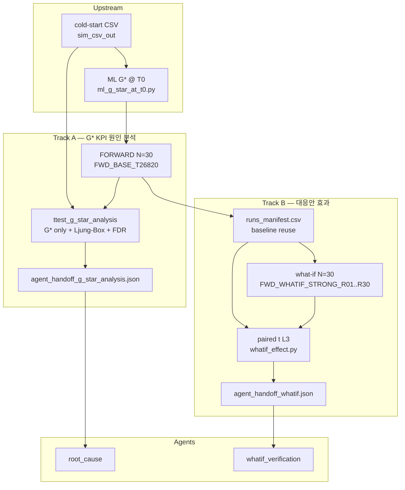
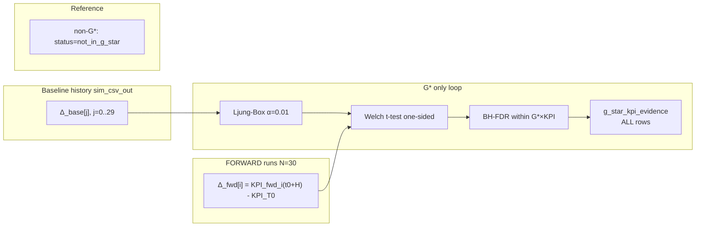

# FabGuard PoC — G* KPI 원인 분석(A) · 대응안 효과(B) 통계 파이프라인 구현 및 N=30 E2E 검증 보고

**작성일:** 2026-06-05 (개정: g_star_analysis 반영)  
**대상:** FabGuard PoC (FAB_BEAR/simulation)  
**검증 조건:** T0 = 26820 sim minute, Horizon H = 120분, N = 30

> **개정 이력:** 초판은 Track A를 **병목 확산(propagation)** 으로 기술했다. PoC 타겟 변경에 따라 Track A는 **G\* KPI 원인 분석(`g_star_analysis` / `root_cause` Agent)** 으로 재정의·구현되었다. 본 개정판이 현행 SSOT이다.

---

## 1. 요약 (Executive Summary)

FabGuard PoC에서 **파이프라인 A(G\* KPI 원인 분석)** 와 **파이프라인 B(대응안 효과 검증)** 의 통계 로직 구현 및 N=30 end-to-end 검증을 완료했다.

**Track A**는 ML이 T0에서 알람 낸 **G\* TG만** 대상으로, **과거 2시간 KPI 차분 vs FORWARD 2시간 변화**에 대한 Welch 일측 t-검정 + **Ljung-Box 독립성 게이트** + **BH-FDR**(G\*×KPI 25개 within)을 수행한다. handoff는 **G\* 전원 × KPI 5종 전 행**을 `g_star_kpi_evidence.csv`로 `root_cause` Agent에 전달한다(유의 여부와 무관, 옵션 A).

**Track B**는 A에서 저장한 baseline FORWARD 30회를 **재사용**하고, 동일 seed의 what-if 시뮬 30회와 쌍을 맞춰 **paired t-검정(L3)** 으로 대응안 효과를 검증한다. E2E STRONG 시나리오(`Diffusion_FE_120#1`, `q_len`)에서 **mean_delta = −10.0**(30쌍 전부), `verdict = improved`가 재현되었다.

| 구분 | 핵심 결과 | Agent 산출물 |
|------|-----------|--------------|
| A 원인 분석 | G\* 5 TG, evidence 25행, 유의 KPI 4건 | `agent_handoff_g_star_analysis.json` |
| B 대응안 | paired_n=30, q_len Δ=−10 (STRONG) | `agent_handoff_whatif.json` |
| 테스트 | pytest 12 passed (stat smoke) | — |

A와 B는 **통계·시뮬이 독립**이며, B는 A의 `g_star_kpi_evidence`를 입력으로 사용하지 않는다. 다만 B는 A의 `runs_manifest.csv`를 baseline으로 **재사용**한다.

---

## 2. 배경 및 목표

### 2.1 PoC가 답하는 질문

| 파이프라인 | 질문 |
|------------|------|
| **A (G\* 원인 분석)** | ML이 알람 낸 **G\* TG** 에서, FORWARD 2시간 KPI 변화가 **과거 동일 길이(2h) 변동**보다 유의하게 악화되었는가? (어떤 KPI가 근거인가?) |
| **B (대응안)** | 제안된 운영 대응안(what-if)이 동일 seed baseline 대비 KPI를 **개선**했는가? |

### 2.2 설계 원칙 (Locked)

- **T0 = 26820**, **H = 120분**, **N = 30** (Monte Carlo FORWARD / paired)
- **G\*** = ML alarm @ T0, `proba ≥ 0.7`, T0+H 병목 **예측**
- **G\* inference** = cold-start `sim_csv_out` @ T0
- **A 검정 대상** = **G\* 집합만** (5 TG × 5 KPI = 25 hypotheses for FDR)
- **non-G\*** = summary에 `status=not_in_g_star` 참고 행 (t-test 미수행)
- **A → 저장 → B**: A가 `runs_manifest.csv`를 남기고, B가 baseline 재사용

### 2.3 Track A 타겟 변경 이력

| 단계 | 타겟 | Agent |
|------|------|-------|
| 초기 (폐기) | eligible B 확산 후보 (binom → ttest_propagation) | `bottleneck_propagation` |
| **현행** | **G\* KPI 통계 근거 → 원인 분석** | **`root_cause`** |

통계 엔진(Ljung-Box, Welch t-test, FDR)은 유지하고 **검정 집합·handoff 계약**만 변경했다. 설계 SSOT: `docs/PROMPT_REFACTOR_PROPAGATION_TO_G_STAR_ANALYSIS.md`.

---

## 3. 파이프라인 전체 아키텍처



**운영 순서:** cold-start → ML G\* → FORWARD N회 저장 → **A 통계·handoff** → (what-if 준비 후) **B 시뮬·통계·handoff**.

---

## 4. Track A: G\* KPI 원인 분석

### 4.1 설계 요약

| 항목 | 값 |
|------|-----|
| pipeline | `g_star_analysis` |
| target_agent | `root_cause` |
| analysis_rule | `ttest_g_star_analysis` |
| FDR scope | `g_star_x_kpi` (최대 \|G*\|×5) |
| handoff | **G\* 전원** + KPI별 `t_p_adj`, `delta_mean` (**유의 무관**) |

| 폐기 (확산 시대) | 현행 |
|------------------|------|
| eligible B 101 TG 검정 | **G\* 5 TG만** 검정 |
| `propagation_candidates` (27 TG) | **`g_star_kpi_evidence`** (25행) |
| FDR ~505 hypotheses | FDR **25** hypotheses |
| `min_sig_kpis` 후보 필터 | **없음** |

### 4.2 구현 파일

| 파일 | 역할 |
|------|------|
| `simulation/stats/g_star_analysis.py` | A 핵심: G\* t-test, Ljung-Box, FDR, evidence 출력 |
| `simulation/stats/common.py` | manifest, KPI read, G\* load, merge_handoff |
| `simulation/tools/stat_g_star_analysis_report.py` | A 단독 CLI |
| `simulation/tools/run_stat_batch.py` | `--mode g_star_analysis` / whatif / both |
| `simulation/tools/run_ml_g_star_e2e.sh` | ML G\* → FORWARD → analysis E2E |
| `simulation/tools/ml_g_star_at_t0.py` | G\* @ T0 |
| `simulation/tests/test_stats_g_star_analysis_smoke.py` | A smoke (7 tests) |
| `docs/schemas/agent_handoff_g_star_analysis.schema.json` | handoff 스키마 |

### 4.3 통계 절차



#### KPI 및 악화 방향

| KPI | 악화 방향 | t-검정 alternative |
|-----|-----------|---------------------|
| `q_time_min`, `wait_ratio`, `wip`, `utilization_avg` | ↑ | `greater` |
| `available_tool_ratio` | ↓ | `less` |

#### 파라미터 (E2E 고정값)

| 파라미터 | 값 |
|----------|-----|
| `significance_alpha` | 0.05 |
| `independence_alpha` | 0.01 |
| `lb_lags` | 10 |
| `n_diff_baseline` | 30 |
| `n_runs_forward` | 30 |
| `multipletest` | `fdr_bh` |
| `fdr_scope` | `g_star_x_kpi` |
| `baseline_csv_dir` | `sim_csv_out` |

**핵심 수식:**

- `Δ_base[j] = KPI(t0 − j·H) − KPI(t0 − (j+1)·H)`, j = 0,…,29  
- `Δ_fwd[i] = KPI_fwd_i(t0+H) − KPI_T0`  
- `kpi_significant` = 정보용 플래그; **handoff 행 제외에 사용하지 않음**

### 4.4 E2E 실행 조건 및 재현

**산출 디렉터리:** `simulation/out/ml_g_star_e2e/`  
**FORWARD manifest:** `out/ml_propagation_e2e/runs_manifest.csv` 재사용 가능 (동일 N=30 run)

```bash
cd FAB_BEAR/simulation && source ../.env

# 전체 E2E
N_RUNS=30 ./tools/run_ml_g_star_e2e.sh

# stat only (FORWARD·ML 재사용)
python tools/stat_g_star_analysis_report.py \
  --runs-manifest out/ml_propagation_e2e/runs_manifest.csv \
  --g-star-file out/ml_propagation_e2e/g_star_T26820.json \
  --baseline-csv-dir sim_csv_out \
  --t0 26820 --horizon 120 --n-runs 30 \
  --anchor-tg DefMEt_FE_118 \
  --out-dir out/ml_g_star_e2e
```

### 4.5 N=30 E2E 결과

#### ML G\* (`g_star_T26820.json`)

| 항목 | 값 |
|------|-----|
| G\* TG 수 | 5 |
| ML anchor_tg (proba 최고) | DefMEt_FE_118 (0.948) |
| alarm_threshold | 0.7 |

**G\* 목록:**

| toolgroup | proba |
|-----------|-------|
| DefMEt_FE_118 | 0.948 |
| Dielectric_FE_30 | 0.928 |
| TF_Met_FE_61 | 0.881 |
| EPI_38 | 0.862 |
| DE_BE_66 | 0.724 |

#### G\* KPI 검정 (`g_star_analysis_summary.csv`, 530 rows)

| 구분 | 행 수 |
|------|------|
| G\* tested (`in_g_star=1`, `status=ok`) | **25** |
| non-G\* reference (`not_in_g_star`) | **505** |
| **합계** | **530** |

#### KPI evidence (`g_star_kpi_evidence.csv`, 25 rows)

**handoff 규칙:** G\* 5개 × KPI 5개 = **25행 전부** 포함.

| status (G\* only) | 행 수 |
|-------------------|------|
| `ok` | 25 |
| `kpi_significant=1` | **4** |

**유의 KPI (FDR 후, 정보용):**

| toolgroup | kpi | t_p_adj | delta_mean |
|-----------|-----|---------|------------|
| Dielectric_FE_30 | utilization_avg | 0.00030 | 0.455 |
| EPI_38 | utilization_avg | 0.0000011 | 0.180 |
| TF_Met_FE_61 | utilization_avg | 0.00000018 | 0.042 |
| DE_BE_66 | utilization_avg | 0.033 | 0.032 |

**해석:** 4개 G\* TG에서 `utilization_avg` 상승이 과거 2h 변동 대비 유의했다. DefMEt_FE_118(ML anchor)은 evidence 5행이 handoff에 포함되나, 본 실행에서 FDR 후 유의 KPI는 없었다(`kpi_significant=0` 전 KPI). 일부 TG는 forward 방향이 baseline 대비 **개선**(음의 delta_mean)으로 t-검정 one-sided greater 가설에서 유의하지 않음.

#### FORWARD manifest

`runs_manifest.csv`: 30 rows, seed 1..30, `FWD_BASE_T26820`, status `ok`.

### 4.6 Agent handoff 산출물 (A)

**파일:** `out/ml_g_star_e2e/agent_handoff_g_star_analysis.json`  
**생성 시각:** 2026-06-05T08:54:20Z

| 필드 | 값 |
|------|-----|
| `pipeline` | `g_star_analysis` |
| `target_agent` | `root_cause` |
| `analysis_rule` | `ttest_g_star_analysis` |
| `fdr_scope` | `g_star_x_kpi` |
| `fdr_n_hypotheses` | 25 |
| `g_star_toolgroups` | 5개 (ML G\*와 동일) |
| `summary_csv` | `g_star_analysis_summary.csv` |
| `evidence_csv` | `g_star_kpi_evidence.csv` |

**Agent 주 입력 (`g_star_kpi_evidence.csv`):** 행 = G\*×KPI 1건. 컬럼: `toolgroup`, `kpi`, `delta_mean`, `t_p_adj`, `lb_pvalue`, `status`, `kpi_significant`, `anchor_tg` 등.

**금지/없음:** `candidates` 배열, `propagation_candidates`, `min_sig_kpis`.

---

## 5. Track B: 대응안 효과 검증

### 5.1 Paired 설계

```
D_i = whatif_value_i − baseline_value_i     (i = 1..N)
```

- **통계:** paired t-test (L3), 95% CI  
- **compare:** `tools/compare_whatif.py` → `compare_dirs()`

### 5.2 구현 파일

| 파일 | 역할 |
|------|------|
| `simulation/stats/whatif_effect.py` | paired 통계 |
| `simulation/tools/stat_whatif_paired_report.py` | B CLI |
| `simulation/tools/compare_whatif.py` | KPI @ T0+H compare |
| `simulation/tools/run_stat_batch.py` | `--mode whatif` |
| `docs/schemas/agent_handoff_whatif.schema.json` | handoff 스키마 |

### 5.3 Baseline 재사용 계약

| 규칙 | 내용 |
|------|------|
| 입력 | `runs_manifest.csv` (Track A FORWARD 산출) |
| baseline 시뮬 | **재실행하지 않음** |
| A 결과 의존 | B는 `g_star_kpi_evidence` **미사용** |

### 5.4 E2E 재현

**산출 디렉터리:** `simulation/out/ml_whatif_e2e/`

```bash
python tools/run_stat_batch.py \
  --mode whatif \
  --reuse-baseline-manifest out/ml_propagation_e2e/runs_manifest.csv \
  --baseline-scenario-id FWD_BASE_T26820 \
  --whatif-scenario-id FWD_WHATIF_T26820_STRONG \
  --whatif-suffix-pattern "FWD_WHATIF_T26820_STRONG_R{run:02d}" \
  --t0 26820 --horizon 120 --n-runs 30 \
  --out-dir out/ml_whatif_e2e \
  --focus-scopes "Diffusion_FE_120#1"
```

### 5.5 N=30 STRONG 결과

| 항목 | 값 |
|------|-----|
| scope | Diffusion_FE_120#1 |
| kpi_name | q_len |
| mean_delta | **−10.0** (30쌍 동일) |
| paired_t_p | 0.0 |
| verdict | **improved** |

### 5.6 Agent handoff (B)

**파일:** `out/ml_whatif_e2e/agent_handoff_whatif.json`  
**생성 시각:** 2026-06-05T07:50:55Z · `target_agent`: `whatif_verification`

---

## 6. A vs B 비교

| | Track A (G\* 원인 분석) | Track B (대응안) |
|--|-------------------------|------------------|
| **질문** | G\* TG에서 어떤 KPI가 비정상 변화했는가? | 대응안이 baseline 대비 KPI를 개선했는가? |
| **검정 대상** | **G\* only** (5 TG) | paired whatif − baseline |
| **통계** | Welch t + Ljung-Box + FDR (G\*×KPI) | paired t (L3) + 95% CI |
| **FDR 범위** | 25 (5×5) | — |
| **Agent JSON** | `agent_handoff_g_star_analysis.json` | `agent_handoff_whatif.json` |
| **Agent CSV** | `g_star_kpi_evidence.csv` | `whatif_paired_summary.csv` |
| **target_agent** | `root_cause` | `whatif_verification` |

---

## 7. 테스트 및 품질

```bash
cd FAB_BEAR/simulation
.venv/bin/python -m pytest \
  tests/test_stats_g_star_analysis_smoke.py \
  tests/test_stats_whatif_paired_smoke.py \
  tests/test_stats_common.py \
  tests/test_build_paired_manifest.py \
  -q
```

**결과:** **12 passed**

| 테스트 | 내용 |
|--------|------|
| `test_stats_g_star_analysis_smoke.py` | G\* only, not_in_g_star ref, FDR scope, evidence 전행 (7) |
| `test_stats_whatif_paired_smoke.py` | paired delta (1) |
| 기타 | common, paired manifest |

---

## 8. 한계 및 후속 작업

### 8.1 완료

- [x] A: propagation → **g_star_analysis** / **root_cause**  
- [x] A: G\*×KPI 25행 evidence handoff (옵션 A)  
- [x] B: N=30 paired E2E, STRONG q_len −10  
- [x] pytest 12 passed  

### 8.2 미완 / 선택

| 항목 | 설명 |
|------|------|
| `STAT_PIPELINE_AB.md` | g_star_analysis 기준 갱신 |
| `CSV_DB_MAPPING.md` | evidence CSV → DB 매핑 |
| 통합 handoff | `agent_handoff.json` E2E |
| B 전체 TG×KPI | focus scope 없이 paired summary |
| anchor_tg | CLI `--anchor-tg` 미지정 시 sorted(G\*)[0] 기본값 — 운영 시 ML anchor 명시 권장 |

---

## 9. 부록

### 9.1 주요 산출 파일 경로

| 경로 | 설명 |
|------|------|
| `simulation/out/ml_g_star_e2e/g_star_T26820.json` | ML G\* (또는 propagation e2e dir 공유) |
| `simulation/out/ml_propagation_e2e/runs_manifest.csv` | FORWARD 30회 manifest |
| `simulation/out/ml_g_star_e2e/g_star_analysis_summary.csv` | A 전체 (530행) |
| `simulation/out/ml_g_star_e2e/g_star_kpi_evidence.csv` | A Agent 주 입력 (25행) |
| `simulation/out/ml_g_star_e2e/agent_handoff_g_star_analysis.json` | A handoff |
| `simulation/out/ml_whatif_e2e/agent_handoff_whatif.json` | B handoff |

### 9.2 JSON 스키마

- `docs/schemas/agent_handoff_g_star_analysis.schema.json`  
- `docs/schemas/agent_handoff_whatif.schema.json`  
- `docs/schemas/agent_handoff.schema.json` (병합용, `g_star_analysis` 키)

### 9.3 KPI 참고: `utilization_avg`

- **윈도우:** 직전 60분 RUN 분 / 60, TG 내 장비별 비율의 **산술평균**  
- 본 E2E에서 G\* 유의 KPI는 대부분 `utilization_avg`  
- 참고: `docs/KPI_CSV_4FILES.md`, `docs/REPORT_SIMULATION_KPI.md`

### 9.4 G\* 전체 목록 (handoff)

DE_BE_66, DefMEt_FE_118, Dielectric_FE_30, EPI_38, TF_Met_FE_61

### 9.5 참고 문서

| 문서 | 용도 |
|------|------|
| `docs/PROMPT_REFACTOR_PROPAGATION_TO_G_STAR_ANALYSIS.md` | **A 현행 설계 SSOT** |
| `docs/PROMPT_REPLACE_BINOM_WITH_TTEST_PROPAGATION.md` | [DEPRECATED] 확산 시대 |
| `docs/PROMPT_IMPLEMENT_STAT_PIPELINE_AB.md` | A/B 초기 설계 |
| `docs/PROMPT_WRITE_REPORT_STAT_PIPELINE_AB_20260605.md` | 보고서 작성 프롬프트 (초판) |

### 9.6 버전 정보

| 항목 | 값 |
|------|-----|
| 보고서 개정 | 2026-06-05 (g_star_analysis) |
| A handoff `generated_at` | 2026-06-05T08:54:20Z |
| B handoff `generated_at` | 2026-06-05T07:50:55Z |

> 수치 SSOT: `out/ml_g_star_e2e/`, `out/ml_whatif_e2e/`. FORWARD run은 `out/ml_propagation_e2e/runs/` 재사용.

---

*보고서 버전: 2026-06-05b · FabGuard PoC · A=g_star_analysis/root_cause · B=paired L3 · N=30 @ T0=26820*
